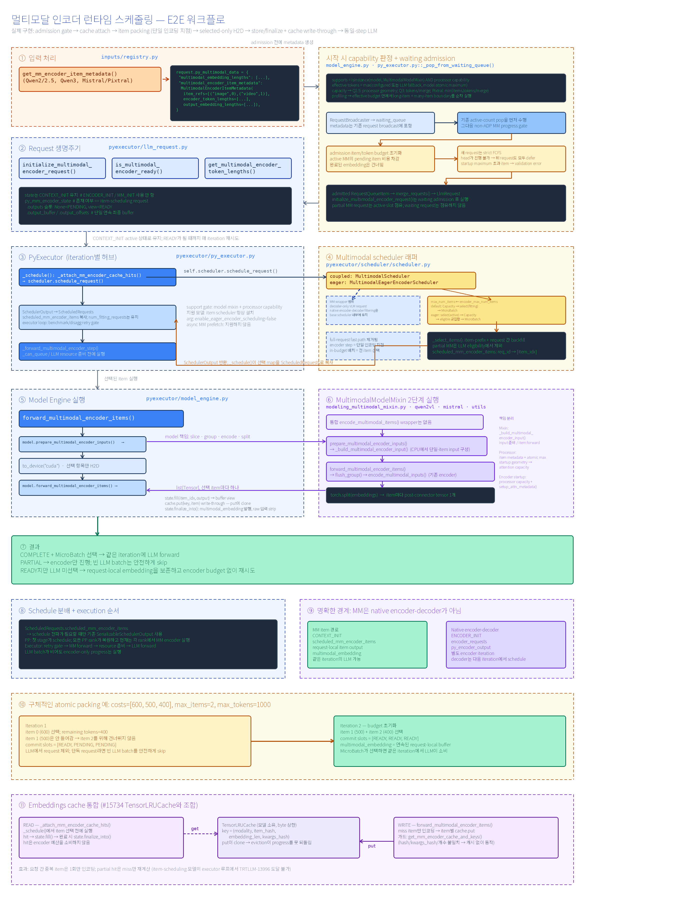

<!--
SPDX-FileCopyrightText: Copyright (c) 2026 NVIDIA CORPORATION & AFFILIATES. All rights reserved.
SPDX-License-Identifier: Apache-2.0
-->

# 멀티모달 인코더 런타임 스케줄링

> **리뷰용 설계 노트 — 머지 전에 제거 예정.**
>
> **상태 갱신 (2026-07-16): 이 문서 작성 이후의 as-built 변경사항.**
> 아래 본문은 원래 설계이며, 다음 변경들이 해당 섹션을 대체합니다 (현재 diff에 반영됨):
>
> 1. **네이밍**: user-facing knob을 `encoder_max_batch_size` →
>    `encoder_max_num_items`로 전면 rename (본문에도 반영됨). 이 값은 atomic MM
>    item **개수**를 세고, item **크기**는 `encoder_max_num_tokens`가 담당. item이
>    여러 attention sequence로 갈라지는 인코더는
>    `get_mm_encoder_attention_metadata_capacity()`로 토큰 예산에서 workspace
>    capacity를 유도.
> 2. **Embeddings cache 통합 (#15734와 조합)**: 스케줄링 전에
>    `PyExecutor._attach_mm_encoder_cache_hits()`가 per-item 캐시 hit을 request
>    슬롯에 커밋 — hit은 encoder 예산을 소비하지 않고 재인코딩되지 않음. 인코딩
>    경로는 공유 키 포맷(`_encoder_cache_item_key`)으로 item별 write-through.
>    요청 단위 가드는 `ModelEngine.get_mm_encoder_cache_and_keys()`; 키를 만들 수
>    없는 요청은 캐시 없을 때와 완전히 동일하게 동작.
> 3. **단일 인코딩 지점**: 본문에 기술된 full-request fast path
>    (`_can_schedule_full_request_mm_batch`)를 제거. item-scheduling 모델의 모든
>    MM 인코딩은 executor의 encoder step에서 실행 — in-budget 배치는 전 pending
>    item이 선택되는 경우일 뿐이며, 해당 요청은 여전히 같은 iteration에 prefill.
>    이로써 캐시와의 probe/스케줄 시차 창이 구조적으로 닫히고, (2)와 결합해
>    TRTLLM-13996의 all-or-nothing 한계가 이 모델들의 executor 루프에서 도달
>    불가능해짐 (partial hit은 miss만 재계산).
> 4. **request 상태 캡슐화 (T40)**: item별 슬롯·버퍼·offsets가
>    `MultimodalEncoderRequestState` 하나로 묶이고, 상태 전이는 `fill()` /
>    `finalize_into()` 메서드로 중앙화 (single-writer 불변식).

| 항목 | 값 |
| --- | --- |
| 상태 | 구현 완료, 리뷰 진행 중 |
| 범위 | TensorRT-LLM PyTorch backend |
| 선행 작업 | [PR #13503: encoder sizing controls](https://github.com/NVIDIA/TensorRT-LLM/pull/13503) |
| 구현 PR | [PR #16051](https://github.com/NVIDIA/TensorRT-LLM/pull/16051) |
| 영문 문서 | [Multimodal Encoder Runtime Scheduling](multimodal_encoder_runtime_scheduling_design.md) |
| 마지막 갱신 | 2026-07-15 |

## 요약

이 문서는 현재 구현된 멀티모달(MM) 인코더 런타임 스케줄링을 설명한다.
`encoder_max_num_items`와 `encoder_max_num_tokens`를 MM encoder forward에 제출되는 실제 작업량의
한도로 만들면서, 기존 LLM 스케줄링 동작과 같은 iteration의 MM encoder-to-LLM 실행 경로를 보존한다.

스케줄링 단위는 이미지 하나 또는 비디오 하나와 같은 **원본 MM item**이다. 이 설계에서 item은
atomic하다. 호환되는 여러 item을 하나의 물리적 encoder forward로 묶을 수는 있지만, 하나의 item을
여러 forward로 나누지는 않는다. Item cost는 connector 또는 merger가 representation을 줄이기 전의
물리적 encoder attention token 수다. 따라서 LLM prompt에 삽입되는 placeholder embedding 수와 의도적으로
다른 개념이다.

기본 admission 정책은 vLLM의 핵심 모델을 따른다. LLM capacity에서 탈락한 MM request는 encoder를
독립적으로 실행하지 않는다. A/B 실험용 eager encoder 정책은 public
`multimodal_config.enable_eager_encoder_scheduling` argument로 활성화하며 기본값은 `false`다. 이 정책은 이미
admit된 request가 현재 iteration의 LLM-capacity filtering보다 먼저 encoder progress를 만들게 하지만, waiting
request를 미리 encode하지는 않는다.

이 문서는 구현 중심 문서다. 현재형으로 쓴 내용은 현재 branch의 동작을 의미한다. Deferred 또는 필수
검증으로 명시한 항목은 아직 구현되지 않았다. 특히 현재 구현은 native encoder-decoder request state나
execution path를 재사용하지 않고, 원본 MM item을 쪼개지 않으며, 별도의 encoder-only request queue를 만들지 않는다.

## 구현 다이어그램

아래 다이어그램은 engine 초기화부터 waiting admission, iteration별 scheduling, 선택된 item 실행,
request-local commit, 조건부 LLM forward까지 현재 코드 경로를 따른다. PP 동작, native
encoder-decoder와의 경계, 2-iteration packing 예시도 포함한다.

[편집 가능한 한국어 Excalidraw 원본](../../../mm_encoder_scheduling_KR.excalidraw)과
[고해상도 한국어 PNG](../../../mm_encoder_scheduling_KR.png)를 제공한다.



## 배경과 문제

[PR #13503](https://github.com/NVIDIA/TensorRT-LLM/pull/13503)은 두 user-facing control을 추가하고,
이를 사용해 encoder attention metadata와 dummy input 크기를 결정적으로 정했다.

- `encoder_max_num_items`: request와 modality가 공유하는, 한 iteration의 encoder 실행에 schedule되는
  최대 atomic MM item 수
- `encoder_max_num_tokens`: encoder batch 하나에 의도한 최대 encoder attention token 수

해당 PR은 scheduler enforcement를 후속 작업으로 남겼다. 따라서 sizing과 runtime work admission이 서로
다를 수 있었다. Encoder forward가 workspace 설계보다 더 많은 item이나 physical attention token을 받을 수
있었다. 반대로 LLM placeholder length를 encoder cost로 사용하면 Qwen-VL vision merger처럼 token을 줄이는
connector가 있는 모델의 실제 encoder 비용을 크게 과소평가할 수 있다.

LLM chunked prefill은 이 문제를 해결하지 못한다. 긴 text context는 여러 LLM iteration으로 나아갈 수 있지만,
MM encoder input은 일반적으로 bidirectional이고 임의의 token 경계에서 나눌 수 없다. 따라서 MM 전용 작업
단위와 budget이 필요하다.

## 목표

1. Iteration마다 MM encoder item budget과 physical attention-token budget을 강제한다.
2. 하나의 MM item을 atomic하게 유지하고, encoder 및 E2E 결과의 수치적 동등성을 보존한다.
3. Encoder output이 같은 iteration의 LLM forward에 들어가는 기존 MM 동작을 보존한다.
4. Non-MM scheduler 경로를 그대로 보존하고 non-MM model의 측정 가능한 overhead를 피한다.
5. 가능한 범위에서 기존 request metadata, schedule distribution, model-specific input processor를 재사용한다.
6. 초기 구현에서 Qwen2-VL/Qwen2.5-VL, Qwen3-VL, Mistral3/Pixtral을 지원한다.
7. Eager encoder scheduling을 기본값으로 만들지 않고 통제된 실험으로 제공한다.

## 목표가 아닌 것

- 이미지, 비디오, 오디오 한 item을 spatial, temporal, window, patch microbatch로 나누는 것
- User-facing partial precomputed-embedding API를 도입하는 것
- Request 간 MM encoder output cache를 구현하는 것. 향후 별도 cache 작업을 위해 안정적인 item identity와
  lifecycle hook만 보존한다.
- 초기 구현에서 request-local encoder output을 byte/item 단위로 제한하거나 eviction/offload하는 것
- Native encoder-decoder scheduling 또는 execution을 변경하는 것
- MM tower LoRA를 지원하는 것. 대상 encoder는 현재 request-level LoRA parameter를 받지 않는다.
- 초기 구현에서 overlap scheduler 또는 MM prefetch compatibility를 재설계하는 것
- `MultimodalModelMixin`을 상속하지 않는 모델로 새 scheduler를 확장하는 것

## 용어와 단위

MM pipeline에서 "token"은 모호하다. 구현과 metric에서는 다음 용어를 구분한다.

| 용어 | 정의 | 예시 |
| --- | --- | --- |
| MM item | 사용자가 넣은 원본 입력 하나 | Prompt의 두 번째 이미지 |
| Encoder attention token | merger/connector 전 encoder attention에 참여하는 한 row | Qwen-VL pre-merger vision patch |
| Encoder output embedding | encoder connector/merger 이후 출력되는 한 row | LLM embedding sequence에 삽입되는 row |
| Placeholder token | MM output embedding으로 대체되는 text prompt 위치 또는 run | Image placeholder 위치 |
| Internal encoder sequence | Encoder `AttentionMetadata`에 표현되는 sequence/window/segment | Temporal 또는 window-attention sequence 하나 |

Item `i`의 scheduler cost는 다음과 같다.

```text
encoder_cost(i) = sum(item_encoder_attention_metadata.seq_lens)
```

이 값은 `multimodal_embedding_lengths[i]`, placeholder 수 또는 LLM-side context chunk 크기가 아니다.
Connector에 따라 이 값들이 같을 수 있지만 scheduler는 동일성을 가정하지 않는다.

### Configuration 의미

Encoder token budget은 base scheduling 값이다. `None`이면 LLM token budget에서 base를 resolve한다.
Atomic MM item은 encoder forward 사이에서 분할할 수 없으므로, 어느 base를 사용하든 model의 가장 큰 유효
atomic item을 scheduling 가능하게 유지하기 위해 필요하면 effective 값을 올린다.

```text
resolved_encoder_max_num_items =
    encoder_max_num_items if encoder_max_num_items is not None else max_batch_size

base_encoder_token_budget =
    encoder_max_num_tokens if explicitly set else max_num_tokens

effective_encoder_token_budget =
    max(base_encoder_token_budget,
        model_max_atomic_item_tokens)
```

따라서 startup configuration 네 가지 경우는 다음과 같다.

| User input | Item budget | Token-budget base | Effective token budget |
| --- | --- | --- | --- |
| 두 값 모두 설정 | `encoder_max_num_items` | `encoder_max_num_tokens` | `max(base, model atomic maximum)` |
| item 값만 설정 | `encoder_max_num_items` | `max_num_tokens` | `max(base, model atomic maximum)` |
| token 값만 설정 | `max_batch_size` | `encoder_max_num_tokens` | `max(base, model atomic maximum)` |
| 둘 다 미설정 | `max_batch_size` | `max_num_tokens` | `max(base, model atomic maximum)` |

이 규칙은 user-facing scheduling 축 두 개만 resolve한다. 어느 값도 attention의
`max_num_requests`에 직접 복사하지 않는다. 별도의 startup 변환은 아래에서 설명한다.

Item-count budget은 원본 MM item을 센다. Request 수, internal attention sequence, video frame,
temporal unit 또는 physical encoder forward 수를 세지 않는다.

구현은 다음을 보장한다.

1. Optional configured 값과 base/effective 값을 모두 보존한다.
2. Configured/base/effective 값을 log하고 atomic-item compatibility 때문에 값을 올릴 때 warning을 한 번 기록한다.
3. Scheduling, profiling, attention metadata, workspace sizing에 effective 값을 일관되게 사용한다.
4. 기존 positive-value validation 외의 이유로 `encoder_max_num_items`를 올리지 않는다.

Effective startup maximum보다 큰 item은 invalid다. 이 maximum은 startup 시 선언된 model maximum atomic
item 이상이므로 정상적인 model-valid input이 configured base가 작다는 이유만으로 거부되지는 않는다. Input
processing은 보통 media resize 또는 sampling으로 model limit 안에 맞춰야 한다. Defensive runtime check는
불일치한 request만 실패시키며 metadata를 동적으로 resize하거나 server를 종료하지 않는다.

## 범위와 model gating

Input processor는 다음 class flag로 명시적으로 opt-in한다.

```python
supports_mm_encoder_item_scheduling = True
```

Model-engine 초기화에서 양쪽 contract를 한 번만 확인한다.

```python
supports_mm_encoder_item_scheduling = (
    isinstance(model, MultimodalModelMixin)
    and input_processor.supports_mm_encoder_item_scheduling
)
```

Combined capability가 true일 때만 MM scheduler를 설치한다. Mixin 밖의 모델과 완전한 item metadata를
제공하지 않는 processor는 기존 full-request 경로를 사용한다. Runtime kill switch는 없으며 scheduler
gating을 위해 iteration마다 `model.modules()`를 scan하지 않는다.

초기 item-level 지원 범위는 다음과 같다.

- `Qwen2VLModelBase`: Qwen2-VL, Qwen2.5-VL
- `Qwen3VLModelBase`
- `Mistral3VLM`: Mistral3, Pixtral 계열

지원 계열은 item cost, identity, output length, startup maximum atomic item cost, model item preparation을
제공한다. Processor capability flag를 켰지만 `get_mm_max_tokens_per_item()`이 비어 있거나 양수가 아닌 값을
반환하면 silent fallback 대신 engine startup이 실패한다.

Item scheduling을 지원하지 않는 모델은 기존 scheduler를 직접 사용한다. MM wrapper, MM request scan,
MM metadata allocation, MM schedule payload가 없다.

지원 MM 모델의 text-only 경로는 현재 constant-time이 아니다. Non-ADP mode의 waiting-admission gate가
`active_requests`를 scan하고, cache attach와 `_select_items()`가 scheduling call마다
capacity-fitting request list를 복사/scan한다. Text-only request는 boolean request-kind flag에서 즉시
빠져나가므로 비용은 작지만,
두 `O(active_requests)` Python loop가 존재한다. ADP는 waiting-admission MM gate를 건너뛰므로 scheduler scan
하나만 남는다. Pending-MM request counter/index는 deferred host-latency optimization이며 현재 구현하지 않았다.

## Request 분류와 state

Native `LlmRequestState.ENCODER_INIT`은 encoder-decoder scheduling에 속하며, 다음 iteration에서 decoder가
진행되는 semantics를 갖는다. 이는 기존 MM workflow와 맞지 않는다. MM 구현은 이를 재사용하지 않고 native
`MM_INIT` state도 추가하지 않는다.

MM request는 `CONTEXT_INIT`에 남는다. Python은 다음 불변 request-kind flag를 붙인다.

```text
py_mm_encoder_state is not None ==
    runtime_item_scheduling_is_enabled_for_model_and_processor
    and request_has_raw_mm_payload
    and request_has_no_complete_precomputed_mm_embedding
```

Raw MM content가 없는 mRoPE metadata는 encoder request가 아니다. 완전한 외부 precomputed
`multimodal_embedding`이 있으면 encoder compute를 우회하고 item/token budget을 소비하지 않는다. Partial
external embedding은 지원하지 않는다.

Flag는 request 종류를 나타내고 readiness는 별도로 저장한다. Partially encoded request는 context state를
유지하지만, 모든 required embedding이 ready이거나 이번 iteration에 ready가 될 때까지 LLM microbatch 직전에
제외된다.

### Native encoder-decoder scheduling과의 경계

MM item scheduling과 native encoder-decoder scheduling은 별도 executor 경로다.

| 구분 | MM encoder runtime scheduling | Native encoder-decoder |
| --- | --- | --- |
| Request state | `CONTEXT_INIT` 유지 | `ENCODER_INIT`에서 시작 |
| Scheduled output | `scheduled_mm_encoder_items` | `encoder_requests` |
| Request-local output | MM item slot과 연속 `multimodal_embedding` buffer | `py_encoder_output` |
| Executor entry | `_forward_multimodal_encoder_step` | `_run_encoder_step` |
| Decoder timing | 같은 iteration 실행 가능 | 이후 iteration에서 decoder scheduling 재진입 |

`MultimodalScheduler`는 native encoder-decoder readiness filtering을 실행하지 않는다. 현재 지원하는 Qwen과
Mistral/Pixtral은 decoder-only VLM이며, MM readiness는 위에서 설명한 Python item progress만 사용한다. Native
encoder-decoder scheduler는 자신의 `drop_decoder_context_requests_waiting_for_encoder_output()` 호출을 그대로
유지한다. MM 경로는 request를 `encoder_requests`에 넣지 않고 `forward_encoder()`를 호출하지 않는다.

## 정적 request metadata

Model-specific input processing은 waiting-queue admission과 initial request broadcast 전에 scheduling metadata를
만든다. Opt-in processor는 typed `MultimodalEncoderItemMetadata` `NamedTuple`을 반환한다.

```python
MultimodalEncoderItemMetadata(
    item_refs: list[tuple[str, int]],
    encoder_token_lengths: list[int],
    output_embedding_lengths: list[int],
)
```

Generic input-processor wrapper는 세 list 길이가 같은지 검사하고, 기존 embedding-length list가 있으면 값도
검사한 뒤 typed metadata object 자체를 `request.py_multimodal_data`에 저장한다. 기존 flat
embedding-length field는 generic MM layout contract이므로 유지하며, generic hashing 경로가 계산하지 않은
경우 typed metadata에서 materialize한다.

```python
{
    # Item별 기존 output/placeholder row 수
    "multimodal_embedding_lengths": list[int],

    # 하나의 CPU-only typed scheduler contract
    "multimodal_encoder_item_metadata": MultimodalEncoderItemMetadata(
        item_refs=list[tuple[str, int]],
        encoder_token_lengths=list[int],
        output_embedding_lengths=list[int],
    ),
}
```

`output_embedding_lengths`와 기존 `multimodal_embedding_lengths`는 같은 값을 담는다. 전자는 mixed-modality
또는 basic input-processing처럼 generic hashing이 flat field를 만들지 않는 경로에서도 opt-in item-scheduling
contract를 완전하게 만들고, wrapper는 두 값이 같은지 검증한 뒤 기존 downstream consumer를 위해 flat field를
노출한다. Item reference 예시는 `("image", 0)`, `("video", 1)`이다. Metadata의 세 list는 dictionary
iteration, modality grouping, completion 순서가 아니라 canonical prompt-placeholder 순서로 정렬한다. Input
processing은 모호하거나 서로 맞지 않는 ordering을 거부한다. Opt-in processor가 raw MM payload를 받으면
full-request encoding으로 조용히 fallback하지 않고 metadata를 반드시 반환해야 한다.

Metadata object와 flat embedding length는 `_CPU_ONLY_MULTIMODAL_DATA_KEYS`에 등록된 CPU
scheduling/layout data다. 따라서 generic device transfer가 host에 남겨둔다. 기존 `MultimodalInput` position,
length, hash, UUID, item-run metadata도 남아 있지만,
현재 scheduler는 hash를 item identity로 사용하지 않고 hashing 활성화를 요구하지도 않는다. 현재 hashing
경로에는 one-modality flattening 가정이 있으므로 향후 cache가 hash를 item identity로 쓰기 전에 ordering을
검증해야 한다.

`MultimodalRuntimeData`는 scheduling 저장소로 적합하지 않다. 이미 선택된 LLM chunk를 위해 생성되므로
waiting admission이나 encoder item selection에는 너무 늦다.

### Cost 생성

지원 input processor는 encoder가 소비하는 normalized media metadata에서 physical token length를 계산한다.
Qwen은 spatial merge 전 `prod(grid_thw)`를 사용하고, 여러 temporal prompt span을 원본 video item 하나로 다시
합치며, spatial merge unit으로 나누어 output row를 계산한다. Mistral/Pixtral은
`_vit_tokens(width, height, patch)`를 사용하고 square spatial merge 뒤의 output row를 계산한다. Qwen은
prompt에서 canonical image/video 순서를 복원하고 processed grid와 다르면 거부한다. 현재 Mistral 경로는
image-only이며 processed image 순서를 사용한다.

현재 executor는 positive cost, aligned list length, startup maximum, item별 output embedding length를 검증한다.
Launch 뒤 encoder runtime attention sequence sum을 독립적으로 다시 계산해 declared cost와 비교하지는 않는다.
따라서 processor/model geometry formula의 일치와 model-specific test가 현재 correctness contract의 일부다.
Declared-versus-runtime cost assertion은 향후 hardening 항목이다.

## Mutable request-local state

Python request는 fixed-size item slot, 하나의 연속 output buffer, 미리 계산된 offset을 소유한다.

```python
py_mm_encoder_state: Optional[MultimodalEncoderRequestState]
#   .outputs: list[Optional[torch.Tensor]]   # 슬롯; buffer의 view
#   .output_buffer: Optional[torch.Tensor]   # fill()이 lazy 할당
#   .output_offsets: list[int]
#   .fill(item_idx, output)                  # 단일 writer (encode + cache attach)
#   .finalize_into(multimodal_data)          # embedding 발행 + raw strip
#   .progress / .pending_item_indices()
```

Item은 두 persistent state 중 하나다.

| State | Output slot | 의미 |
| --- | --- | --- |
| `PENDING` | `None` | 선택 가능 |
| `READY` | tensor | 재사용 가능한 request-local 결과 |

가독성을 위해 `MultimodalEncoderRequestState.progress`가 이 slot들에서 item-level
`MultimodalEncoderProgress.PENDING`, `PARTIAL`, `READY`를 계산하고, `is_multimodal_encoder_ready()`가
이를 request-level readiness 판정으로 올린다(item state가 없는 request는 encoder 작업이 필요 없다).
둘 다 별도로 저장하는 두 번째 state가 아니며 C++ `LlmRequestState`도 변경하지 않는다. MM request는 `CONTEXT_INIT`을 유지하므로 같은 iteration의
encoder-to-LLM 실행이 보존된다.

Selection은 request state를 변경하지 않는다. 현재 executor는 같은 item을 다시 선택할 수 있는 다음 schedule
result를 만들기 전에 이전 result 하나를 소비한다. Selection을 scheduler output에만 두면 result cancel/discard
시 누수될 수 있는 reservation이 생기지 않는다.

첫 item 성공 시 declared item별 embedding length로 하나의 연속 최종 output buffer를 할당한다. 완료된 item은
canonical slice에 직접 복사하고, output slot은 별도 allocation이 아니라 이 buffer의 view를 보관한다. 모든
slot이 ready가 되면 같은 buffer가 final `torch.cat` allocation 없이 `multimodal_embedding`이 된다. Request
cancel, validation failure, execution error 시 buffer와 slot은 request와 함께 해제된다.

## End-to-end request workflow

### Request admission 전 startup

Request serving 전에 `PyTorchModelEngine`은 encoder-specific runtime size를 resolve한다. User-facing encoder
knob이 `None`이면 해당 LLM 값으로 fallback한다. 그 뒤 다음 순서로 feature contract를 설정한다.

1. Model-specific input processor를 만들고 model을 load한다.
2. Model이 `MultimodalModelMixin`을 상속하고 processor가 완전한 item metadata 지원을 명시한 경우에만
   `supports_mm_encoder_item_scheduling`을 설정한다.
3. `get_mm_max_tokens_per_item()`이 modality별 양수 값을 포함한 nonempty 결과인지 요구한다.
4. Optional configured 값과 resolved base를 별도로 보존하고, 필요할 때 effective 값을 가장 큰 유효 atomic
   item 크기로 올린다.
5. Effective budget으로 `MultimodalEncoderMixin` attention metadata와 direct encoder profiling을 초기화한다.
6. 기존 asynchronous MM prefetch를 거부한다. 기본 coupled 정책에는 `MultimodalScheduler`를, eager
   scheduling이 켜지면 `MultimodalEagerEncoderScheduler`를 설치한다. Eager mode는 attention DP와
   disaggregated KV cache transceiver도 거부한다.

### Request 및 iteration 경로

현재 request 경로는 다음과 같다.

1. **Input processing:** Model-specific processor가 media를 normalize하고
   `MultimodalEncoderItemMetadata`를 반환한다. Wrapper가 prompt 순서의 item reference, physical cost,
   output length를 `py_multimodal_data`에 쓴다.
2. **Initial request distribution:** `RequestBroadcaster`가 일반 request와 Python-only
   `py_multimodal_data`를 기존 TP/PP/CP route로 전달한다. MM 전용 request broadcast는 추가하지 않는다.
3. **Waiting admission:** `_pop_from_waiting_queue()`가 기존 active-count pop을 먼저 실행한 뒤 non-ADP MM
   progress gate를 적용하고, defer된 request를 queue 앞에 다시 넣는다.
4. **Request attachment:** `merge_requests()`가 `LlmRequest`를 만들고 validation이
   `initialize_multimodal_encoder_request()`를 호출한다. Request를 분류하고 startup item maximum을 검증하며
   item slot과 output offset을 만든다. State는 `CONTEXT_INIT`을 유지한다.
5. **Scheduling:** `MultimodalScheduler`가 기본 coupled 정책을 실행하고,
   `MultimodalEagerEncoderScheduler`가 opt-in eager 정책을 실행한다. 두 scheduler 모두 optional
   `request_id -> item_indices` map을 반환하며 기존 schedule serialization이 이 map을 전달한다.
6. **Item execution:** 참여 executor가 같은 selection을 복원하고 active request를 resolve한다. 선택 item을
   CPU에서 slice하고 해당 slice만 GPU로 옮기며, 연속 modality group을 실행하고 item별 output을 request의
   최종 buffer에 commit한다.
7. **LLM execution:** 마지막 pending item이 이번에 선택된 request는 같은 iteration의 LLM context batch에
   들어갈 수 있다. 아직 item이 남은 request는 LLM batch에서 제외되고 다음 iteration에 재시도한다. Encoder
   progress만 있는 iteration은 빈 LLM work를 건너뛴다.
8. **완료 이후 lifetime:** 모든 item slot이 ready가 되면 연속 buffer가 `multimodal_embedding`이 되고 raw
   media tensor를 제거한다. 이후 chunked-prefill iteration은 encoder budget을 다시 쓰지 않고 embedding을
   재사용한다. Normal request teardown이 최종적으로 이를 해제한다.

5단계에서 갈라지는 full-request 경로는 없다: encoder step이 유일한 인코딩 지점이다. In-budget 배치는 fitting
request들의 모든 pending item이 선택되는 경우일 뿐이며, 해당 request는 여전히 같은 iteration의 LLM context
batch에 들어간다 (encoder step이 LLM forward보다 먼저 실행됨). Embeddings cache에서 전 item이 attach된
request는 선택 전에 `READY`가 되어 encoder 작업이 아예 schedule되지 않는다.

### 서로 다른 두 budget pass

Waiting admission과 item scheduling은 의도적으로 별도 simulation을 실행한다.

```text
waiting admission:
    encoder item/token budget 초기화
    active MM request의 pending work 비용 차감
    새로 pop한 request를 strict FCFS 순서로 순회
    head가 첫 progress를 만들 수 없으면:
        head와 뒤의 모든 request를 defer

per-iteration scheduling:
    encoder item/token budget을 다시 초기화
    default mode: CapacityScheduler-fitting request에서만 선택
    eager mode: capacity 전에 이미 active인 모든 request에서 선택
    request item state를 변경하지 않고 scheduled_mm_encoder_items 생성
```

첫 pass는 waiting request가 active slot을 차지할 수 있는지를 결정한다. 두 번째 pass는 이 schedule result가
실제로 실행할 item ID를 결정한다. 두 pass를 합치면 progress guarantee 없이 request를 admit하거나, LLM
capacity 결정 전에 item work를 reserve하는 문제가 생긴다.

### 구체적인 atomic-item 예시

Cost가 `[600, 500, 400]`인 request 하나, `encoder_max_num_items=2`,
`encoder_max_num_tokens=1000`을 가정한다.

| Iteration | 선택 | Commit 이후 request-local state | LLM 동작 |
| --- | --- | --- | --- |
| 1 | Item 0을 선택한다. Item 1은 남은 400 token에 들어가지 않고 item 2는 이를 건너뛸 수 없다. | `[READY, PENDING, PENDING]` | Request를 LLM에서 제외한다. 유일한 request라면 executor가 빈 LLM batch를 안전하게 건너뛴다. |
| 2 | Budget을 초기화하고 item 1과 2를 900 token으로 선택한다. | `[READY, READY, READY]`; 연속 buffer가 `multimodal_embedding`이 된다. | MicroBatchScheduler가 선택하면 같은 iteration에서 LLM이 embedding을 소비한다. 선택하지 않으면 ready embedding을 request-local로 유지한다. |

다른 active request의 다음 item cost가 400 이하라면 iteration 1의 남은 budget을 backfill할 수 있다. 첫
request 내부의 item을 재정렬해 빈 공간을 채우지는 않는다.

## Scheduler 구조

MM scheduler는 기존 request scheduler를 감싸는 Python wrapper다. 일반적인 `SimpleScheduler` 구조에서는
기존 CapacityScheduler와 MicroBatchScheduler stage를 직접 호출해 그 사이에 MM item selection을 넣는다.
C++ LLM capacity scheduler를 대체하지 않고, encoder cost를 LLM token accounting에 더하지 않는다.

```text
waiting requests
      |
      | 새 admission에 대한 MM progress eligibility
      v
기존 LLM CapacityScheduler
      |
      | 기존 policy 순서의 fitting/admitted request
      v
MM atomic-item budget packing
      |
      | partial MM request 제외
      v
기존 LLM MicroBatchScheduler
      |
      | ready 또는 이번 step에 완료되는 MM request의 기존 순서 유지
      v
MM encoder forward(s) -> embedding 조립 -> 같은 iteration의 LLM forward
```

기본 정책의 실제 scheduling call 순서는 다음과 같다.

1. Active request에 기존 LLM CapacityScheduler를 실행한다.
2. `_select_items()`로 capacity-fitting list에서 atomic item을 선택하며 두 encoder budget에 차감한다.
   Embeddings cache에서 이미 attach된 item은 slot이 채워져 있으므로 건너뛴다.
3. 이번 iteration 후에도 partial로 남을 MM request를 제외한 뒤 나머지 LLM-eligible request에 기존
   MicroBatchScheduler를 실행한다.

Wrapper는 capacity와 microbatch stage를 별도로 expose하지 않는 scheduler도 지원한다. 이 fallback은 반환된
context list를 filter할 수 있지만 production의 의도된 경로는 위 `SimpleScheduler` 경로다.

### Iteration별 budget

하나의 `ScheduledRequests` result를 만드는 각 call은 다음 값으로 시작한다.

```text
max_num_items = resolved_encoder_max_num_items  # Scheduler 내부 이름
remaining_items = max_num_items
remaining_tokens = effective_encoder_token_budget
```

User-facing knob은 `encoder_max_num_items`다 (`encoder_max_batch_size`에서 rename). 이 limit는 LLM request,
beam, model-internal attention segment가 아니라 atomic item을 세며, 이제 이름이 end-to-end로 그 사실을
말해준다.

해당 result에서 선택된 모든 physical MM encoder forward group은 이 counter를 공유한다. 여러
shape-compatible group을 만들더라도 budget을 여러 개 만들지 않는다. Scheduling rank가 selection을
serialize하고 TP, PP, CP rank가 해당 replica의 같은 selected item ID를 복원한다.

Item-count budget과 token budget은 독립적이다. 두 counter 모두 item 전체 cost를 지불할 수 있어야 item이
들어간다. 향후 cache hit는 두 compute counter 모두 소비하지 않는다.

### Item selection 순서

Selection rule은 단순하고 결정적이다.

1. 한 request 안에서는 canonical prompt 순서로 item을 처리한다.
2. 앞의 pending item을 건너뛰고 뒤의 더 싼 item을 선택하지 않는다.
3. Running/admitted request 사이에는 backfill을 허용한다. 한 request의 다음 item이 안 들어가면 다른 active
   request를 고려할 수 있다.
4. 새 waiting MM admission은 strict FCFS다. Head request의 첫 pending item이 initial progress를 만들 수
   없으면 strict FCFS를 위해 이번 turn의 모든 뒤 request admission을 멈춘다. Effective budget보다 큰 item은
   queue를 영구 block하지 않고 정상 validation이 request를 실패시키도록 일단 admit한다.
5. Ready request를 MicroBatchScheduler에 전달할 때 기존 scheduler-policy 순서를 유지한다. 새로 완료된 MM
   request를 list 끝에 붙이지 않는다.

이 규칙은 packing efficiency 일부를 예측 가능한 fairness, 안정적인 output ordering, 작은 구현 표면과
교환한다. Trace를 기반으로 best-fit 또는 modality-aware 정책을 나중에 평가할 수 있다.

### Same-step eligibility

Admit된 request는 모든 required item이 다음 중 하나일 때 현재 LLM microbatch에 들어갈 수 있다.

- 이미 `READY`
- 같은 schedule result에서 encoder 실행 대상으로 선택됨

MicroBatchScheduler가 request를 선택하면 executor가 selected encoder item을 실행하고 전체 embedding을 조립한
뒤 같은 iteration에서 LLM forward를 실행한다. 이로써 기존 MM latency behavior를 보존한다.

MM 실행이 끝났지만 LLM microbatch가 request를 포함하지 못하면 output은 request-local slot에 남고, request는
나중에 LLM scheduling을 재시도한다. 기본 정책에서는 encoder work를 시작하기 전에 CapacityScheduler가
request를 admit해야 하므로 capacity rejection이 speculative encoder output을 남기지 않는다.

Encoder-only progress iteration은 유효하다. 하나의 request가 여러 MM iteration을 필요로 하면 중간
`ScheduledRequests`는 selected MM item을 갖지만 context/generation request는 0일 수 있다. Executor는 empty
batch `_can_queue()` 검사 전에 `_forward_multimodal_encoder_step()`을 실행한다. 그 뒤 빈 LLM batch는
forward, sampling, per-batch statistics 없이 건너뛴다. Local single-request 32-image test에서 item budget 16으로
2-iteration 형태를 실행했지만, 아직 checked-in integration test는 아니다.

## Admission 정책

### 기본값: LLM-coupled admission

기본 정책은 vLLM의 핵심 admission behavior를 따른다.

- LLM capacity에서 탈락한 request는 MM encoder를 독립적으로 실행하지 않는다.
- 기존 active-request-count pop 뒤 새 waiting MM request는 progress를 만들 수 있을 때만 admit 상태를 유지한다.
  이미 MM ready이거나 첫 required atomic item이 simulation의 남은 encoder budget에 들어가야 한다.
- Prefill progress를 전혀 만들 수 없는 waiting request는 waiting에 남고 active LLM slot을 쓰지 않는다.
- Admit되어 MM progress를 만드는 request는 모든 item이 ready가 될 때까지 여러 encoder iteration 동안 active
  LLM slot을 차지할 수 있다.

이 coupling은 encoder-only active request가 무한히 늘어나는 것을 막고 request lifecycle semantics를 기존
scheduler와 가깝게 유지한다. 비용은 큰 multi-item request가 encoder iteration을 진행하는 동안 LLM slot을
점유할 수 있다는 것이다.

Waiting gate는 먼저 active MM request의 pending item 비용을 차감하되 complete embedding이 ready인 request는
건너뛴다. 그다음 새로 pop한 request를 strict queue order로 본다. Head 하나가 progress를 못 만들면 해당
request와 이후의 모든 request—MM 또는 text—를 waiting queue 앞에 되돌린다. Effective maximum을 넘는
item은 validation이 실패시키도록 의도적으로 admit해 server 전체의 head-of-line block을 피한다.

이 gate는 active-set admission을 제어하고, 기존 CapacityScheduler가 LLM resource reservation의 authority로
남는다. 기본 mode에서는 capacity result 뒤 item selection을 실행하므로 capacity-rejected request를 encode하지
않는다.

### Eager encoder scheduling

다음 public argument가 eager 정책을 켠다.

```yaml
multimodal_config:
  enable_eager_encoder_scheduling: true
```

기본값은 `false`이며 coupled 정책을 선택한다.

Eager mode는 LLM capacity filtering 전에 기존 `active_requests`에서 encoder item을 선택한다. 이미
admit된 request가 이번 iteration의 LLM capacity에서 탈락해도 encoder progress를 계속할 수 있다. 별도의
pre-admission collection을 만들지 않고 active request limit도 늘리지 않는다. 완료 output은 정상 LLM
scheduling까지 request-local로 남는다.

두 정책의 차이는 item selection이 LLM capacity의 앞인지 뒤인지뿐이다. 같은 active set, serial execution
order, model hook, output validation, output assembly를 사용하므로 throughput/latency 비교가 의미 있다.

Eager mode는 attention data parallelism 또는 disaggregated KV cache transceiver가 켜지면
`NotImplementedError`를 낸다. 기본 coupled 정책에는 이 명시적 거부가 없다. 모든 item-scheduled mode는
`multimodal_config.encoder_side_stream_max_ahead > 0`도 executor 초기화에서 거부한다. 기존 asynchronous
MM prefetch가 request-local item state와 통합되지 않았기 때문이다. 일반 executor overlap loop는 계속 켜져
있다.

## Schedule 분배

TensorRT-LLM은 이미 scheduling rank의 result를 분배한다. 이 설계는 기존 payload를 확장하며 두 번째
collective 또는 broadcast를 추가하지 않는다.

`ScheduledRequests`와 `SerializableSchedulerOutput`에 optional mapping을 추가한다.

```python
scheduled_mm_encoder_items: dict[int, list[int]] | None
```

Key는 request ID이고 value는 canonical item index list다. Static cost와 item reference는 기존 initial
`RequestBroadcaster`로 도착한다. Iteration별 payload는 selection만 보낸다. Non-MM schedule은 field를
`None`으로 두므로 backward-compatible field handling 외의 serialized payload/hot path는 바뀌지 않는다.

원래 scheduling을 소유한 rank가 MM policy를 적용한다. 다른 TP/PP/CP rank는 model 실행 전에 serialized
result에서 같은 request/item selection을 복원한다. Rank마다 독립적으로 item을 다시 pack하지 않는다.

Pipeline parallel 실행에서 현재 구현은 첫 stage의 schedule을 복원한 뒤 **모든 PP rank**에서 selected MM
encoder item을 실행한다. 지원 Qwen/Mistral MM wrapper는 현재 모든 PP stage에 encoder를 instantiate하고,
기존 full-request MM 경로도 PP stage마다 encoder를 중복 실행한다. 따라서 item scheduling은 stage 0 전용
encode와 embedding broadcast를 새로 만들지 않고 기존 PP ownership behavior를 보존한다. Encoder compute가
PP degree만큼 중복될 수 있다. 이 동작을 완전히 검증하거나 최적화하기 전에 MM+PP integration test가 필요하다.

`num_fitting_requests`는 MM-incomplete request를 LLM microbatch에서 제외하기 전 CapacityScheduler count를
유지한다. Executor는 disaggregated-serving idle/progress 판단에 이 값을 사용한다. Encoder-progress iteration을
LLM capacity starvation으로 잘못 보고하면 안 되기 때문이다. 이 값은 실제 scheduled LLM batch size가 아니며
MM wrapper가 다시 쓰지 않는다.

## Model execution API

`MultimodalModelMixin`은 2단계 internal item API를 제공한다.

```python
def prepare_multimodal_encoder_inputs(
    self,
    selected_items: Sequence[tuple[MultimodalParams, int]],
) -> list[tuple[MultimodalParams, int, str]]:
    """CPU에서 selected item별 encoder input을 구성한다."""

def forward_multimodal_encoder_items(
    self,
    encoder_inputs: Sequence[tuple[MultimodalParams, int, str]],
) -> list[torch.Tensor]:
    """Encoder input을 forward하고 입력 순서대로 item별 tensor를 반환한다."""
```

이전에 제안한 단일 `encode_multimodal_items()` hook은 구현에 없다. Scheduler는 request ID, item index,
cost만 안다. Model engine이 selected request/item pair를 resolve하고, 원본 payload가 CPU에 있을 때
`prepare_multimodal_encoder_inputs()`를 호출하며, 준비된 microbatch만 전송한 다음
`forward_multimodal_encoder_items()`를 호출한다.

Mixin의 책임은 다음과 같다.

- Raw model-specific tensor를 item별로 slice
- Physical forward compatibility 결정
- 호환되는 연속 item grouping
- 정확한 attention metadata 구성
- Encoder와 connector 실행
- Output을 selected item별 tensor 하나로 split

Model engine은 selected-only H2D transfer, selected item마다 결과 하나인지와 declared output row count 검증,
연속 final output buffer로의 direct copy, 모든 item 완료 후 raw modality payload 제거를 담당한다. Request ID를
resolve할 때 dictionary `KeyError` 대신 명시적인 missing-request lifecycle error를 낸다. 완료 output은 same-step
LLM consumption을 위해 GPU에 남고 offload하지 않는다.

기존 `encode_multimodal_inputs`는 legacy 경로와 기존 prefetch behavior를 위해 유지한다.

### Physical grouping

Scheduler packing은 modality와 shape을 모른다. 현재 지원 모델은 **연속된** selected item을 modality별로
grouping한다. Preparation contract가 각 run 안에서 호환되는 field, dtype/device, shape을 만든다. 이를 보장할
수 없는 향후 모델은 `forward_multimodal_encoder_items()`를 override하거나 더 엄격한 compatibility key를
사용해야 한다. 모든 physical forward는 하나의 iteration budget을 공유한다.

더 큰 batch를 만들기 위해 nonconsecutive item을 reorder하지 않는다. Reordering에는 추가 permutation contract가
필요하고 output을 잘못된 placeholder에 연결할 위험이 커진다. 초기 구현은 correctness와 투명한 execution
trace를 우선한다.

Qwen2/Qwen3는 grid와 patch offset으로 item slice를 계산한다. Mistral은 image metadata로 image slice를
계산한다. Video는 item 하나로 유지하며 `(t, h, w)`를 독립 `(1, h, w)` forward로 바꾸지 않는다. 이 변환은
temporal attention과 output을 바꿀 수 있으므로 설계 범위 밖이다.

### LoRA

대상 Qwen/Mistral encoder entry는 현재 per-request LoRA parameter를 받지 않고 LoRA는 LLM side에 적용된다.
따라서 초기 grouping key에 `lora_task_id`를 넣지 않는다. Encoder/tower LoRA를 도입하면 feature를 켜기 전에
adapter identity가 physical grouping key와 cache key 모두에 들어가야 한다.

## Attention metadata capacity

`encoder_max_num_items`는 원본 item을 세지만 `AttentionMetadata.max_num_requests`는 internal sequence,
temporal segment, attention window를 셀 수 있다. 단위가 다르므로 model이 1:1 mapping을 증명하지 않는 한
item budget을 `max_num_requests`에 그대로 넣으면 안 된다.

Startup에서 model engine은 `MultimodalEncoderMixin`을 찾기 위해 `model.modules()`를 한 번 scan하고 다음을
호출한다.

```python
module.setup_attn_metadata(
    max_num_items=encoder_max_num_items,
    max_num_tokens=effective_encoder_max_num_tokens,
    attention_metadata_capacity=processor_capacity,
)
```

`encoder_max_num_items`는 input budget이지 `AttentionMetadata.max_num_requests` 값 자체가 아니다. Image 하나가
attention sequence 하나가 될 수 있는 반면 video item 하나는 여러 temporal segment로 펼쳐질 수 있고,
windowed encoder도 item 하나에서 여러 internal sequence를 만들 수 있으므로 encoder마다 item/token pair를
자신의 attention sequence/window/segment capacity로 변환한다.
정확한 resize/grid 제약은 input processor가 소유하므로 opt-in processor가 먼저 resolved budget과 live startup
geometry를 model-specific capacity로 변환한다.

```python
processor_capacity = input_processor.get_mm_encoder_attention_metadata_capacity(
    max_num_items=encoder_max_num_items,
    max_num_tokens=effective_encoder_max_num_tokens,
)
```

`None`을 반환하면 encoder model의 보수적인 `get_encoder_attention_metadata_capacity()` fallback을 유지한다.
이 분리는 의도적이다. Model은 attention "request"의 의미를 알고 processor는 실제로 들어올 수 있는 media
geometry를 안다. Module scan과 변환은 initialization 때 한 번만 실행하며 iteration별 scheduler gating과
무관하다.

Qwen에서 `T = effective_encoder_max_num_tokens`, `U = spatial_merge_unit`이라고 하자. `A_min`은 live startup
processor에서 Qwen2.5 image/video frame 하나가 가지는 최소 post-merge spatial cell 수다. Window attention에서는
startup geometry 전체에서 post-merge cell당 nonempty window 수의 최대 비율을 `max(W/A)`라 하자. Qwen2.5는
다음 상한을 사용한다.

```text
Qwen2.5 full-attention max_num_requests =
    max(1, floor(T / (U * A_min)))

Qwen2.5 window-attention max_num_requests =
    max(1, floor(T * max(W / A) / U))
```

두 Qwen2.5 식에는 `encoder_max_num_items`를 의도적으로 넣지 않는다. Atomic video item 하나가 token budget을
모두 소비할 만큼 많은 temporal segment를 가질 수 있기 때문이다. Request processing은 실제 Qwen2.5 grid가
동일한 minimum-frame/window-ratio contract를 만족하는지 검사한다. Request-local processor override가 다른 shape을
사용해도 결과 grid가 startup capacity 안이면 허용하지만, 벗어나면 fixed metadata buffer를 넘기는 대신 scheduler
admission 전에 해당 request를 실패시킨다.

Qwen3는 다르다. Video processor가 aggregate temporal pixel volume을 clamp하므로 충분히 긴 video는 temporal
segment 하나당 한 merged cell까지 작아질 수 있다. 따라서 safe bound는 hard geometry limit을 유지한다.

```text
Qwen3 attention max_num_requests = max(1, floor(T / U))
```

Pixtral은 scheduled image item 하나를 nonempty attention context 하나로 매핑한다. Processor는 image를
spatial-merge tile에 정렬하므로 context 하나가 최소 `U`개의 physical patch를 소비하고 두 budget 축이 모두
적용된다.

```text
Pixtral attention max_num_requests =
    max(1, min(encoder_max_num_items, floor(T / U)))
```

Mistral3는 `PixtralVisionModel`을 vision tower로 사용하므로 processor-derived mapping을 전달받는다. Processed
item metadata도 nonempty merge-tile invariant를 검증한다. Runtime scheduling 대상인 Qwen2.5, Qwen3,
Mistral/Pixtral 경로는 legacy 8192 fallback을 사용하지 않는다.

Base `MultimodalEncoderMixin`의 legacy minimum은 runtime item scheduling에 아직 opt-in하지 않았거나
model-specific 변환을 제공하지 않은 encoder만을 위해 남는다. 이들의 encoder forward는 아직 이 feature의
runtime budget으로 통제되지 않으므로 configured budget만으로 fixed per-segment buffer를 줄이면 안전하지 않다.

Effective token budget은 attention metadata setup과 direct encoder profiling에 전달된다. Direct profiling은
가능한 두 boundary shape를 순차 실행한다. 하나는 가장 긴 item 한 개이고, 다른 하나는 같은 aggregate token
budget을 나눠 쓰는 최대 `encoder_max_num_items`개의 동일한 짧은 item이다. 한 shape의 input은 다음 shape 전에
해제하고, 마지막 output만 이후 LLM dummy forward 동안 유지한다. 따라서 불가능한 두 dummy batch를 더해 peak를
과대 계산하지 않으면서 maximum context length와 maximum item/sequence pressure를 모두 확인한다. 두 shape
모두 atomic-item compatibility resolution 이후의 effective budget을 사용한다.

## 실행 순서

초기 구현은 scheduler 관점에서 직렬이다.

```text
selected MM encoder forward group(s)
    -> request-local final embedding buffer로 direct commit
    -> selected LLM forward
```

Scheduling 자체는 MM GPU work를 launch하지 않는다. `_prepare_and_schedule_batch()`는 request를 fetch하고
`ScheduledRequests`를 반환한다. Benchmark/disaggregated-serving retry gate가 그 결과를 받아들인 뒤 non-PP와
overlap executor loop가 `_forward_multimodal_encoder_step()`을 호출한다. 이 phase는 `_can_queue()`와
`resource_manager.prepare_resources()`보다 먼저 실행되며, LLM batch가 비어 있어도 실행된다. PP loop도 schedule
propagation과 local reconstruction 뒤, `_can_queue()` 전에 같은 phase를 호출한다.

Same-step consumption에는 이 executor 순서가 필요하다. 기존 asynchronous MM prefetch는 item scheduling과
조용히 결합하지 않고 initialization에서 거부한다.

## Error handling과 cancellation

GPU launch 전 missing/invalid metadata, 일치하지 않는 list ordering/length, effective startup maximum보다 큰
item 등의 오류는 해당 request를 실패시킨다. Commit 중에는 returned item count, embedding row count, output
shape, dtype, device를 검증한다. 앞서 설명한 대로 physical attention cost는 launch 후 독립적으로 다시
계산하지 않는다.

GPU encoder-forward exception은 executor의 보수적인 fatal/error 경로를 따른다. 초기 구현은 잠재적으로
invalid CUDA state 이후 강한 per-item fault isolation 또는 같은 iteration 지속을 시도하지 않는다. 성공한
request-local output은 향후 cache가 소유하지 않는 한 request teardown 시 해제된다.

Cancellation은 request를 waiting/active collection에서 제거하고 request-local output tensor를 해제한다.
Selection은 request에 in-flight reservation을 만들지 않으므로 schedule result discard 시 rollback할 reservation도
없다. Execution 시 selected request가 `active_requests`에 없으면 명시적 scheduler lifecycle error로 취급한다.

## Memory ownership과 embeddings cache 통합

초기 구현에는 누적 request-local output의 별도 byte/item limit가 없다. 첫 correctness/performance 평가에는
허용할 수 있지만, 이미 active인 request가 현재 iteration의 LLM capacity에서 반복적으로 탈락하는 동안
encoding을 끝낼 수 있는 eager mode에서는 특히 위험하다.

Eager mode를 supported default로 만들기 전에 다음 후속 작업이 필요하다.

1. Resident MM output embedding을 item/byte로 추적한다.
2. Item forward 뒤가 아니라 scheduling 전에 resident capacity를 reserve한다.
3. Resident budget이 고갈되면 eager selection을 멈춘다.
4. LLM consumption, cancellation, validation failure, executor error에서 capacity를 해제한다.
5. 완료 output을 GPU에 둘지, pinned CPU로 옮길지, evict할지 정의한다.
6. DP replica별 ownership과 distributed accounting을 정의한다.
7. Waiting-request accumulation과 cancellation storm stress test를 추가한다.

Cross-request embeddings cache(#15734의 `TensorLRUCache`)는 위 원칙 그대로, scheduler identity를 바꾸지
않고 이제 통합되어 있다.

- **Read**: `PyExecutor._attach_mm_encoder_cache_hits()`가 `_schedule()`에서 item 선택 전에 실행된다.
  Hit는 `MultimodalEncoderRequestState.fill()`로 request-local slot에 채워지며 encoder item/token
  budget을 소비하지 않는다. 전 item이 attach된 request는 encoder 작업 없이 `READY`가 되고, 일부만
  attach된 request는 item 경로에서 miss만 재계산한다.
- **Write**: `forward_multimodal_encoder_items()`가 새로 encode된 item마다 `cache.put()`으로
  write-through한다 (put이 clone하므로 entry가 request buffer를 alias하거나 pin하지 않음).
- **Key**: item별 `(modality, item_hash, embedding_length, mm_processor_kwargs_hash)` —
  `_encoder_cache_item_key()` 단일 출처라 item 경로와 full-request 소비자(prefetch, `mm_encoder_only`)가
  서로의 entry를 hit한다. Per-item modality는 `item_refs`에서 오므로 이 경로에선 mixed-modality도 keyable.
- **Guard**: `ModelEngine.get_mm_encoder_cache_and_keys()` — 모델 capability, cache 활성, item metadata,
  hash/kwargs-hash 존재·개수 일치. 하나라도 실패하면 그 request는 cache 없을 때와 완전히 동일하게 동작한다.
- **Lifetime**: request가 commit된 copy를 소유하므로 eviction은 progress를 절대 되돌리지 못한다. Cache
  byte는 `encoder_cache_max_bytes`로 bounded되고 #15734의 memory estimation에 반영된다.

남은 후속: iteration 내 key dedup(동시 중복 item은 아직 각각 encode됨), admission 시점 probe-only 체크,
나머지 full-request 소비자를 위한 partial-hit 조립(TRTLLM-13996).

## Correctness 요구사항

Accuracy는 강한 invariant다. Scheduling은 batching과 launch boundary를 바꿀 수 있지만 semantic item order와
model computation은 바꾸면 안 된다.

필수 비교 항목은 다음과 같다.

1. 지원 모델별 full-batch encoder output과 micro-scheduled request-local reassembly 비교
2. Shape이 다른 여러 이미지와 여러 physical forward group
3. Placeholder 순서의 mixed image/video prompt
4. 여러 encoder scheduling iteration에 걸친 request
5. Item/token pressure에서 여러 request의 backfill
6. Complete precomputed embedding의 encoder budget bypass
7. Pending/executing item 중 cancellation
8. Distributed schedule serialization과 reconstruction
9. Default/eager admission에서 동일 encoder output과 final greedy token

Test는 dtype에 맞는 numerical tolerance로 encoder output을 비교한다. Kernel이 다른 physical batch를 보면
bitwise equality가 불가능할 수 있지만 deterministic greedy generation은 같은 token을 만들어야 한다. E2E
greedy result가 바뀐다면 tolerance-only encoder test로 충분하지 않다.

별도 model-level proof와 accuracy suite 없이 budget을 맞추기 위해 Qwen video temporal unit을 쪼개면 안 된다.

### 현재 검증 상태

Checked-in unit test는 다음을 포함한다.

- Atomic packing과 request 간 backfill
- Full-request path selection
- LLM-capacity rejection 뒤 eager selection
- Ready request의 admission accounting
- Oversized item을 validation에 전달
- CPU item slicing
- Selected output을 하나의 buffer로 조립하고 raw input cleanup
- Prompt-order metadata와 original-video item identity
- Qwen/Mistral token-unit 계산
- Typed processor metadata materialization과 validation

대상 unit suite는 development branch에서 통과한다. Local single-GPU Qwen E2E는 32-image request 하나를 두
encoder iteration에 걸쳐 실행해 empty-LLM-batch executor 형태를 확인했지만 checked-in regression test는 아니다.
다음 중요한 gap이 남아 있다.

- Checked-in full-batch 대 item-scheduled greedy/output equivalence integration test
- MM+PP execution 및 output equivalence
- Schedule distribution과 item execution 사이 cancellation
- Default-mode attention-DP 및 disaggregated-serving integration
- Overlap-mode performance 및 executor-level serialization round-trip coverage

## 성능과 observability

현재 observability는 의도적으로 좁다. Startup log는 configured/base/effective/model atomic maximum을
기록하고, atomic-item compatibility 때문에 값을 올릴 때 warning을 남긴다. Eager scheduling
활성화도 기록한다. Normal scheduler는 item마다 log하지 않는다.

다음 desired metric은 아직 stable counter로 구현하지 않았다.

- Step별 selected item count, physical token count, physical forward-group count
- Item/token budget에 막힌 request 수
- Eager mode를 중심으로 request-local ready byte
- Selected H2D byte와 encoder forward 주변 peak allocated memory
- 첫 encoder item까지 waiting time, 마지막 item부터 첫 LLM prefill까지 시간
- Cache integration 이후 hit/miss

Performance 평가는 최소한 다음을 비교해야 한다.

- 전후 non-MM throughput/latency: 통계적으로 동일해야 함
- 현재 full MM batch behavior와 default item scheduling
- Default coupled admission과 eager admission
- Single-item 및 multi-item prompt
- Compatible/incompatible item shape
- Encoder-heavy workload와 긴 LLM prefill/decode workload의 혼합

주요 A/B 질문은 encoder utilization만이 아니다. Resident-output memory와 LLM work contention까지 고려했을 때
eager encoder progress가 E2E latency 또는 throughput을 개선하는지가 핵심이다.

Host-side 측정은 세 경우를 구분해야 한다. Non-MM model은 wrapper를 설치하지 않는다. 지원 MM model의
text-only traffic은 model gating 절의 `O(active_requests)` scan을 지불하므로 GPU throughput이 같아도 minimum
latency에 영향이 있을 수 있다. MM traffic은 item selection, CPU slicing, commit bookkeeping도 추가로 지불한다.
Pending-MM index/counter는 admission, completion, cancellation, error, full-request path completion의 정확한
increment/decrement를 증명하는 lifecycle test와 함께 평가해야 한다.

## 구현 상태

### 현재 branch에 구현됨

1. Qwen2/2.5-VL, Qwen3-VL, Mistral3/Pixtral processor가 typed physical cost, output length,
   prompt-order item-reference metadata를 생성한다.
2. Startup이 configured/base/effective token budget을 보존한다. Explicit base와 LLM fallback 모두 model
   atomic maximum을 위해 auto-raise될 수 있다. Effective 값은 encoder metadata setup과 long-item/many-item
   profiling에 전달된다.
3. Request attachment가 immutable MM request-kind flag, fixed output slot, output offset을 만들고 request는
   `CONTEXT_INIT`을 유지한다.
4. `ScheduledRequests`와 `SerializableSchedulerOutput`이 기존 schedule distribution으로 selected item ID를
   전달한다.
5. 기본 wrapper가 LLM capacity를 먼저 실행하고, atomic item을 별도 item/token budget으로 pack하며
   (encoder step이 단일 인코딩 지점; in-budget 배치는 전 pending item이 선택되는 경우), partial MM
   request를 LLM microbatch 전에 제외한다.
6. FCFS waiting gate가 pending active MM work를 accounting하고 첫 item이 진행할 수 없으면 request를 waiting에
   남긴다.
7. Execution은 CPU에서 slice하고 selected input만 전송하며, 연속 modality를 grouping하고, `torch.cat` 없이
   하나의 연속 request-local buffer에 output을 직접 commit한다.
8. 완료된 raw encoder payload를 제거하고 scheduler metadata와 final embedding은 유지한다.
9. 실험적 eager scheduling이 LLM capacity 전에 기존 active set에서 선택한다. Public
   `multimodal_config.enable_eager_encoder_scheduling` argument로 제어하며 기본값은 `false`다.
10. 검증되지 않은 path를 조용히 조합하지 않도록 asynchronous MM prefetch를 거부하고, eager mode에서는
    attention DP와 disaggregated serving을 거부한다.

### Deferred 또는 미완성

1. Resident-output memory budgeting과 eviction. Offload는 현재 구현 범위가 아니다.
2. Cross-request encoder cache integration
3. Asynchronous MM prefetch 및 전용 overlap/concurrency design
4. 지원 MM model의 constant-time text-only fast path
5. First-PP-stage-only encoder ownership과 embedding distribution
6. 남은 legacy encoder에도 model-specific attention-sequence capacity hook을 추가해 base 8192 fallback 제거
7. Strict waiting FCFS와 active-request backfill 이외의 optional packing policy
8. Model이 equivalence를 명시적으로 증명한 경우의 item-internal chunking
9. 위에 열거한 integration/distributed correctness test

## 거부하거나 미룬 대안

### Placeholder/output embedding length를 비용으로 사용

Merger가 LLM에 삽입하기 전에 physical encoder token을 줄일 수 있으므로 거부했다. 이 budget은 attention
workspace 또는 encoder compute를 통제하지 못한다.

### Encoder token을 LLM token budget에 추가

다른 compute domain과 단위를 사용해 LLM scheduling capacity를 직접 줄이므로 거부했다. MM은 iteration별
별도 budget을 사용한다. 기본 admission이 LLM-coupled인 이유는 lifecycle/capacity correctness이지 MM token을
LLM token으로 과금하기 때문이 아니다.

### 모든 LLM scheduling 뒤에만 encoder 실행

Oversized encoder forward를 막을 수 없고 same-step readiness 표현이 어려우므로 일반 기본값으로 거부했다.
LLM capacity가 admit하지 않은 request에 work를 실행할 위험도 있다.

### `ENCODER_INIT` 재사용 또는 `MM_INIT` 추가

Native encoder-decoder state transition은 LLM work를 뒤 iteration으로 미룬다. 기존 MM request는 같은
iteration에서 encode와 prefill이 가능하므로 거부했다. Python readiness와 item selection으로 충분하다.

### Video를 temporal item으로 분할

초기 설계에서 거부했다. 독립 `(1, h, w)` forward가 하나의 `(t, h, w)` forward와 같다는 보장이 없다.
Temporal attention과 positional treatment가 바뀔 수 있으므로 원본 video를 atomic item으로 유지한다.

### 별도 encoder-only request collection 추가

이미 복잡한 executor에 별도 ownership/lifecycle domain을 추가하므로 deferred했다. 실험적 eager mode는
이미 `active_requests`에 있는 request만 다룬다. Waiting request를 미리 encode하지 않고 active-request limit을
넘기지 않으며 두 번째 cancellation path도 만들지 않는다. 대신 MM request가 여러 encoder iteration 동안
active slot을 차지할 수 있다.

### 호환되는 모든 item 재정렬

Output permutation과 placeholder association이 복잡해지므로 초기에는 거부했다. 연속 grouping은 명백한
order contract를 유지하면서 유용한 batching case를 잡는다.

### Item count만으로 encoder metadata sizing

원본 item 하나가 많은 attention window 또는 temporal segment로 확장될 수 있어 거부했다. 현재 Qwen은
effective physical-token budget을 model의 internal segment당 minimum token 수(`spatial_merge_unit`)로 나눈다.
Pixtral/Mistral은 item 하나와 nonempty attention context 하나의 1:1 mapping 및 context당 최소 한 physical
token을 함께 사용한다. Override가 없는 모델에는 base mixin의 legacy minimum 8192가 남는다.

## Open/deferred 질문

다음은 첫 runtime-enforcement change의 landing에 필수는 아니다.

1. Eager mode에 어떤 resident-output byte limit과 eviction policy를 써야 하는가? GPU-to-host offload는
   현재 작업에서 계획하지 않는다.
2. MM prefetch와 overlap scheduler가 item ownership 및 execution ordering을 어떻게 조정해야 하는가?
3. 어떤 production benchmark 기준을 만족할 때 해당 workload에 eager 정책을 활성화해야 하는가?
4. Production trace 이후에도 strict FCFS waiting admission이 좋은가, 아니면 bounded bypass/best-fit을 넣어야
   하는가?
5. 어느 model family가 semantically equivalent item-internal chunking을 증명할 수 있는가?
6. Cross-request cache가 DP/disaggregated deployment에서 ownership을 어떻게 조정해야 하는가?
7. Encoder/tower LoRA 지원 시 adapter residency가 batching/cache key와 어떻게 상호작용해야 하는가?
8. MM encoder execution을 PP stage 0으로 옮기고 embedding을 broadcast해야 하는가, 아니면 모든 stage의
   duplicated execution을 supported ownership model로 유지해야 하는가?
9. Request-lifecycle counter가 completion, cancellation, error path의 fragile bookkeeping 없이 text-only
   iteration을 constant-time으로 만들 수 있는가?

## Reference implementation map

### TensorRT-LLM

- [PR #13503](https://github.com/NVIDIA/TensorRT-LLM/pull/13503): Configuration control, deterministic
  dummy sizing, runtime-scheduler 후속 작업 명시
- [`llm_args.py`](../../../tensorrt_llm/llmapi/llm_args.py): User-facing encoder limit과 LLM fallback resolve
- [`multimodal.py`](../../../tensorrt_llm/inputs/multimodal.py): `MultimodalInput`,
  `MultimodalRuntimeData`, CPU-only MM field, raw encoder input cleanup
- [`registry.py`](../../../tensorrt_llm/inputs/registry.py): Typed item metadata, processor capability,
  input processing, placeholder metadata, MM hashing
- [`modeling_multimodal_mixin.py`](../../../tensorrt_llm/_torch/models/modeling_multimodal_mixin.py):
  CPU item preparation, prepared-item grouping, 기존 full-request encoder 경로
- [`modeling_multimodal_encoder.py`](../../../tensorrt_llm/_torch/models/modeling_multimodal_encoder.py):
  공통 encoder sizing 및 validation support
- [`modeling_qwen2vl.py`](../../../tensorrt_llm/_torch/models/modeling_qwen2vl.py),
  [`modeling_qwen3vl.py`](../../../tensorrt_llm/_torch/models/modeling_qwen3vl.py),
  [`modeling_mistral.py`](../../../tensorrt_llm/_torch/models/modeling_mistral.py): 초기 model-family 구현
- [`scheduler.py`](../../../tensorrt_llm/_torch/pyexecutor/scheduler/scheduler.py): Python scheduling interface,
  `MultimodalScheduler`, `ScheduledRequests`, serialized output
- [`py_executor.py`](../../../tensorrt_llm/_torch/pyexecutor/py_executor.py): Request lifecycle, scheduling,
  distributed orchestration
- [`model_engine.py`](../../../tensorrt_llm/_torch/pyexecutor/model_engine.py): MM encoder와 LLM model execution
- [`llm_request.py`](../../../tensorrt_llm/_torch/pyexecutor/llm_request.py): Python request metadata와 helper
- [`request_utils.py`](../../../tensorrt_llm/_torch/pyexecutor/request_utils.py): Initial request broadcast
- [PyTorch scheduler 문서](scheduler.md): CapacityScheduler와 MicroBatchScheduler 역할

### vLLM 비교

다음 vLLM file은 TensorRT-LLM이 복사해야 할 API가 아니라 design reference다. 현재 item-level scheduling
model을 이해하기 위해 조사했다.

- [V1 scheduler](https://github.com/vllm-project/vllm/blob/main/vllm/v1/core/sched/scheduler.py): Step별
  encoder budget, atomic item selection, waiting/running admission, selected item ID
- [Encoder cache manager](https://github.com/vllm-project/vllm/blob/main/vllm/v1/core/encoder_cache_manager.py):
  Selection-time allocation과 request cleanup
- [V1 request](https://github.com/vllm-project/vllm/blob/main/vllm/v1/request.py): Item별 encoder embedding count,
  computed-item tracking
- [Input processor](https://github.com/vllm-project/vllm/blob/main/vllm/v1/engine/input_processor.py): Item별
  feature construction과 placeholder association
- [Multimodal inputs](https://github.com/vllm-project/vllm/blob/main/vllm/multimodal/inputs.py) 및
  [multimodal utilities](https://github.com/vllm-project/vllm/blob/main/vllm/multimodal/utils.py): Item spec과
  prompt-position ordering
- [Encoder budget](https://github.com/vllm-project/vllm/blob/main/vllm/multimodal/encoder_budget.py) 및
  [scheduler configuration](https://github.com/vllm-project/vllm/blob/main/vllm/config/scheduler.py): Effective
  per-item budget과 configured default
- [GPU model runner](https://github.com/vllm-project/vllm/blob/main/vllm/v1/worker/gpu_model_runner.py): Selected-item
  execution, compatibility grouping, encoder-before-LLM same-step ordering

TensorRT-LLM과 vLLM의 중요한 차이는 의도적이다. vLLM은 흔히 post-encoder embedding span을 encoder compute
budget으로 사용한다. 이 설계는 TensorRT-LLM user-facing knob 및 workspace sizing과 맞추기 위해 physical
pre-connector attention token을 과금한다. TensorRT-LLM은 또한 기존 C++ LLM CapacityScheduler를 resource
authority로 유지하고, 좁게 gate된 Python MM wrapper를 추가한다.
