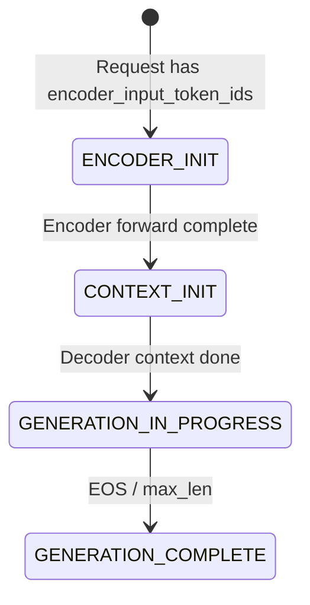
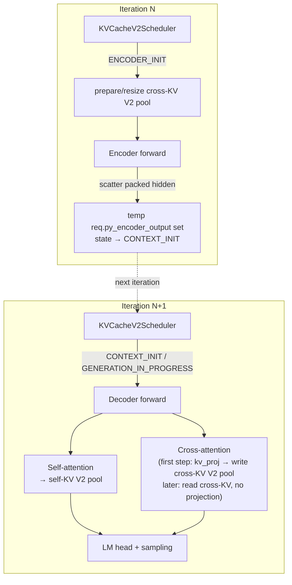

# Encoder-Decoder Models: Legacy C++ Flow and PyTorch Porting Guide

This guide has three parts:

- **Part 1** — how encoder-decoder models work in the legacy C++ / TensorRT flow. A condensed tour; the exhaustive file-by-file reference lives in [`legacy_enc_dec_architecture.md`](legacy_enc_dec_architecture.md).
- **Part 2** — the current state of encoder-decoder support in the PyTorch flow: what is already plumbed, and what the headline gaps are.
- **Part 3** — the porting plan. Structured as: `1. Model Graph`, `2. Runtime Executor`, `3. Request and Config Surface`, `4. Target-State Execution Flow`, `5. Parity Gaps vs. Legacy TRT Path`, `6. Performance Validation`, and `7. ETA`.

Scope: **text encoder-decoder models** (T5, BART, mBART). Whisper is out of scope — it additionally needs `encoder_input_features` / mel-spectrogram plumbing that is not part of this plan. This plan is **V2-only** on the PyTorch runtime: enc-dec requires `use_kv_cache_manager_v2=True`, explicit dual pools (`SELF` + `CROSS`), and beam width 1 in the baseline, matching `KVCacheManagerV2` constraints.

## Goal of this port

Achieve **parity with the legacy C++ / TensorRT path for the covered text enc-dec families** (specifically the `Executor::Impl` production path in §1.3, not the Python-runner fallback in §1.4) along two axes:

1. **Business-logic parity.** Same request state machine, same scheduling invariants (encoder and decoder never share a micro-batch, cross-KV is one-shot per request, etc.), same cross-KV lifecycle, and same chunked-context / KV-reuse / disagg-serving behaviors where those are in scope. At steady state, a user request going through the PyTorch path should match `ModelRunnerCpp` within the correctness bars in `Performance Validation` and follow the same state transitions.
2. **End-to-end performance parity.** Match the throughput / TTFT / TPOT / memory bars in `Performance Validation` on standard production workloads (IFB, paged self-KV + cross-KV, `TRTLLM` attention backend). The port must not silently drop perf-sensitive behavior the C++ path has (two-stream overlap, projecting encoder output into the cross-KV pool rather than stashing raw hidden states, KV reuse across enc-dec requests). Where the initial implementation intentionally trades perf for simplicity (for example, next-iteration dispatch in `Runtime Executor`), the doc calls it a **stage-1 shortcut** and spells out the stage-2 change needed to reach legacy-level performance.

Parity gaps and their classifications live in `Parity Gaps vs. Legacy TRT Path`; concrete acceptance criteria and the measurement method live in `Performance Validation`.

Once parity is reached for the covered text enc-dec families, the corresponding legacy TRT path (§1.2 build + §1.3 runtime) can be retired. Anything the port defers (Whisper, PP encoder, disagg enc-dec, see `Decoder-step extensions`) remains an explicit gap *vs. legacy* and must be tracked as such.

---

## Part 1: How Encoder-Decoder Works in the Legacy C++ / TensorRT Flow

### 1.1 Model Definition (TensorRT Network Graph)

All seq2seq families (T5, BART, mBART, Whisper, Pix2Struct, BLIP2, NMT) share a single unified Python implementation in [`tensorrt_llm/models/enc_dec/model.py`](tensorrt_llm/models/enc_dec/model.py). Three `PretrainedModel` subclasses:

- **`EncoderModel`** — self-attention-only transformer stack. On the last PP rank, `hidden_states` is marked as a TRT network output named `encoder_output`.
- **`DecoderModel`** — self-attention + **cross-attention** + MLP per layer, plus `lm_head`. Accepts `encoder_output` as an input tensor.
- **`WhisperEncoder`** — conv frontend + encoder stack (audio-specific).

Model-family differences (gated MLP for T5, positional-embedding flavor, etc.) are controlled by `PretrainedConfig` fields set during checkpoint conversion in [`examples/models/core/enc_dec/convert_checkpoint.py`](examples/models/core/enc_dec/convert_checkpoint.py).

Cross-attention in `DecoderLayer` uses the TRT-LLM `Attention` layer with `cross_attention=True`, backed by `gptAttentionPlugin` which has a dedicated `do_cross_attention` code path and a separate cross-KV cache.

### 1.2 Build Process

The build (via [`tensorrt_llm/builder.py`](tensorrt_llm/builder.py)) produces **two separate TRT engines** in subdirectories `encoder/` and `decoder/`:

- `BuildConfig.max_encoder_input_len` controls the encoder sequence-length budget.
- `DecoderModel.prepare_inputs` receives `max_decoder_input_len` and `max_encoder_input_len`.
- `WhisperEncoder.prepare_inputs` only needs `max_batch_size` (mel spectrograms are fixed-length).
- The decoder engine **skips** the standard `optimize(network)` post-pass (cross-attention op patterns regress under it).
- `--gpt_attention_plugin` is mandatory even on the encoder build, because the decoder's cross-attention relies on the same plugin's KV-cache layout.

### 1.3 Runtime — State Machine and C++ Executor (production path)



One logical `LlmRequest` per user request; the state machine is in [`cpp/include/tensorrt_llm/batch_manager/llmRequest.h`](cpp/include/tensorrt_llm/batch_manager/llmRequest.h). The C++ `Executor::Impl` ([`cpp/tensorrt_llm/executor/executorImpl.cpp`](cpp/tensorrt_llm/executor/executorImpl.cpp)) is the top-level orchestrator — it is what the production serving stack (`trtllm-serve`, Triton backend, `ModelRunnerCpp`) uses. Construction takes **both** engine paths:

```cpp
Executor(encoderModelPath, decoderModelPath,
         ModelType::kENCODER_DECODER, ExecutorConfig{...});
```

It parses both `config.json`s, instantiates a `TrtEncoderModel` (`mEncoderModel`) and a `TrtGptModelInflightBatching` (`mModel`), and drives them per iteration inside `Executor::Impl::forwardAsync`:

1. On new request arrival, `Impl` allocates per-request encoder-output storage (`allocEncoderOutput` / `allocEncoderOutputHost`).
2. `mEncoderModel->forwardAsync(activeRequests)` picks up `kENCODER_INIT` requests on its own CUDA stream, runs the encoder TRT engine, writes `encoder_output` back onto each `LlmRequest`, and transitions state to `kCONTEXT_INIT`.
3. `Impl` records a `CudaEvent` on the encoder stream and has the decoder stream wait on it (no half-written `encoder_output` is ever read).
4. `mModel->forwardAsync(activeRequests)` schedules only `kCONTEXT_INIT+` requests, binds the cross-attn tensors (`encoder_output`, `encoder_input_lengths`, cross-KV block offsets, `cross_attention_mask`, `skip_cross_attn_blocks`), and runs one decoder engine step — context (projects cross-KV) or generation (reads cross-KV).
5. On termination, both `mKvCacheManager` and `mCrossKvCacheManager` release their blocks.

**Two engines, two CUDA streams, one event per iteration.** Encoder- and decoder-phase requests are never mixed in the same micro-batch because each wrapper's scheduler is gated on a disjoint state range.

### 1.4 Runtime — Python Runner (legacy fallback)

[`tensorrt_llm/runtime/enc_dec_model_runner.py`](tensorrt_llm/runtime/enc_dec_model_runner.py) is a pure-Python two-engine runner used by `examples/models/core/enc_dec/run.py`, primarily for debugging and non-paged-KV builds. It does **not** do in-flight batching; it runs one request (or a padded static batch) at a time. The orchestration collapses into a Python function-call sequence, so most of the C++ components above have no equivalent in this path.

### 1.5 Key Observation

Legacy enc-dec never goes through the `GenerationExecutor` / `LLM` high-level API. Users reach it via one of two paths:

- **`ModelRunnerCpp`** — Python wrapper over the C++ `Executor::Impl`. Production-style execution with IFB, paged KV, cross-KV. Used by `trtllm-serve` and the Triton backend.
- **`EncDecModelRunner`** — pure-Python session, non-IFB fallback.

In both cases the caller constructs a `trtllm.Request` with encoder fields (`encoder_input_token_ids` or `encoder_input_features`) explicitly.

---

## Part 2: PyTorch Flow — Headline Gaps

The PyTorch flow is architected around **decoder-only causal LMs**. Enc-dec infrastructure is partially plumbed but unwired end-to-end. This plan defines the PyTorch enc-dec port as **V2-only**: `use_kv_cache_manager_v2=True` with an explicit dual-pool design (`SELF` + `CROSS`). The runtime scope therefore includes first-class `KVCacheManagerV2` / `scheduler_v2.py` support for two pools.

| Gap                          | Symptom                                                                                                       |
| ---------------------------- | ------------------------------------------------------------------------------------------------------------- |
| **Request path**             | `executor_request_to_llm_request` hard-codes `encoder_input_tokens=None` ([`llm_request.py`](tensorrt_llm/_torch/pyexecutor/llm_request.py) L1013), so `LlmRequestState` never initializes to `ENCODER_INIT` on the live PyTorch request path. |
| **Model graph**              | `Attention` module is self-attention-only; no `CrossAttention`; no `EncoderDecoderLayer`; no top-level enc-dec model class registered.                                   |
| **Attention backend**        | The default production `TRTLLM` attention backend asserts `not metadata.is_cross`, so the runtime has no live cross-attention path.                                      |
| **V2 scheduler admission**   | `KVCacheV2Scheduler` knows what `ENCODER_INIT` means, but live construction defaults to `no_schedule_until_state=CONTEXT_INIT`, so encoder requests are not admitted automatically. |
| **V2 dual-pool cache**       | `KVCacheManagerV2` can be instantiated with `CacheType.CROSS`, but the PyTorch runtime constructs only one primary `SELF` manager and never builds a second explicit cross pool. |
| **Config signal**            | `ModelConfig.is_encoder_decoder` does not exist in `_torch/` at all, so nothing downstream can branch on enc-dec-ness or enforce the V2-only contract.                    |

What **does** exist: `KVCacheV2Scheduler` has an encoder scheduling path keyed off `ENCODER_INIT`; `KVCacheManagerV2` accepts a `kv_cache_type`; `AttentionMetadata` models cross-attention sub-metadata; and the low-level `thop.attention` / `thop.qkv_preprocessing` C++ ops accept `cross_kv_input`, `encoder_seq_lens`, and `cross_attention`. So the port is mostly **Python/runtime wiring**, not a new kernel project, with the main runtime work concentrated in V2 scheduler and resource-manager integration.

---

## Part 3: Porting Plan

Organized by abstraction axis, in build-up order:

- **1. Model Graph** — the `nn.Module`s to add. Unit-testable in isolation.
- **2. Runtime Executor** — how `PyExecutor` drives the two-phase (encoder, decoder) flow per iteration. Depends on `Model Graph`.
- **3. Request and Config Surface** — entry points (`LlmRequest`, `GenerationRequest`, `LLM.generate()`, `ModelConfig`). Thin but end-user-visible.

Cross-references to [`legacy_enc_dec_architecture.md`](legacy_enc_dec_architecture.md) sections (§2.x) are given in parentheses throughout.

This plan chooses an explicit dual-pool V2 design throughout: one `KVCacheManagerV2` for self-attention (`CacheType.SELF`) and one `KVCacheManagerV2` for cross-attention (`CacheType.CROSS`). Any place below that says "self pool" or "cross pool" refers to those separate managers, not a single fused V2 cache.

---

### 1. Model Graph

**Files:** `_torch/modules/attention.py`, `_torch/models/modeling_utils.py`, `_torch/models/` (new `modeling_t5.py`, `modeling_bart.py`), `_torch/models/checkpoints/`

#### New `CrossAttention` module

Accept encoder_hidden_states as K/V source instead of self-attention KV. Must support paged cross-KV cache (separate pool from self-KV). The TRT-LLM thop.qkv_preprocessing C++ op already has `cross_kv_input` and `encoder_seq_lens` parameters available in the interface.

| §2.9 cross-attn behavior                                             | PyTorch equivalent                                                                                                |
| -------------------------------------------------------------------- | ----------------------------------------------------------------------------------------------------------------- |
| Context phase — project K/V once from `encoder_output`, write into cross-KV pool | `CrossAttention.forward` runs `kv_proj(encoder_hidden_states)` and passes the result as `cross_kv_input`  |
| Generation phase — read cross-KV from pool, no projection            | Same `forward` with `cross_kv_input=None`; a per-request flag `skip_cross_kv_projection` controls the branch     |
| K/V bounds use `encoder_input_lengths`                               | Pass `encoder_seq_lens=cross_attn_metadata.encoder_seq_lens` instead of `None`                                    |
| K/V block tables point at the **cross** pool                         | `kv_cache_block_offsets` + `host_kv_cache_pool_{pointers,mapping}` bind the cross pool for this call only         |

- The `thop.attention()` C++ kernel and `thop.qkv_preprocessing()` already accept `cross_kv_input`, `encoder_seq_lens`, and `cross_attention` parameters; the enc-dec path needs to wire them through.
- Wire these parameters for cross-attention layers. Likely needs a separate `AttentionMetadata` (or sub-struct) for the cross-attention pass with `encoder_seq_lens`, `cross_kv_cache_block_offsets`.
- The default `TRTLLM` attention backend rejects `metadata.is_cross`, so stage-1 needs either a cross-capable backend path (`thop` / `trtllm_gen`) or a `TRTLLM` backend extension before enc-dec can run end-to-end.

#### Encoder, `EncoderDecoderLayer`, and top-level model

- **`EncoderModel`** — stack of self-attention layers with `is_causal=False`. Produces packed hidden states of shape `[sum(encoder_output_len), hidden_size]` on the last PP rank (matching the shape contract from §2.6 point 3b). Could reuse the existing `DecoderModel` class with `is_causal=False` or be a separate class; either is fine.
- **`EncoderDecoderLayer`** — like `DecoderLayer` but with an extra cross-attention sublayer between self-attention and MLP. Its `forward()` should mirror the decoder-layer inputs, with added `encoder_hidden_states`, `cross_attn_metadata`, and `skip_cross_kv_projection` arguments.
- **Top-level class** (e.g. `EncoderDecoderModelForConditionalGeneration`) composes encoder + decoder + `lm_head`.

#### Weight loading and architecture registration

- **Architecture registration**: register the top-level class for `T5ForConditionalGeneration`, `BartForConditionalGeneration`, and `MBartForConditionalGeneration`. `mBART` and BART share the same weight schema.
- **HF config normalization**: `load_pretrained_config` must normalize T5 and BART's different encoder/decoder layout fields into one internal `ModelConfig`, including `encoder_num_hidden_layers`, `decoder_num_hidden_layers`, `encoder_num_heads`, and `encoder_num_kv_heads`.
- **Direct HF weight loading**: add `_torch/models/checkpoints/` loaders mapping HF `t5.*` / `bart.*` names onto the new model. This replaces the legacy TRT-only `convert_checkpoint.py` path: no encoder/decoder directory split and no separate weight-format conversion.

---

### 2. Runtime Executor

Two observations that shape this whole section:

1. **The PyTorch flow has no `TrtEncoderModel` and no `TrtGptModelInflightBatching` peer classes.** The existing `PyTorchModelEngine` is already the decoder IFB loop, and the encoder is added as a new step in the same loop — not a new orchestrator class.
2. **Dispatch is next-iteration, not same-iteration** (diverging from the C++ `Executor::Impl::forwardAsync`). Rationale below.

**Files:** `_torch/pyexecutor/model_engine.py`, `_torch/pyexecutor/py_executor.py`, `_torch/pyexecutor/scheduler/scheduler_v2.py`, `_torch/pyexecutor/resource_manager.py`, `_torch/pyexecutor/_util.py`

**Scope note.** This section is the production baseline for the port. Enc-dec is supported only on `use_kv_cache_manager_v2=True`; the supported runtime path is `KVCacheManagerV2` + `scheduler_v2.py`.

#### Encoder step (analog of `TrtEncoderModel`, §2.6–§2.7)

PyTorch does not need a separate `TrtEncoderModel`-style wrapper. Reuse the existing `PyTorchModelEngine` and scheduler, and treat encoder work as a special kind of scheduled context work keyed by request state.

- **Scheduler admission**: when `model_config.is_encoder_decoder`, construct `KVCacheV2Scheduler` with `no_schedule_until_state=ENCODER_INIT` and an explicit `enc_dec_kv_cache_manager`. `ENCODER_INIT` admission reserves/resizes the **cross** pool using `encoder_output_len`; the self pool stays untouched until decoder context. The executor then splits the scheduler's `context_requests` bucket into encoder requests (`ENCODER_INIT`) vs true decoder-context requests (`CONTEXT_INIT`). This preserves the invariant that encoder and decoder requests never share one micro-batch.
- **Encoder input packing**: add an encoder branch in `_prepare_tp_inputs` that concatenates `req.encoder_tokens`, builds `[0, encoder_len)` positions and length tensors, emits non-causal `AttentionMetadata` with no KV block tables, and produces packed inputs shaped like `EncoderBuffers`: `[sum(encoder_output_len), hidden_size * tp_size]`.
- **Encoder forward + scatter**: add `_forward_step_encoder` on `PyTorchModelEngine`, patterned on `_forward_step_mm_encoder_only`, to run `self.model.encoder(**inputs)` and produce packed encoder hidden states. Add `_scatter_encoder_output` on `PyExecutor` to slice that packed output back into per-request tensors, store each slice temporarily on `req.py_encoder_output`, and transition the request from `ENCODER_INIT` to `CONTEXT_INIT`. Reuse the existing `inflight_request_ids` guard; no extra duplicate-launch mechanism is needed.
- **Executor-loop integration**: in `_executor_loop`, schedule normally, split the scheduler's `context_requests` bucket into encoder vs decoder-context subsets, run the encoder subset first, scatter the results, then send only decoder-context and generation requests through the normal decoder IFB step. Stage-1 uses **next-iteration dispatch**: after scatter, the request becomes `CONTEXT_INIT` and is picked up by the next scheduler iteration for decoder context. This is simpler than same-iteration C++-style dispatch, but adds one scheduler tick to TTFT. `_executor_loop_overlap` needs the same encoder branch.
- **Encoder-output lifetime**: use `req.py_encoder_output` only as a temporary buffer between encoder forward and the first decoder context step. That first decoder context step should project directly into the cross-KV V2 pool and then free the raw hidden states, matching legacy lifetime and memory behavior.
- **PP / TP**: match legacy for now by rejecting `pp_size > 1` on encoder-decoder models unless encoder send/recv hooks are added. TP already works with the existing `Attention` sharding.

#### Decoder-step extensions (analog of `TrtGptModelInflightBatching` cross-attn, §2.8)

The decoder side does **not** need a new orchestrator class. `PyTorchModelEngine._forward_step` stays in place; enc-dec support is added by passing cross-attention inputs and metadata into the existing decoder step.

- **Scheduler behavior**: no decoder-side state change is needed. Decoder scheduling starts at `CONTEXT_INIT`, and the V2 path must resume/verify the cross pool alongside the self pool before cross-attention can read from it.
- **Cross-attention metadata**: in `_prepare_tp_inputs`, build `cross_attn_metadata` alongside the existing self-attention metadata for each scheduled enc-dec request. It should carry `encoder_hidden_states` (from the temporary `req.py_encoder_output` on the first context step), `encoder_seq_lens`, cross-pool block tables, and the derived cross-attention mask. Q-side lengths still come from the decoder request; K/V-side lengths come from the encoder.
- **First context step vs later steps**: use a per-request Python bool `req.py_skip_cross_kv_projection` as the PyTorch equivalent of the C++ `skip_cross_attn_blocks` scalar input. Initialize it to `False`, so the first decoder context step projects K/V from `encoder_output` and writes the cross-KV pool. After that context step completes, flip it to `True`, so later decoder steps read cross-KV without re-projecting.
- **No new batch shape or decoder entry point**: `ScheduledRequests` stays unchanged, because first-vs-later cross-attention behavior is a per-request flag, not a new batch type. `_forward_step` also stays unchanged as an entry point; it just receives richer metadata, and `CrossAttention` handles the branching internally.
- **Chunked context**: if decoder context is chunked, project cross-KV only on the first context chunk (`req.is_first_context_chunk`), then keep `py_skip_cross_kv_projection=True` for later chunks.
- **KV cache reuse**: match legacy by enabling cross-KV reuse keyed by `LlmRequest.get_encoder_unique_tokens()`, while keeping self-KV reuse namespaced with those encoder-unique tokens. This preserves reuse without allowing decoder prefixes from different encoder inputs to collide.
- **Disaggregated serving**: out of scope for this plan. The decoder-side worker will need the same `cross_attn_metadata` even if encoder work ran on the context worker.

#### Dual-pool KV cache (analog of `crossKvCacheFraction` + `KvCacheType::kCROSS`, §2.8)

The explicit design choice for this plan is **two independent `KVCacheManagerV2` instances**, not one shared manager with mixed self/cross roles.

- **Two V2 pools, one config knob**: when `model_config.is_encoder_decoder`, require `use_kv_cache_manager_v2=True` and `kv_cache_config.cross_kv_cache_fraction`, reject both settings for decoder-only models, and build two `KVCacheManagerV2` instances: one `SELF` pool sized by `1 - cross_kv_cache_fraction` and one `CROSS` pool sized by `cross_kv_cache_fraction`. Store both on `ResourceManager` and plumb both through `_util.create_kv_cache_manager(...)`.
- **Scheduler integration**: extend `KVCacheV2Scheduler` to accept `enc_dec_kv_cache_manager` in addition to the existing self manager. `ENCODER_INIT` uses `enc_dec_kv_cache_manager.prepare_context(req)` / `resize_context(req, req.encoder_output_len)`. `CONTEXT_INIT` and generation keep using the self manager as the primary budget owner, but they must also ensure the cross pool is resumable/active before decoder cross-attention reads from it.
- **Per-request lifetime**: the cross pool is allocated once per request on the encoder-to-decoder transition and then reused for every decoder step. The self pool follows the normal decoder context/generation lifecycle. On termination, free both pools; forgetting the cross-pool free path is the easiest way to leak memory.
- **Reuse policy**: match legacy by enabling cross-KV reuse keyed by `LlmRequest.get_encoder_unique_tokens()`, and keep self-KV reuse namespaced with those encoder-unique tokens for enc-dec requests.
- **Sizing detail**: size the cross pool from the encoder-side / cross-attention KV head count (`encoder_num_kv_heads` when present), not from the decoder self-attention KV head count.
- **Non-goal**: do **not** invent a single fused V2 page layout that stores self and cross KV together for stage-1. The supported design is explicit dual-pool `SELF` + `CROSS`.

---

### 3. Request and Config Surface

Thin but end-user-visible. Scope: text-token path only (Whisper's `encoder_input_features` plumbing remains out of scope).

**Files:** `_torch/pyexecutor/llm_request.py`, `_torch/model_config.py`, `tensorrt_llm/executor/request.py`, `tensorrt_llm/executor/base_worker.py`, `tensorrt_llm/llmapi/llm.py`

#### Request plumbing

The C++ `LlmRequest` (§2.4) already carries every encoder-decoder field needed. The Python bindings expose them too. Porting is mostly wiring, but the PyTorch path needs one extra thing spelled out clearly: **the seq2seq request contract**.

An encoder-decoder request carries **two token sequences**: `encoder_input_token_ids` for the source sequence, and decoder input tokens for the decoder context step. For normal T5/BART-style generation, the decoder side usually starts from `[decoder_start_token_id]`, but callers may provide explicit `decoder_input_token_ids` for forced decoder prefixes.

- **Public API contract**: `LLM.generate`, `LLM.generate_async`, and `LLM.preprocess` should accept `encoder_inputs` / `encoder_input_token_ids` plus optional `decoder_input_token_ids`. If the decoder-side tokens are omitted, synthesize `[decoder_start_token_id]` from the model config. If that id is missing, fail validation rather than guessing a BOS token.
- **Internal request contract**: keep `prompt_token_ids` / `input_token_ids` as the decoder-side token sequence, and add `encoder_input_token_ids` for the encoder-side sequence. This matches the legacy runner contract: the runtime receives both token streams explicitly, not "decoder-only plus an extra encoder tensor."
- **State-machine wiring**: in `executor_request_to_llm_request`, stop hard-coding `encoder_input_tokens=None` and pass through `encoder_input_token_ids` from the executor request. Once that field is wired, `LlmRequestState` auto-initializes to `ENCODER_INIT`; no separate state-setting hook is needed.
- **High-level API plumbing**: extend `GenerationRequest`, `BaseWorker._enqueue_request`, `LLM.preprocess`, `PreprocessedInputs`, `LLM.generate`, and `LLM.generate_async` to carry the new encoder-side field while keeping decoder-only behavior unchanged.
- **Shared config prerequisite**: add `is_encoder_decoder: bool = False` to `_torch/model_config.py`, populate it from the HF config's top-level `is_encoder_decoder` field, and propagate it through `_torch/pyexecutor/config_utils.py` so `ResourceManager`, `PyTorchModelEngine`, and `PyExecutor` can branch on enc-dec models. When `is_encoder_decoder=True`, require `use_kv_cache_manager_v2=True`, require `cross_kv_cache_fraction`, and reject the V1 path so there is only one supported runtime contract.
- **Encoder-output result path**: internal execution can use `req.py_encoder_output` only as a temporary GPU buffer until the first decoder context step projects into cross-KV and frees it. If `return_encoder_output` is preserved, add a separate host/result path so the user-visible result does not extend the GPU lifetime.

Without this wiring, the high-level `LLM` API remains decoder-only and enc-dec users have to drop down to `ModelRunnerCpp`, which is exactly the gap this section is meant to close.

---

### 4. Target-State Execution Flow



Key properties visible in the diagram:

- Encoder and decoder execute in **separate iterations** (next-iteration dispatch, stage-1 shortcut — see `Parity Gaps vs. Legacy TRT Path`).
- The runtime owns **two independent V2 pools** per enc-dec request: self-KV and cross-KV.
- Only the decoder forward writes to the cross-KV pool, and only on the first context step.
- The scheduler, not the model, owns the phase transition via request state.

---

### 5. Parity Gaps vs. Legacy TRT Path

This section lists the remaining differences from the legacy C++ / TensorRT path (§1.3), their impact, and how they close.

**Legend:** Stage-1 = temporary shortcut for correctness. Permanent = neutral or better-than-legacy divergence. Must-close = legacy feature still missing.

| # | Gap | Where introduced | Parity impact | Classification | How it closes |
|---|-----|------------------|---------------|----------------|---------------|
| G1 | **Next-iteration dispatch**: encoder runs in iteration N and decoder context runs in N+1, unlike legacy same-iteration dispatch. | `Runtime Executor` preamble, `Encoder step` | Adds about one scheduler tick to TTFT for new enc-dec requests. | **Stage-1** | Re-run decoder dispatch in the same iteration, ideally with the legacy-style two-stream + event handshake. |
| G2 | **Single-stream execution**: encoder and decoder share one CUDA stream. Legacy uses two streams plus one event per iteration. | `Encoder step` | Loses encoder/decode overlap and hurts steady-state throughput. | **Stage-1** | Add a second CUDA stream for encoder work and a decoder wait event. Closed together with G1 under the recommended stage-2a design. |
| G3 | **`_executor_loop_overlap` lacks the encoder branch**. Stage-1 only wires the non-overlap loop first. | `Encoder step` | Production IFB overlap mode cannot run enc-dec benchmarks until this lands. | **Must-close before perf benchmarks** | Thread the encoder/decode split through `_executor_loop_overlap`, including `previous_batch`, speculative-decoding state, delayed updates, and empty-rank cases. |
| G5 | **Disaggregated serving is out of scope.** Legacy supports enc-dec disagg. | `Decoder-step extensions` | Existing disagg enc-dec users cannot migrate yet. | **Must-close before retiring legacy** | Make the decoder worker receive the required cross-attention state even when encoder work ran on the context worker. |
| G6 | **Whisper / feature-input path is out of scope.** Legacy supports it. | Scope, `Request plumbing` | Whisper users cannot migrate yet. | **Must-close before retiring legacy** | Separate port for feature-input model graph and encoder packing. |
| G7 | **Two-engine build becomes one `nn.Module`.** Legacy uses separate `encoder/` and `decoder/` engine directories. | Build/runtime structure | None on parity; deployment is simpler. | **Permanent (better than legacy)** | No action. |
| G8 | **No executor-level `ModelType::kENCODER_DECODER` enum dispatch.** PyTorch uses `ModelConfig.is_encoder_decoder` instead. | Config/runtime structure | None; this is only a structural difference. | **Permanent (better than legacy)** | No action. |

---

### 6. Performance Validation

Use one fixed baseline config, one workload matrix, one correctness bar, and one performance bar.

#### Baseline configuration (identical between legacy and port)

| Knob | Value |
|------|-------|
| Model | `google/t5-base`, the Hugging Face BART-base checkpoint; add `google/flan-t5-large` for a second size class |
| Precision | BF16 weights, BF16 KV cache |
| TP | 1 and 2 |
| PP | 1 only |
| Beam width | 1 |
| Attn backend (port) | `TRTLLM` |
| KV manager (port) | `use_kv_cache_manager_v2=True` (explicit dual `KVCacheManagerV2`: `SELF` + `CROSS`) |
| KV cache | Paged, `tokens_per_block=64`, `cross_kv_cache_fraction=0.5` |
| Scheduler | IFB (`_executor_loop_overlap` mode) |
| Request stream | Fixed seed, fixed arrival pattern, fixed `encoder_input_token_ids` / decoder-target pairs |

Before running any benchmark, confirm both paths use the same `max_batch_size`, `max_num_tokens`, `cross_kv_cache_fraction`, `tokens_per_block`, `kv_cache_reuse`, and `max_seq_len`, and confirm the V2 self/cross pools are sized from the expected decoder-side vs encoder-side KV head counts.

#### Benchmark matrix

| Profile | Encoder len | Decoder in/out | Concurrency | What it exercises |
|---------|-------------|----------------|-------------|-------------------|
| **Summarization** | 512 / 1024 (long source) | 1 / 128 | 1, 8, 32, 64 | Encoder dominates; cross-KV memory footprint still matters at high concurrency. |
| **Translation** | 32 / 64 (short source) | 1 / 64 | 1, 32, 128 | Many small requests; admission rate dominates; stresses G1 (TTFT) and G2 (stream overlap). |
| **Long-form generation** | 128 (medium source) | 1 / 1024 | 1, 8, 16 | Decoder dominates; cross-attn read per-step perf matters; stresses cross-KV read path. |

`Decoder in = 1` reflects the normal enc-dec generation contract: when the caller does not provide explicit `decoder_input_token_ids`, the runtime seeds the decoder with a single token `[decoder_start_token_id]`. Benchmarks that exercise forced decoder prefixes should be called out separately rather than folded into the default matrix.

For each cell, measure: **Throughput**, **TTFT** (p50/p99), **TPOT** (p50), **Peak GPU memory**, and **Goodput**.

**Benchmark harness note.** Current `trtllm-bench` is decoder-only on the request schema, so `Performance Validation` needs one of these first:

1. **Extend `trtllm-bench` for enc-dec** — add `encoder_input_token_ids` and optional `decoder_input_token_ids` to the dataset JSON schema, `InferenceRequest`, dataset parser, and async request-submission path.
2. **Use a dedicated enc-dec harness** — legacy side via `ModelRunnerCpp` / `trtllm.Request`, port side via `LLM.generate()` once the `Request plumbing` API surface lands.

In both cases, the two baselines must consume the same `(encoder_input_token_ids, decoder_input_token_ids | decoder_start_token_id, max_new_tokens)` request stream.

#### Correctness bar

1. **Logit parity.** On a fixed 100-prompt eval set, compare decoder logits step-by-step between legacy (greedy, temperature=0) and port (same). Pass bar: max absolute diff < 1e-2 on BF16 (accounts for kernel-order nondeterminism), exact argmax match on ≥ 99% of steps.
2. **State-machine parity.** Emit `(request_id, state)` transition traces from both paths on the same request stream. Pass bar: byte-identical state transition sequences.
3. **Cross-KV reuse behavior.** Send two requests with identical `encoder_input_token_ids`. Pass bar: the second request allocates 0 new cross blocks.
4. **Chunked-context consistency.** Run a request with `max_num_tokens` < encoder length so decoder context is chunked. Pass bar: final logits match the unchunked run within the logit-parity tolerance.

#### Performance bar

Apply these bars on every cell of the benchmark matrix, **after G1, G2, and G3 are closed**:

| Metric | Pass bar |
|--------|----------|
| Steady-state throughput | ≥ 95% of legacy |
| p50 TTFT | ≤ 110% of legacy |
| p99 TTFT | ≤ 115% of legacy |
| p50 TPOT | ≤ 105% of legacy |
| Peak GPU memory | ≤ 105% of legacy |
| Goodput | ≥ 95% of legacy |

**Stage-1 bar.** Before G1/G2/G3 are closed, gate only on `Correctness bar` and "does not OOM." Do not treat stage-1 perf numbers as representative.

#### Retiring the legacy path

1. `Correctness bar` passes on all models in `Baseline configuration`.
2. `Performance bar` passes on all cells in `Benchmark matrix`.
3. G3, G5, G6 are closed (all feature-parity gaps).
4. G1 and G2 are resolved (all remaining stage-1 shortcuts replaced with stage-2 parity targets).

G7 and G8 do not block retirement.

---

### 7. ETA

#### Recommended implementation order

Ordered to make the core enc-dec model and weight loading work first so real HF checkpoints are available early for validation; attention backend, KV-cache behavior, and integration tests build on that foundation; scheduler, request-state, and API integration land after that baseline is stable.

1. **`ModelConfig.is_encoder_decoder` + V2-only validation** (`ModelConfig.is_encoder_decoder`) — add the one-line signal plus the "enc-dec requires `use_kv_cache_manager_v2=True`" validation.
2. **`CrossAttention` module + `EncoderDecoderLayer` + top-level model class** (`CrossAttention`; `Encoder, EncoderDecoderLayer, and top-level model`) — unit-testable with direct `forward()` calls on dummy tensors.
3. **Weight-loading and architecture registration** (`Weight loading and architecture registration`) — make real HF checkpoints load into the new model.
4. **Explicit dual-pool `KVCacheManagerV2` construction** (`Dual-pool KV cache`) — create `SELF` + `CROSS` `KVCacheManagerV2` pools in `ResourceManager` / `_util.py` and size them from `cross_kv_cache_fraction`. This is a prerequisite for the attention backend wiring that follows.
5. **Attention-backend wiring + decoder cross-attn integration** (`CrossAttention` backend availability; `Decoder-step extensions`) — with the dual-pool V2 KV cache in place, wire the `TRTLLM` attention backend for encoder-decoder models end-to-end: (a) encoder self-attention through the self pool, (b) cross-attention through the cross pool (`encoder_seq_lens`, differing Q/K lengths, `is_cross` metadata path, per-request `skip_cross_kv_projection`), (c) tie model graph, backend selection, and dual-pool KV metadata together. Switch tests from `VANILLA` to `TRTLLM` backend to validate.
6. **V2-focused tests and smoke benchmarks** — validate the model/backend/cache stack before runtime bring-up.
7. **`KVCacheV2Scheduler` dual-manager admission** (`Encoder step`; `Dual-pool KV cache`) — teach the V2 scheduler about `ENCODER_INIT`, the cross pool, and the self/cross resume rules.
8. **Encoder step in `PyTorchModelEngine` + `PyExecutor`** (`Encoder step`) — add the two-phase iteration driver on top of the validated model/backend/cache path.
9. **Internal request/state wiring** (`Request plumbing`: internal request contract + state-machine wiring) — wire `encoder_input_token_ids` through `LlmRequest` so real requests reach `ENCODER_INIT`.
10. **High-level API / preprocessing / result surface** (`Request plumbing`: public API contract, high-level API plumbing, encoder-output result path) — `LLM.preprocess()`, `LLM.generate()` / `generate_async()`, and `return_encoder_output` if preserved.

#### Stage-1 — correctness baseline (per-step estimates)

Numbers below are rough **focused engineer-days** for one engineer implementing with `Claude Code` or `Cursor`, assuming no major unrelated scheduler / resource-manager bugs appear. These are **effort estimates, not elapsed schedule estimates**: the work should land as multiple PRs, so actual calendar time will be longer because of review and CI waits.

Ends when the `Correctness bar` passes on T5-base / BART-base with the stage-1 shortcuts in place (G1, G2, G3 still open). This milestone is "enc-dec request runs end-to-end through `LLM.generate()` on V2 dual-pool KV cache."

| # | Step | ETA (days) | Risk notes |
|---|-------------|------------|------------|
| 1 | `ModelConfig.is_encoder_decoder` + V2-only validation | 0.5 | Trivial signal, but make the V2-only validation explicit early so later code can assume one runtime contract. |
| 2 | `CrossAttention` module + `EncoderDecoderLayer` + top-level model class | 3–5 | Main model-graph work; risk is metadata-schema and weight-name alignment. |
| 3 | Weight-loading and architecture registration | 3–5 | HF config normalization is straightforward, but checkpoint bring-up and weight-name mismatch debugging can take longer than the initial loader scaffolding. |
| 4 | Explicit dual-pool `KVCacheManagerV2` construction — `Dual-pool KV cache` | 2–4 | Main risk is getting the self/cross memory split and ownership semantics right in `ResourceManager` / `_util.py`. Prerequisite for attention backend wiring. |
| 5 | Attention-backend wiring + decoder cross-attn integration | 5–8 | Merged scope: encoder self-attention through self pool, cross-attention through cross pool, `is_cross` metadata path, `skip_cross_kv_projection`, and tying model graph + backend + dual-pool metadata together. Default backend rejects cross attention, so there is real backend enablement work here. |
| 6 | V2-focused tests and smoke benchmarks | 2–3 | Needed to stabilize the model/backend/cache stack before scheduler and executor bring-up. |
| 7 | `KVCacheV2Scheduler` dual-manager admission / resume — `Encoder step`; `Dual-pool KV cache` | 3–5 | Main risk is asymmetric self/cross lifecycle bugs under suspend, resume, chunking, and budget pressure. |
| 8 | Encoder step in `PyTorchModelEngine` + `PyExecutor` — `Encoder step` | 3–4 | Largest orchestration surface; scheduler split and state timing are the main risks. |
| 9 | Internal request/state wiring — `Request plumbing`: internal request contract + state-machine wiring | 1 | Small diffs with one high-leverage unlock in `llm_request.py`. |
| 10 | High-level API / preprocessing / result surface — `Request plumbing`: public API contract, high-level API plumbing, encoder-output result path | 1–2 | Small but user-visible surface. |
| | **Stage-1 total (sum of ranges)** | **24.5–37.5 focused days** | Critical path is 2 → 4 → 5 → 7 → 8 → 9. |

#### Full path to legacy retirement — per-stage rollup

Continues past stage-1 through the gaps that `Parity Gaps vs. Legacy TRT Path` flags as must-close or stage-1 shortcuts.

| Stage | Scope | Gaps closed | ETA (days) | Notes |
|-------|-------|-------------|------------|-------|
| **Stage-1** | V2-only correctness baseline with explicit dual `KVCacheManagerV2` pools (table above) | — (shortcuts G1/G2/G3 still open by design) | 22.5–35.5 | Passes `Correctness bar`; `Performance bar` is not attempted. |
| **Stage-1.5 Overlap-loop wiring** | Thread enc-dec through `_executor_loop_overlap`; enable `Performance Validation` benchmarking on the committed `trtllm` backend | G3 | 4–7 | `_executor_loop_overlap` is a deeper control-flow port than `_executor_loop`; expect extra integration/debug time here. |
| **Stage-2a Same-iteration dispatch + second stream** | Add CUDA-event / two-stream encoder handshake; restore encoder/decoder overlap | G1, G2 | 4–6 | Two-stream variant is the recommended target. |
| **Must-close feature gaps** | Disagg enc-dec (G5), Whisper feature-input path (G6) | G5, G6 | 7–12 | Heaviest remaining feature work; if Whisper stays out of scope, subtract ~3–5 days. |
| **Benchmark harness** | Extend `trtllm-bench` for enc-dec or build the dedicated `Performance Validation` harness | — | 2–6 | Lower end assumes a dedicated harness; higher end assumes a real `trtllm-bench` extension. |
| **Perf-parity validation** | Run `Benchmark matrix`, meet `Performance bar` on T5 / BART / Flan-T5 | — | 5–8 | Includes config-equivalence debugging plus TTFT / throughput / memory triage on any bar miss. |
| **Legacy retirement cleanup** | Remove `TrtEncoderModel`, `EncDecModelRunner`, `convert_checkpoint.py` enc-dec branch, deprecation notices, doc updates | — | 2–3 | Still non-trivial because examples and tests depend on the legacy path. |
| | **Full total** | G1, G2, G3, G5, G6 closed; G7/G8 are permanent divergences | **46.5–77.5 focused days** | Excluding Whisper (G6), total drops to **43.5–74.5 focused days**. |

#### Calibration notes

These ranges assume one engineer using `Claude Code` or `Cursor` for implementation and iteration, plus no major unrelated scheduler / resource-manager bugs. The main source of variance is the explicit dual-pool V2 work in `ResourceManager` / `KVCacheV2Scheduler`; the rest of the plan is mostly model wiring and executor integration. These tools mainly reduce drafting and plumbing time; review, CI, GPU debugging, and perf validation remain the pacing items. Stage-1 should land as several PRs rather than one, so elapsed calendar time will exceed the focused-day totals above. For tracking, use the gap IDs in `Parity Gaps vs. Legacy TRT Path` as the dashboard: `Gap | Status | PR link | Benchmark delta`.

---

### Open question: inference dtype for encoder-decoder models (float32 vs bfloat16)

Both `t5-small` and `bart-large-cnn` (and most other T5/BART checkpoints on HuggingFace) ship with **all parameters in float32**. Neither model card specifies a recommended inference dtype. The legacy TRT backend accepts `--dtype float32` as a first-class option and disables `context_fmha` (flash attention) when running in float32.

**The question**: should the PyTorch path serve these models in their native float32, cast to bfloat16 for performance, or let the user choose?

#### Impact on the PyTorch path today

Several components in the PyTorch inference stack only support fp16/bf16 and will fail or produce incorrect results on float32 inputs:

| Component | float32 behaviour | Current mitigation |
|-----------|-------------------|-------------------|
| **flashinfer `rmsnorm` kernel** | Crashes with `failed to dispatch data type` — the CUDA kernel only handles fp16/bf16 | `RMSNorm.forward` now checks `hidden_states.dtype` and falls back to the pure-PyTorch manual implementation for float32 (same numerical result, slower) |
| **`flash_attn_varlen_func`** (used by VANILLA backend `no_kv_cache_forward`) | Raises `FlashAttention only support fp16 and bf16 data type` | `VanillaAttention.no_kv_cache_forward` now checks dtype and falls back to `torch.nn.functional.scaled_dot_product_attention` per-request for float32 |
| **`LayerNorm`** (used by BART) | Works — pure PyTorch `F.layer_norm`, no kernel dependency | No mitigation needed |
| **T5 custom SDPA** (in `T5Attention.forward` with position bias) | Works — pure PyTorch matmul + softmax | No mitigation needed |
| **TRTLLM attention backend** (production backend, not VANILLA) | Unknown — needs investigation | Not yet tested with float32 enc-dec models |

#### Trade-offs

| | float32 | bfloat16 |
|---|---------|----------|
| **Accuracy** | Exact parity with HF reference | Small numerical divergence (max_diff ~0.05–0.08 for large models like bart-large-cnn with 12 layers) |
| **Performance** | Slower: no flash-attn, no flashinfer RMSNorm, 2× memory bandwidth | Faster: flash-attn, flashinfer kernels, halved memory footprint |
| **Memory** | 2× parameter memory vs bf16 | Standard for GPU inference |
| **TRT legacy parity** | Matches `--dtype float32` path | Matches `--dtype bfloat16` path |
| **User expectation** | Users of T5/BART may expect float32 since that is the checkpoint dtype | Users of TRT-LLM generally expect half-precision inference |

#### Recommendation (to be decided)

This should be an explicit user-facing choice (e.g. via `torch_dtype` in the config or a serving flag). The fallbacks are in place so float32 *works*, but serving in float32 leaves performance on the table. A sensible default might be:

- **Default to bfloat16** for the PyTorch path (matching modern LLM conventions and getting full kernel acceleration)
- **Support float32** as an opt-in for users who need exact HF numerical parity or are migrating from the legacy TRT path with `--dtype float32`
- **Document the trade-off** clearly in the deployment guide

This decision affects how `trtllm-serve` and the LLM API will handle encoder-decoder configs and should be resolved before the serving integration (Step 9–11).
