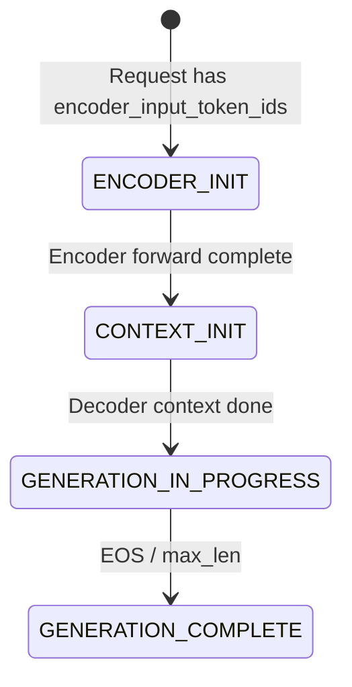
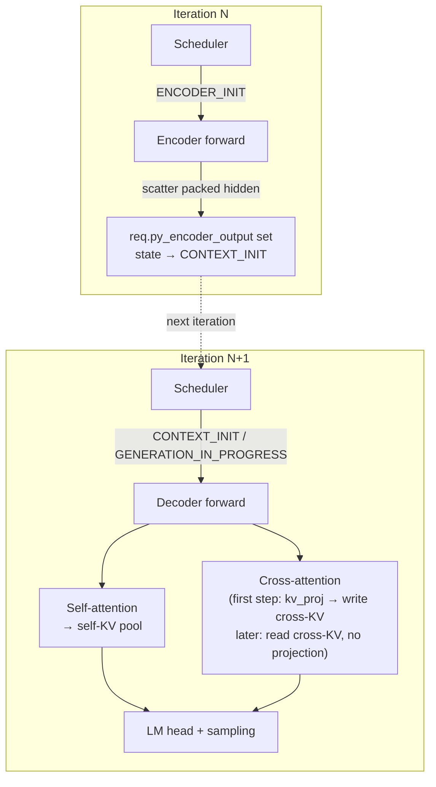

# Encoder-Decoder Models: Legacy C++ Flow and PyTorch Porting Guide

This guide has three parts:

- **Part 1** — how encoder-decoder models work today in the legacy C++ / TensorRT flow. A condensed tour; the exhaustive file-by-file reference lives in [`legacy_enc_dec_architecture.md`](legacy_enc_dec_architecture.md).
- **Part 2** — the current state of encoder-decoder support in the PyTorch flow: what is already plumbed, and what the headline gaps are.
- **Part 3** — the porting plan. Structured as: `1. Model Graph`, `2. Runtime Executor`, `3. Request and Config Surface`, `4. Recommended Implementation Order`, `5. Target-State Execution Flow`, `6. Parity Gaps vs. Legacy TRT Path`, `7. Performance Validation`, and `8. ETA`.

Scope: **text encoder-decoder models** (T5, BART, mBART). Whisper is out of scope — it additionally needs `encoder_input_features` / mel-spectrogram plumbing that is not part of this plan.

### Goal of this port

Achieve **parity with the legacy C++ / TensorRT path for the covered text enc-dec families** (specifically the `Executor::Impl` production path in §1.3, not the Python-runner fallback in §1.4) along two axes:

1. **Business-logic parity.** Same request state machine, same scheduling invariants (encoder and decoder never share a micro-batch, cross-KV is one-shot per request, etc.), same cross-KV lifecycle, and same chunked-context / KV-reuse / disagg-serving behaviors where those are in scope. At steady state, a user request going through the PyTorch path should match `ModelRunnerCpp` within the correctness bars in `Performance Validation` and follow the same state transitions.
2. **End-to-end performance parity.** Match the throughput / TTFT / TPOT / memory bars in `Performance Validation` on standard production workloads (IFB, paged self-KV + cross-KV, `TRTLLM` attention backend). The port must not silently drop perf-sensitive behavior the C++ path has (two-stream overlap, projecting encoder output into the cross-KV pool rather than stashing raw hidden states, KV reuse across enc-dec requests). Where the initial implementation intentionally trades perf for simplicity (for example, next-iteration dispatch in `Runtime Executor`; stashing encoder hidden states in `Encoder step`), the doc calls it a **stage-1 shortcut** and spells out the stage-2 change needed to reach legacy-level performance.

Parity gaps and their classifications live in `Parity Gaps vs. Legacy TRT Path`; concrete acceptance criteria and the measurement method live in `Performance Validation`.

Once parity is reached for the covered text enc-dec families, the corresponding legacy TRT path (§1.2 build + §1.3 runtime) can be retired. Anything the port defers (Whisper, PP encoder, disagg enc-dec, see `Decoder-step extensions`) remains an explicit gap *vs. legacy* and must be tracked as such.

---

## Part 1: How Encoder-Decoder Works in the Legacy C++ / TensorRT Flow

### 1.1 Model Definition (TensorRT Network Graph)

All seq2seq families (T5, BART, mBART, Whisper, Pix2Struct, BLIP2, NMT) share a single unified Python implementation in [`tensorrt_llm/models/enc_dec/model.py`](tensorrt_llm/models/enc_dec/model.py). Three `PretrainedModel` subclasses:

- **`EncoderModel`** — self-attention-only transformer stack. On the last PP rank, `hidden_states` is marked as a TRT network output named `encoder_output`.
- **`DecoderModel`** — self-attention + **cross-attention** + MLP per layer, plus `lm_head`. Accepts `encoder_output` as an input tensor.
- **`WhisperEncoder`** — conv frontend + encoder stack (audio-specific).

Model-family differences (gated MLP for T5, positional-embedding flavor, etc.) are controlled by `PretrainedConfig` fields set during checkpoint conversion in [`examples/models/core/enc_dec/convert_checkpoint.py`](examples/models/core/enc_dec/convert_checkpoint.py).

Cross-attention in `DecoderLayer` uses the TRT-LLM `Attention` layer with `cross_attention=True`, backed by `gptAttentionPlugin` which has a dedicated `do_cross_attention` code path and a separate cross-KV cache.

### 1.2 Build Process

The build (via [`tensorrt_llm/builder.py`](tensorrt_llm/builder.py)) produces **two separate TRT engines** in subdirectories `encoder/` and `decoder/`:

- `BuildConfig.max_encoder_input_len` controls the encoder sequence-length budget.
- `DecoderModel.prepare_inputs` receives `max_decoder_input_len` and `max_encoder_input_len`.
- `WhisperEncoder.prepare_inputs` only needs `max_batch_size` (mel spectrograms are fixed-length).
- The decoder engine **skips** the standard `optimize(network)` post-pass (cross-attention op patterns regress under it).
- `--gpt_attention_plugin` is mandatory even on the encoder build, because the decoder's cross-attention relies on the same plugin's KV-cache layout.

### 1.3 Runtime — State Machine and C++ Executor (production path)



One logical `LlmRequest` per user request; the state machine is in [`cpp/include/tensorrt_llm/batch_manager/llmRequest.h`](cpp/include/tensorrt_llm/batch_manager/llmRequest.h). The C++ `Executor::Impl` ([`cpp/tensorrt_llm/executor/executorImpl.cpp`](cpp/tensorrt_llm/executor/executorImpl.cpp)) is the top-level orchestrator — it is what the production serving stack (`trtllm-serve`, Triton backend, `ModelRunnerCpp`) uses. Construction takes **both** engine paths:

```cpp
Executor(encoderModelPath, decoderModelPath,
         ModelType::kENCODER_DECODER, ExecutorConfig{...});
```

It parses both `config.json`s, instantiates a `TrtEncoderModel` (`mEncoderModel`) and a `TrtGptModelInflightBatching` (`mModel`), and drives them per iteration inside `Executor::Impl::forwardAsync`:

1. On new request arrival, `Impl` allocates per-request encoder-output storage (`allocEncoderOutput` / `allocEncoderOutputHost`).
2. `mEncoderModel->forwardAsync(activeRequests)` picks up `kENCODER_INIT` requests on its own CUDA stream, runs the encoder TRT engine, writes `encoder_output` back onto each `LlmRequest`, and transitions state to `kCONTEXT_INIT`.
3. `Impl` records a `CudaEvent` on the encoder stream and has the decoder stream wait on it (no half-written `encoder_output` is ever read).
4. `mModel->forwardAsync(activeRequests)` schedules only `kCONTEXT_INIT+` requests, binds the cross-attn tensors (`encoder_output`, `encoder_input_lengths`, cross-KV block offsets, `cross_attention_mask`, `skip_cross_attn_blocks`), and runs one decoder engine step — context (projects cross-KV) or generation (reads cross-KV).
5. On termination, both `mKvCacheManager` and `mCrossKvCacheManager` release their blocks.

**Two engines, two CUDA streams, one event per iteration.** Encoder- and decoder-phase requests are never mixed in the same micro-batch because each wrapper's scheduler is gated on a disjoint state range.

### 1.4 Runtime — Python Runner (legacy fallback)

[`tensorrt_llm/runtime/enc_dec_model_runner.py`](tensorrt_llm/runtime/enc_dec_model_runner.py) is a pure-Python two-engine runner used by `examples/models/core/enc_dec/run.py`, primarily for debugging and non-paged-KV builds. It does **not** do in-flight batching; it runs one request (or a padded static batch) at a time. The orchestration collapses into a Python function-call sequence, so most of the C++ components above have no equivalent in this path.

### 1.5 Key Observation

Legacy enc-dec never goes through the `GenerationExecutor` / `LLM` high-level API. Users reach it via one of two paths:

- **`ModelRunnerCpp`** — Python wrapper over the C++ `Executor::Impl`. Production-style execution with IFB, paged KV, cross-KV. Used by `trtllm-serve` and the Triton backend.
- **`EncDecModelRunner`** — pure-Python session, non-IFB fallback.

In both cases the caller constructs a `trtllm.Request` with encoder fields (`encoder_input_token_ids` or `encoder_input_features`) explicitly.

---

## Part 2: PyTorch Flow Today — Headline Gaps

The PyTorch flow is architected around **decoder-only causal LMs**. Enc-dec infrastructure is partially plumbed but unwired end-to-end. For the **production PyTorch baseline**, this plan targets `use_kv_cache_manager_v2=False`, i.e. the shipped V1 `KVCacheManager` path. `KVCacheManagerV2` is currently prototype / experimental and is **out of scope for this port plan** unless called out separately. The four gaps worth knowing about up front:

| Gap                          | Symptom                                                                                                       |
| ---------------------------- | ------------------------------------------------------------------------------------------------------------- |
| **Request path**             | `executor_request_to_llm_request` hard-codes `encoder_input_tokens=None` ([`llm_request.py`](tensorrt_llm/_torch/pyexecutor/llm_request.py) L1013), so `LlmRequestState` never initializes to `ENCODER_INIT` on the live PyTorch request path. |
| **Model graph**              | `Attention` module is self-attention-only; no `CrossAttention`; no `EncoderDecoderLayer`; no top-level enc-dec model class registered.                                   |
| **Cross-KV pool**            | C++ `CacheType.CROSS` binding exists (`kvCacheManager.cpp` L619), but `ResourceManager` never instantiates a second `KVCacheManager` for it.                             |
| **Config signal**            | `ModelConfig.is_encoder_decoder` does not exist in `_torch/` at all, so nothing downstream can branch on enc-dec-ness.                                                    |

What **does** already exist: the V1 scheduler code knows what `ENCODER_INIT` means ([`scheduler.py`](tensorrt_llm/_torch/pyexecutor/scheduler/scheduler.py) L411-L426), accepts a `cross_kv_cache_manager` kwarg (L1215, L1468), and the cross-pool reservation accounting is already in `GuaranteedNoEvictPolicy` (L879-L887). But that support is only **partial** today: the request path never produces `ENCODER_INIT`, and the production V1 scheduler path still defaults to `no_schedule_until_state=CONTEXT_INIT` unless explicitly widened for enc-dec. So `ENCODER_INIT` is present in pieces, not wired end-to-end in the current PyTorch runtime path. The `thop.attention` C++ op already has `cross_kv_input`, `encoder_seq_lens`, and `cross_attention` parameters — they are just passed `None` / `False` today. Porting is therefore overwhelmingly a **call-site wiring job**, not new kernels or new C++.

---

## Part 3: Porting Plan

Organized by abstraction axis, in build-up order:

- **1. Model Graph** — the `nn.Module`s to add. Unit-testable in isolation.
- **2. Runtime Executor** — how `PyExecutor` drives the two-phase (encoder, decoder) flow per iteration. Depends on `Model Graph`.
- **3. Request and Config Surface** — entry points (`LlmRequest`, `GenerationRequest`, `LLM.generate()`, `ModelConfig`). Thin but end-user-visible.

Cross-references to [`legacy_enc_dec_architecture.md`](legacy_enc_dec_architecture.md) sections (§2.x) are given in parentheses throughout.

---

### 1. Model Graph

**Files:** `_torch/modules/attention.py`, `_torch/models/modeling_utils.py`, `_torch/models/` (new `modeling_t5.py`, `modeling_bart.py`), `_torch/models/checkpoints/`

#### `CrossAttention` (analog of `gptAttentionPlugin` cross-attn path, §2.9)

Legacy keeps cross-attention as a **branch inside the existing attention kernel** (switched by `do_cross_attention=True`), not a new kernel. The PyTorch path does the same: the underlying `thop.attention` op already has every parameter needed — they are hard-coded to `None` / `False` today (see Part 2), and the port populates them.

| §2.9 cross-attn behavior                                             | PyTorch equivalent                                                                                                |
| -------------------------------------------------------------------- | ----------------------------------------------------------------------------------------------------------------- |
| Context phase — project K/V once from `encoder_output`, write into cross-KV pool | `CrossAttention.forward` runs `kv_proj(encoder_hidden_states)` and passes the result as `cross_kv_input`  |
| Generation phase — read cross-KV from pool, no projection            | Same `forward` with `cross_kv_input=None`; a per-request flag `skip_cross_kv_projection` controls the branch     |
| K/V bounds use `encoder_input_lengths`                               | Pass `encoder_seq_lens=cross_attn_metadata.encoder_seq_lens` instead of `None`                                    |
| K/V block tables point at the **cross** pool                         | `kv_cache_block_offsets` + `host_kv_cache_pool_{pointers,mapping}` bind the cross pool for this call only         |

Per decoder layer this runs **alongside** the normal self-attention backend call. Under the production `TRTLLM` backend that path ultimately reaches `thop.attention(...)`, so there are still two invocations of the same low-level op, one per pool.

**Backend availability.** The port commits to the `TRTLLM` attention backend as the **production default** for enc-dec — it is the `_torch` backend family selected by `ModelConfig.attn_backend`, and it is the only path that targets kernel-for-kernel parity with the legacy TRT flow. The wiring change is one line: `trtllm.py` L549 `cross_attention=False` → `params.cross_attention`. Support for enc-dec cross-attention on other backend families (`VANILLA`, `FLASHINFER`, etc.) is explicitly **out of scope** for parity — legacy never offered them for enc-dec, so parity is judged against the `TRTLLM` backend only.

**Don't write a new kernel or a `CrossFlashAttention` class.** The one-kernel-two-branches design is deliberate. The only PyTorch-side novelty is that `skip_cross_kv_projection` is a **Python bool on the request** rather than a scalar engine input (see `Decoder-step extensions`).

Separately, the op also needs cross-attention `AttentionMetadata` to carry `encoder_seq_lens` and cross-pool block offsets — added in `Decoder-step extensions`.

#### Encoder, `EncoderDecoderLayer`, and top-level model

- **`EncoderModel`** — stack of self-attention layers with `is_causal=False`. Produces packed hidden states of shape `[sum(encoder_output_len), hidden_size]` on the last PP rank (matching the shape contract from §2.6 point 3b). Could reuse the existing `DecoderModel` class with `is_causal=False` or be a separate class; either is fine.
- **`EncoderDecoderLayer`** — like `DecoderLayer` but with an extra cross-attention sublayer between self-attention and MLP. Its `forward()` should mirror the decoder-layer inputs, with added `encoder_hidden_states`, `cross_attn_metadata`, and `skip_cross_kv_projection` arguments.
- **Top-level class** (e.g. `EncoderDecoderModelForConditionalGeneration`) composes encoder + decoder + `lm_head`.

#### Weight loading and architecture registration

- **Architecture registration** — decorate the top-level class with `@register_auto_model("T5ForConditionalGeneration")`, `@register_auto_model("BartForConditionalGeneration")`, `@register_auto_model("MBartForConditionalGeneration")`. `mBART` and BART share weights schema.
- **HF config handling** — T5 and BART store encoder/decoder hyperparams differently: T5 keeps most params at the top level with `num_decoder_layers` / `num_layers`; BART splits into `encoder_layers` / `decoder_layers`. `load_pretrained_config` must read both layouts and surface them as `encoder_num_hidden_layers` / `decoder_num_hidden_layers` on the internal `ModelConfig`.
- **Checkpoint loader** — new file under `_torch/models/checkpoints/` mapping HF `t5.*` / `bart.*` weight names onto the new model parameter names. This **replaces** the legacy `convert_checkpoint.py`; the PyTorch path loads HF weights directly, no two-directory split, no weight-format conversion.
- **Per-attention head counts** — enc-dec models can carry distinct encoder-side / cross-attention head-count settings (`encoder_num_heads`, `encoder_num_kv_heads`) rather than reusing the decoder self-attention values. Ensure the new `EncoderDecoderLayer` reads both sides from the config instead of sharing a single count with the decoder's self-attention.

---

### 2. Runtime Executor

Two observations that shape this whole section:

1. **The PyTorch flow has no `TrtEncoderModel` and no `TrtGptModelInflightBatching` peer classes.** The existing `PyTorchModelEngine` is already the decoder IFB loop, and the encoder is added as a new step in the same loop — not a new orchestrator class. A common porting mistake is to write a `TorchEncoderModel` / `TorchDecoderModel` pair mirroring C++; resist it.
2. **Dispatch is next-iteration, not same-iteration** (diverging from the C++ `Executor::Impl::forwardAsync`). Rationale below.

**Files:** `_torch/pyexecutor/model_engine.py`, `_torch/pyexecutor/py_executor.py`, `_torch/pyexecutor/scheduler/scheduler.py`, `_torch/pyexecutor/resource_manager.py`

**Scope note.** This section targets the production V1 cache path: `use_kv_cache_manager_v2=False` → `KVCacheManager`. Extending the port to `KVCacheManagerV2` / `scheduler_v2.py` is follow-up work, not part of the baseline parity plan here.

#### Encoder step (analog of `TrtEncoderModel`, §2.6–§2.7)

| `TrtEncoderModel` responsibility (§2.6)                                            | PyTorch equivalent                                                                                                        |
| ---------------------------------------------------------------------------------- | ------------------------------------------------------------------------------------------------------------------------ |
| Dedicated `TllmRuntime` + CUDA stream                                              | Reuse the one `PyTorchModelEngine` + stream; route by request state                                                      |
| Scheduler gated on `[ENCODER_INIT, CONTEXT_INIT)`                                  | Partially present: `PyMicroBatchScheduler` can classify `ENCODER_INIT` into `context_requests`, but the production V1 scheduler path must also be constructed with `no_schedule_until_state=ENCODER_INIT` |
| `EncoderBuffers` — packed `input_ids` / `position_ids` / `input_lengths` (§2.7)    | Branch inside `_prepare_tp_inputs` producing a non-causal `AttentionMetadata`                                            |
| `executeBatch(...)` — run the encoder engine                                       | New `_forward_step_encoder` on `PyTorchModelEngine`, patterned on `_forward_step_mm_encoder_only` ([`model_engine.py`](tensorrt_llm/_torch/pyexecutor/model_engine.py) L3932) |
| `fillEncoderOutputSync(...)` — copy packed output into per-request buffers        | New `_scatter_encoder_output(scheduled_encoder_reqs, packed_hidden)` on the executor                                     |
| Transition `ENCODER_INIT` → `CONTEXT_INIT`                                         | Set `llm_req.state = LlmRequestState.CONTEXT_INIT` at the end of the scatter step                                        |
| `mInflightReqIds` (guard against duplicate launches)                               | Reuse the existing `inflight_request_ids` set the scheduler already consults                                              |

**Concrete code changes:**

1. **Scheduler admission + split.** `PyMicroBatchScheduler.schedule` can admit `ENCODER_INIT` requests into `context_requests`, but the production V1 path still needs two changes: construct the scheduler with `no_schedule_until_state=ENCODER_INIT` when `model_config.is_encoder_decoder`, and split encoder requests from true decoder-context requests in the executor. This preserves the C++ invariant that encoder- and decoder-phase requests never share a micro-batch (§2.6 point 2, §2.8).

2. **Encoder-branch input packing** (in `_prepare_tp_inputs`). Concatenate `req.encoder_tokens`, build per-request `[0, encoder_len)` positions and length tensors, emit non-causal `AttentionMetadata` with no KV block tables, and keep the packed output shape aligned with `EncoderBuffers`: `[sum(encoder_output_len), hidden_size * tp_size]`.

3. **`_forward_step_encoder` on `PyTorchModelEngine`**, patterned on `_forward_step_mm_encoder_only`. It prepares inputs with `is_encoder_step=True` and calls `self.model.encoder(**inputs)` to produce packed `[sum_lens, hidden*tp]` output. Unlike the C++ path, this runs on the same stream as the decoder call in the same iteration — one stream, so no `CudaEvent` sync needed.

4. **`_scatter_encoder_output` on `PyExecutor`** (mirror of `fillEncoderOutputSync`). Slice the packed encoder output back into per-request tensors, stash each slice on `req.py_encoder_output`, then transition the request to `CONTEXT_INIT`. The state transition completes the encoder phase in the current iteration; the same request is picked up by the **next** iteration's scheduler for its decoder context step. This is the key PyTorch-vs-C++ divergence — see the "Next-iteration dispatch" note below.

5. **`_executor_loop` integration** (analog of `Executor::Impl::forwardAsync`). In the main iteration body: schedule normally, split `context_requests` into encoder vs. decoder-context subsets, run the encoder subset first, scatter and advance those requests to `CONTEXT_INIT`, then build a decoder-only `ScheduledRequests` object and pass it through the normal decoder IFB step.

   **Next-iteration dispatch (divergence from C++).** The legacy C++ path runs encoder and decoder back-to-back in the same iteration (§2.10) because the two wrappers own different streams and the decoder stream waits on an event. With one PyTorch stream, we can replicate that behavior (more bookkeeping for encoder-reqs that should *also* enter the decoder micro-batch as context requests) or defer decoder context to the next iteration (simpler; costs one scheduler tick of latency per new request). **Recommended: next-iteration.** That's the flow described above and what all the `CONTEXT_INIT` transitions in the prose assume.

   **`_executor_loop_overlap`** ([`py_executor.py`](tensorrt_llm/_torch/pyexecutor/py_executor.py) L554) also needs the encoder branch, otherwise overlap mode silently skips enc-dec requests.

6. **Encoder-output storage.** Stage-1 can stash packed hidden states on `LlmRequest` as `req.py_encoder_output` for simplicity. The stage-2 parity version should instead let the first decoder context step project directly into the cross-KV pool, then drop the raw hidden states (matching the legacy device-side lifetime in §2.8 / §2.10).

7. **PP / TP.** The legacy encoder asserts `!isPipelineParallel()` (§2.6 point 4). The PyTorch port should either raise the same error when `pp_size > 1 and is_encoder_decoder`, or add the missing hidden-states send/recv hooks to the encoder forward (preferred long-term). TP is fine — the existing `Attention` module already splits heads across TP ranks.

#### Decoder-step extensions (analog of `TrtGptModelInflightBatching` cross-attn, §2.8)

The decoder side **does not get a new orchestrator class**. `PyTorchModelEngine.`_forward_step`_ stays as-is; enc-dec adds per-iteration cross-attention metadata, a per-request flag, and a cross-KV pool — nothing else.

| `TrtGptModelInflightBatching` responsibility (§2.8)                                                    | PyTorch equivalent                                                                                                                                                     |
| ------------------------------------------------------------------------------------------------------ | ---------------------------------------------------------------------------------------------------------------------------------------------------------------------- |
| Own both `mKvCacheManager` + `mCrossKvCacheManager`; enforce `crossKvCacheFraction.has_value()`        | `Dual-pool KV cache`                                                                                                                                                   |
| Scheduler admits only `kCONTEXT_INIT+` requests                                                        | Already correct — `PyMicroBatchScheduler(no_schedule_until_state=CONTEXT_INIT)` default (`scheduler.py` L342). No change.                                              |
| Bind `encoder_output` as a decoder input on the **first** context step                                 | Read `req.py_encoder_output` in `_prepare_tp_inputs`, pack into `cross_attn_metadata.encoder_hidden_states`                                                             |
| Bind `encoder_input_lengths` per request                                                               | New field `cross_attn_metadata.encoder_seq_lens` (int32, `[num_reqs]`); feeds the `encoder_seq_lens` param on `thop.attention` (see `CrossAttention`)                |
| Bind `cross_kv_cache_block_offsets` / `host_cross_kv_cache_block_offsets` / `..._pool_{pointers,mapping}` ([`transformerBuffers.h`](cpp/include/tensorrt_llm/batch_manager/transformerBuffers.h) L47-L61) | Populated from the cross-KV manager (`cross_kv_cache_manager.get_block_offsets(request_ids)`), added to `cross_attn_metadata` |
| Bind `cross_attention_mask` / `cross_attention_packed_mask`                                            | Derived from `encoder_seq_lens` + current decoder position in `_prepare_tp_inputs`                                                                                     |
| `skip_cross_attn_blocks` scalar input (false on first context step, true after)                        | Per-request Python bool `req.py_skip_cross_kv_projection`, initialized `False`, flipped `True` after the first context pass                                            |
| First decoder context step: project K/V from `encoder_output`, **write** cross-KV pool                 | `CrossAttention.forward` branch with `skip_cross_kv_projection=False`                                                                                                  |
| Subsequent decoder steps: **read** cross-KV, no re-projection                                          | Same `CrossAttention.forward` with `skip_cross_kv_projection=True`                                                                                                     |

**Concrete code changes:**

1. **Parallel `cross_attn_metadata` in `_prepare_tp_inputs`.** For each scheduled decoder request that is enc-dec, build a `cross_attn_metadata` alongside the existing self-attn metadata: use `encoder_seq_lens` for the K/V side, keep the decoder's own `seq_lens` for Q, and thread cross-pool block tables separately from the self-KV block tables.

2. **First-step-vs-subsequent-step flag flip.** After the decoder's context step completes, set `req.py_skip_cross_kv_projection = True` on each enc-dec request in `scheduled.context_requests_last_chunk`. This is the PyTorch analog of the C++ `skip_cross_attn_blocks` scalar input (§2.8, §2.9).

3. **`ScheduledRequests` — no new field.** Unlike the encoder step's scheduler split, the decoder can reuse `ScheduledRequests` as-is: first-vs-subsequent is a per-request flag, not a batch split.

4. **`_forward_step` — no new method.** Augment `attn_metadata` only; `CrossAttention` absorbs the branching internally.

**Feature-combination gotchas:**

- **Chunked context:** project cross-KV on the first context chunk (`req.is_first_context_chunk`), then set `py_skip_cross_kv_projection=True` for later chunks.
- **KV cache reuse (decision: namespaced reuse, matching legacy).**
  - **Cross-KV pool:** enable reuse keyed only by `LlmRequest.get_encoder_unique_tokens()`.
  - **Self-KV pool:** keep reuse enabled, but namespace the key by prepending encoder-unique tokens when `is_encoder_decoder`.
  This preserves reuse without allowing decoder prefixes from different encoder inputs to collide; see `Correctness bar` #3.
- **Disaggregated serving:** follow-up scope. The decoder-side worker still needs `cross_attn_metadata` even if encoder work ran on the context worker.

#### Dual-pool KV cache (analog of `crossKvCacheFraction` + `KvCacheType::kCROSS`, §2.8)

The C++ cross-KV pool is already exposed to Python, so this is mainly a Python-side instantiation and lifecycle job.

| §2.8 cross-KV responsibility                                                                           | PyTorch equivalent                                                                                                                                                  |
| ------------------------------------------------------------------------------------------------------ | ------------------------------------------------------------------------------------------------------------------------------------------------------------------- |
| Require `crossKvCacheFraction.has_value()` when `ModelType == kENCODER_DECODER` (`trtGptModelInflightBatching.cpp` ~L312) | Require `kv_cache_config.cross_kv_cache_fraction is not None` in `ResourceManager.__init__` when `model_config.is_encoder_decoder`; reject otherwise.               |
| Self-KV size = `freeMem * (1 - crossFrac)`, cross-KV size = `freeMem * crossFrac` (type `kCROSS`)      | Build **two** `KVCacheManager` instances with separately budgeted free-memory fractions. `CacheTypeCpp = tensorrt_llm.bindings.internal.batch_manager.CacheType` (already imported at [`resource_manager.py`](tensorrt_llm/_torch/pyexecutor/resource_manager.py) L56). |
| `addSequence` on both pools when a request enters decoder context                                      | Extend `ResourceManager.prepare_resources`: call `kv_cache_manager.add_sequence(...)` **and** `cross_kv_cache_manager.add_sequence(...)` (pattern: `resource_manager.py` L656). Cross-pool `add_sequence` is **once per request** on the encoder→decoder transition, not per step — cross-KV is one-shot. |
| `removeSequence` on both pools on termination                                                          | Extend `release_resources` (`resource_manager.py` L2292-L2375) with a parallel `cross_kv_cache_manager.free_resources(req)` when `req.is_encoder_decoder`. **This is the most common cross-KV leak path if forgotten.** |
| Encoder unique-tokens hash used as cross-pool reuse key; self pool reuse key namespaced with it for enc-dec | `LlmRequest.get_encoder_unique_tokens()` binding exists; the scheduler already consumes it for the cross pool (`scheduler.py` L1307-L1329 and L1370-L1382). Enable reuse on both managers and add encoder-token namespacing to `get_unique_tokens` for the self pool (see `Decoder-step extensions` -> `KV cache reuse`). |
| Cross-pool scheduler reservation accounting                                                            | Already in place — `GuaranteedNoEvictPolicy` tracks `newly_contributed_cross_context_blocks` and `reserved_cross_blocks` (`scheduler.py` L879-L887).                  |

**Concrete code changes:**

1. **`ResourceManager` construction** — when `model_config.is_encoder_decoder`, build two `KVCacheManager` instances (`SELF` and `CROSS`) with separately budgeted memory fractions, store the cross one as `self.cross_kv_cache_manager`, and pass it into the already-plumbed scheduler kwarg.
2. **Consume `KvCacheConfig.cross_kv_cache_fraction`** — require it on enc-dec models and reject it on decoder-only models.
3. **Per-attention head counts.** The cross pool must be sized from the encoder-side / cross-attention head count (`encoder_num_kv_heads` when present), not blindly from the decoder self-attention count. Easy to miss.

**What does *not* need changing:** the underlying `KVCacheManager`.

---

### 3. Request and Config Surface

Thin but end-user-visible. Scope: text-token path only (Whisper's `encoder_input_features` plumbing remains out of scope).

**Files:** `_torch/pyexecutor/llm_request.py`, `_torch/model_config.py`, `tensorrt_llm/executor/request.py`, `tensorrt_llm/executor/base_worker.py`, `tensorrt_llm/llmapi/llm.py`

#### Request plumbing

The C++ `LlmRequest` (§2.4) already carries every encoder-decoder field needed. The Python bindings expose them too. Porting is mostly wiring, but the PyTorch path needs one extra thing spelled out clearly: **the seq2seq request contract**.

Unlike a decoder-only request, an encoder-decoder request has **two token sequences**:

1. **Encoder input tokens** — the source sequence (`encoder_input_token_ids`), consumed by the encoder.
2. **Decoder input tokens** — the seed sequence for the decoder context step. For standard T5/BART-style generation this is usually a single token `[decoder_start_token_id]`, but callers may also provide an explicit `decoder_input_token_ids` sequence when they want forced decoder prefixes.

To minimize churn in the executor stack, the existing decoder-side request field keeps its current meaning:

- **Public API surface** (`LLM.generate`, `LLM.generate_async`, `LLM.preprocess`):
  - accepts `encoder_inputs` or `encoder_input_token_ids`,
  - accepts optional `decoder_input_token_ids`,
  - if `decoder_input_token_ids` is omitted, synthesizes `[decoder_start_token_id]` from the model config.
- **Executor-internal request object** (`GenerationRequest` / `trtllm.Request`):
  - continues to use the existing `prompt_token_ids` / `input_token_ids` field for the **decoder-side** token sequence,
  - gains `encoder_input_token_ids` for the encoder-side token sequence.

This matches the legacy runner contract (§1.5, §2.11): the runtime receives both decoder-side input ids and encoder-side input ids, rather than treating enc-dec as "decoder-only plus an extra encoder tensor".

If `decoder_start_token_id` is missing from the HF config and the caller does not provide `decoder_input_token_ids`, request construction must fail with a validation error rather than silently guessing a BOS token.

| `LlmRequest` encoder field (§2.4)                                                                      | PyTorch status                                                                                                        |
| ------------------------------------------------------------------------------------------------------ | --------------------------------------------------------------------------------------------------------------------- |
| `mEncoderTokens` / `getEncoderTokens()`                                                                | Binding exists. **Not wired** — `executor_request_to_llm_request` hard-codes `encoder_input_tokens=None` (`llm_request.py` L1013). |
| `mEncoderInputFeatures` / `getEncoderInputFeatures()`                                                  | Binding exists. Out of scope.                                                                                         |
| `mEncoderOutputLength` / `getEncoderOutputLen()`                                                       | Binding exists. For text, equals `len(encoder_tokens)`; derived at request construction.                              |
| `mEncoderOutput` / `mEncoderOutputHost` (GPU + pinned-host buffers)                                    | Stage-1 replaces the GPU-side request buffers with Python-side `req.py_encoder_output` (see `Encoder step` -> `Encoder-output storage`). If the port preserves `return_encoder_output`, it still needs an optional host-side mirror or equivalent result path. |
| `allocEncoderOutput(...)` / `allocEncoderOutputHost(...)`                                              | `allocEncoderOutput(...)` is replaced in stage-1 by plain `torch.empty(...)` / `clone()` inside `_scatter_encoder_output` (see `Encoder step`). `allocEncoderOutputHost(...)` still needs an equivalent host/result path if `return_encoder_output` remains supported. |
| State-machine init: `mState = kENCODER_INIT if has_encoder_inputs else kCONTEXT_INIT` (`llmRequest.h` L851) | **Automatic via the binding** as soon as `encoder_input_tokens` stops being `None`.                                   |

**Concrete changes (ordered; each depends on the previous):**

1. **`GenerationRequest` (`executor/request.py`)**
   - keep `prompt_token_ids` as the decoder-side token sequence,
   - add `encoder_input_token_ids: Optional[List[int]] = None`,
   - optionally add `decoder_input_token_ids: Optional[List[int]] = None` at the public API layer only; if omitted, materialize `[decoder_start_token_id]` before constructing `GenerationRequest`.
2. **`BaseWorker._enqueue_request` (`executor/base_worker.py`)**
   - thread `encoder_input_token_ids` into the underlying `trtllm.Request`,
   - continue threading decoder-side tokens through `input_token_ids` / `prompt_token_ids`.
3. **`executor_request_to_llm_request` (`llm_request.py` L1013)**
   - replace `encoder_input_tokens=None` with `encoder_input_tokens=getattr(executor_request, "encoder_input_token_ids", None)`.
   - This single line is what lets `LlmRequestState` auto-initialize to `ENCODER_INIT`.
4. **`LLM.preprocess()` / `PreprocessedInputs`**
   - extend the preprocessed structure to carry `encoder_input_token_ids` and optional `decoder_input_token_ids`,
   - keep existing decoder-only behavior unchanged.
5. **`LLM.generate()` / `LLM.generate_async()` (`llmapi/llm.py`)**
   - accept `encoder_inputs` / `encoder_input_token_ids`,
   - accept optional `decoder_input_token_ids`,
   - if `decoder_input_token_ids` is absent, synthesize `[decoder_start_token_id]`,
   - thread the result into `GenerationRequest`.

6. **`return_encoder_output` result path (if preserved)**
   - stop hard-coding `return_encoder_output=False` in `_torch/pyexecutor/llm_request.py`,
   - add a host-side mirror or equivalent result-construction path for encoder outputs,
   - keep this separate from the stage-1 GPU-resident `req.py_encoder_output` lifetime so preserving the result feature does not implicitly extend the device-memory parity gap from G2.

Without this step, the high-level `LLM` API stays decoder-only and users still have to drop down to `ModelRunnerCpp` — which is exactly the §2.11 gap this port is meant to close.

#### `ModelConfig.is_encoder_decoder` — the signal nothing else can branch without

`ModelConfig.is_encoder_decoder` **does not exist in `_torch/`** today (verified: only `_torch/models/checkpoints/mistral/config_loader.py` mentions it, unrelatedly). `Weight loading and architecture registration`, `Encoder step`, `Decoder-step extensions`, and `Dual-pool KV cache` all key off this flag — adding it is the single prerequisite they share.

- Add `is_encoder_decoder: bool = False` to `_torch/model_config.py`, populated from the HF config's top-level `is_encoder_decoder` field.
- In `_torch/pyexecutor/config_utils.py`, propagate the flag to `ResourceManager`, `PyTorchModelEngine`, and `PyExecutor` construction so each can branch on it.

#### What the PyTorch path deliberately drops

The following legacy build-time surface has **no PyTorch equivalent**. If these show up in a future bug report or user question, the answer is that they do not apply:

| Legacy build-time step (§1.2 / §2.2 / §2.3)                                                             | Replacement                                                                                                |
| ------------------------------------------------------------------------------------------------------- | ---------------------------------------------------------------------------------------------------------- |
| `convert_checkpoint.py` splits HF weights into `encoder/` + `decoder/` dirs                             | None — HF weights load directly via the `Weight loading and architecture registration` checkpoint loader.    |
| `trtllm-build` produces two TRT engines with `max_encoder_input_len` / `max_decoder_input_len` budgets  | None — single `nn.Module` with `encoder` and `decoder` submodules; no pre-allocated shape budgets.         |
| `--gpt_attention_plugin`, `--bert_attention_plugin`, `--context_fmha disable` for T5, `--remove_input_padding`, the decoder `optimize(network)` skip | None — PyTorch path selects an attention backend via `ModelConfig.attn_backend`; for enc-dec parity the target is `TRTLLM`, whose runtime path may invoke `thop.attention(...)` internally. None of these build-time switches have direct analogues. |
| Two-engine `Executor(encoderPath, decoderPath, kENCODER_DECODER, cfg)` constructor                      | Single-model construction; enc-dec-ness is the `ModelConfig.is_encoder_decoder` flag.                       |
| `ModelType::kENCODER_DECODER` enum                                                                      | Not needed — the model class itself encodes the structure; no executor-level dispatch branches on it.       |

---

### 4. Recommended Implementation Order

Ordered to minimize blocked-on-upstream waits; each step is unit- or integration-testable.

1. **`ModelConfig.is_encoder_decoder`** (`ModelConfig.is_encoder_decoder`) — the one-line signal everything else keys off.
2. **`CrossAttention` module + `EncoderDecoderLayer` + top-level model class** (`CrossAttention`; `Encoder, EncoderDecoderLayer, and top-level model`) — unit-testable with direct `forward()` calls on dummy tensors.
3. **Attention-backend cross-attn wiring** (`CrossAttention` backend availability) — needed for the model forward to work end-to-end on real tensors.
4. **Request plumbing** (`Request plumbing` steps 1-3) — lets `ENCODER_INIT` requests actually reach the scheduler.
5. **Encoder step in `PyTorchModelEngine` + `PyExecutor`** (`Encoder step`) — two-phase iteration driver.
6. **Cross-KV pool and dual-pool lifecycle** (`Dual-pool KV cache`) — needed for multi-step generation.
7. **Decoder cross-attn wiring** (`Decoder-step extensions`) — ties `Model Graph` and `Dual-pool KV cache` together.
8. **Weight-loading and architecture registration** (`Weight loading and architecture registration`) — makes real HF checkpoints load.
9. **High-level API / preprocessing / result surface** (`Request plumbing` steps 4-6) — `LLM.preprocess()`, `LLM.generate()` / `generate_async()`, and the `return_encoder_output` path if preserved.

### 5. Target-State Execution Flow



Key properties visible in the diagram:
- Encoder and decoder execute in **separate iterations** (next-iteration dispatch, stage-1 shortcut — see `Parity Gaps vs. Legacy TRT Path`).
- Only the decoder forward writes to the cross-KV pool, and only on the first context step (stage-2 target — see `Parity Gaps vs. Legacy TRT Path`).
- The scheduler, not the model, owns the phase transition via request state.

---

### 6. Parity Gaps vs. Legacy TRT Path

This section consolidates every place where the plan above intentionally diverges from the legacy C++ / TensorRT path (§1.3), the reason for the divergence, the parity impact, and how it gets closed. The **principle** is perf parity with legacy as much as possible — every gap here is either (a) a stage-1 shortcut that must be closed before declaring parity, (b) an acceptable divergence because the legacy behavior is itself a limitation, or (c) a feature gap tracked as must-close before retiring the legacy path.

**Legend:** Stage-1 = deliberate shortcut to unblock correctness, closed before declaring parity. Permanent = divergence that is either neutral or better than legacy. Must-close = legacy has it, port does not yet, tracked as a parity blocker.

**Numbering note.** G5 and G6 previously tracked attention-backend choices and have been removed: the port commits to `attn_backend="trtllm"` as the production default (matches legacy `gptAttentionPlugin`) and transparently redirects `trtllm_gen` / `flashinfer` / `flashattn` to `thop` at construction time with a warning. These are standing policies captured in `CrossAttention` -> `Backend availability` and `Baseline configuration`, not gaps that close. Gap IDs G7-G11 are kept as-is rather than re-numbered to preserve stable references across the doc.

| # | Gap | Where introduced | Parity impact | Classification | How it closes |
|---|-----|------------------|---------------|----------------|---------------|
| G1 | **Next-iteration dispatch (TTFT penalty)** — encoder runs in iteration N, decoder context step for the same request runs in iteration N+1. C++ runs both in the same iteration via a two-stream `CudaEvent`. | `Runtime Executor` preamble, `Encoder step` change 5 | +1 scheduler tick (≈1 decode step) added to TTFT per new enc-dec request. Shows up as a p50/p99 TTFT gap in `Benchmark matrix`. Paired with G3 — the two gaps are orthogonal (dispatch timing vs. stream count) but closed together by the same stage-2 change. | **Stage-1** | Stage-2 work in `Encoder step` change 5 — either one-stream sequential dispatch (re-run micro-batch selection after scatter) or two-stream with CUDA event (direct mirror of `Executor::Impl::forwardAsync`). One-stream same-iteration closes G1 alone; two-stream same-iteration closes G1 and G3 jointly and is the recommended target. |
| G2 | **Device-side raw encoder output kept on `LlmRequest` for the full request lifetime** as `py_encoder_output`. In the TRT path, request-owned GPU encoder output exists only until decoder context completes; after cross-KV is materialized, the raw GPU buffers are freed, while an optional host copy may remain for `return_encoder_output`. | `Encoder step` change 6 (option 1) | Memory: +`encoder_len × hidden × dtype_bytes` of extra GPU residency per in-flight request for the whole generation. At `encoder_len=1024, hidden=1024, bf16` that is ~2 MiB/request — materially worse than legacy at high concurrency. Throughput: reduced max in-flight count, reduced effective KV-cache budget. | **Stage-1** | Switch to stage-2 (`Encoder step` change 6, option 2): run `kv_proj(encoder_hidden_states)` on the decoder's first cross-attention call, write straight into the cross-KV block layout via `thop.attention`, and free the raw GPU hidden states once decoder context completes. If the port preserves `return_encoder_output`, keep a separate host/result path rather than extending the GPU lifetime. |
| G3 | **Single-stream execution (no cross-request overlap)** — encoder and decoder forward share one CUDA stream. C++ has two streams with one event per iteration. | `Encoder step` change 3 | Loses the overlap of encoder-of-new-request with decoder-of-in-flight-request. Shows up as a steady-state throughput gap under mixed encoder/decoder load in `Benchmark matrix` (distinct from G1's TTFT gap). Same-iteration dispatch without two streams still serializes them on one queue. | **Stage-1** (closed jointly with G1 under stage-2a) | Add a second CUDA stream for the encoder step and a `torch.cuda.Event` the decoder stream waits on. Chosen together with G1's two-stream variant. |
| G4 | **`_executor_loop_overlap` not covered in stage-1** — only the non-overlap `_executor_loop` gets the encoder branch first. | `Encoder step` change 5 trailing note | Overlap mode silently skips enc-dec requests until the branch is added. Overlap mode is the production config; without this, perf-parity benchmarks can't even run. More importantly, `_executor_loop_overlap` is not a shallow copy of `_executor_loop`: it pipelines current-batch forward with previous-batch request/resource updates and speculative-decoding state, so enc-dec must be threaded through a different control-flow shape. | **Must-close before perf benchmarks** | Thread the encoder-phase split through `_executor_loop_overlap`'s pipelined control flow, including `previous_batch` handling, speculative-decoding interactions, delayed request/resource updates, and empty-rank cases. Must be done and validated in overlap mode before any number in `Benchmark matrix` is meaningful. |
| G7 | **Pipeline parallelism (PP > 1) for the encoder is not supported.** Legacy also asserts `!isPipelineParallel()` (§2.6 point 4). | `Encoder step` change 7 | **None** — legacy has the same restriction. Documenting it so readers don't flag it as a new gap. | **Permanent (matches legacy)** | Stage-1 raises the same assertion. Long-term: add hidden-states send/recv hooks to the encoder forward (strictly better than legacy); not required for parity. |
| G8 | **Disaggregated serving** (`kDISAGG_*` states) is listed as "follow-up scope" for enc-dec. Legacy supports enc-dec under disagg (§2.5). | `Decoder-step extensions` -> `Feature-combination gotchas` | Production serving stacks that run disagg today cannot migrate their enc-dec workloads until this lands. | **Must-close before retiring legacy** | The `cross_attn_metadata` path must fire in the decoder (generation) worker even when encoder-phase work happened on the context worker. Requires threading `encoder_output` (or, post-G2 resolution, cross-KV blocks) across the disagg transfer. |
| G9 | **Whisper / feature-input path** (`encoder_input_features`, mel spectrograms, conv encoder) is out of scope. Legacy supports it. | Top-of-doc scope, `Request plumbing` table | Whisper users cannot migrate. Bindings exist but nothing reads them on the PyTorch side. | **Must-close before retiring legacy** | Separate port — adds a feature-input branch to `Model Graph` (conv frontend / spectrogram path) and to `Encoder step` (encoder packing reads `encoder_input_features` instead of `encoder_input_tokens`). Out of scope for this document. |
| G10 | **Two-engine build replaced by single `nn.Module`** with shared weights file. Legacy has separate `encoder/` and `decoder/` directories with independent `config.json`s. | §1.2 / `Weight loading and architecture registration` / `What the PyTorch path deliberately drops` | **None on perf.** Simpler deployment, no pre-allocated shape budgets. | **Permanent (better than legacy)** | N/A — this is a deliberate architectural improvement. `max_encoder_input_len` / `max_decoder_input_len` knobs disappear; shapes are dynamic. |
| G11 | **No `ModelType::kENCODER_DECODER` dispatch at the executor level.** Legacy uses an enum; PyTorch uses the `ModelConfig.is_encoder_decoder` flag. | `ModelConfig.is_encoder_decoder` / `What the PyTorch path deliberately drops` | **None.** Cosmetic — the model class itself knows which branches to run. | **Permanent (better than legacy)** | N/A. |

**Decision record.** KV-cache reuse for enc-dec is not in this table — the port commits to namespaced reuse (`Decoder-step extensions` -> `KV cache reuse`), matching legacy exactly, so there is no divergence to track as a parity gap; the implementation work is covered under `Decoder-step extensions`, `Dual-pool KV cache`, and the "Must-close feature gaps" row in `Full path to legacy retirement`. G8 (disagg enc-dec) remains "must-close before retiring legacy" — it is a scope-deferral, not an open design question, and legacy shipping this behavior means dropping it is a regression users would notice.

---

### 7. Performance Validation

Use one fixed baseline config, one workload matrix, one correctness bar, and one performance bar.

#### Baseline configuration (identical between legacy and port)

| Knob | Value |
|------|-------|
| Model | `google/t5-base`, the Hugging Face BART-base checkpoint; add `google/flan-t5-large` for a second size class |
| Precision | BF16 weights, BF16 KV cache |
| TP | 1 and 2 |
| PP | 1 only |
| Attn backend (port) | `TRTLLM` |
| KV manager (port) | `use_kv_cache_manager_v2=False` (`KVCacheManager`, V1) |
| KV cache | Paged, `tokens_per_block=64`, `cross_kv_cache_fraction=0.5` |
| Scheduler | IFB (`_executor_loop_overlap` mode) |
| Request stream | Fixed seed, fixed arrival pattern, fixed `encoder_input_token_ids` / decoder-target pairs |

Before running any benchmark, confirm both paths use the same `max_batch_size`, `max_num_tokens`, `cross_kv_cache_fraction`, `tokens_per_block`, `kv_cache_reuse`, and `max_seq_len`.

#### Benchmark matrix

| Profile | Encoder len | Decoder in/out | Concurrency | What it exercises |
|---------|-------------|----------------|-------------|-------------------|
| **Summarization** | 512 / 1024 (long source) | 1 / 128 | 1, 8, 32, 64 | Encoder dominates; cross-KV memory footprint matters; stresses G2 (paging). |
| **Translation** | 32 / 64 (short source) | 1 / 64 | 1, 32, 128 | Many small requests; admission rate dominates; stresses G1 (TTFT) and G3 (stream overlap). |
| **Long-form generation** | 128 (medium source) | 1 / 1024 | 1, 8, 16 | Decoder dominates; cross-attn read per-step perf matters; stresses cross-KV read path. |

`Decoder in = 1` reflects the normal enc-dec generation contract: when the caller does not provide explicit `decoder_input_token_ids`, the runtime seeds the decoder with a single token `[decoder_start_token_id]`. Benchmarks that exercise forced decoder prefixes should be called out separately rather than folded into the default matrix.

For each cell, measure: **Throughput**, **TTFT** (p50/p99), **TPOT** (p50), **Peak GPU memory**, and **Goodput**.

**Benchmark harness note.** Current `trtllm-bench` is decoder-only on the request schema, so `Performance Validation` needs one of these first:

1. **Extend `trtllm-bench` for enc-dec** — add `encoder_input_token_ids` and optional `decoder_input_token_ids` to the dataset JSON schema, `InferenceRequest`, dataset parser, and async request-submission path.
2. **Use a dedicated enc-dec harness** — legacy side via `ModelRunnerCpp` / `trtllm.Request`, port side via `LLM.generate()` once the `Request plumbing` API surface lands.

In both cases, the two baselines must consume the same `(encoder_input_token_ids, decoder_input_token_ids | decoder_start_token_id, max_new_tokens)` request stream.

#### Correctness bar

1. **Logit parity.** On a fixed 100-prompt eval set, compare decoder logits step-by-step between legacy (greedy, temperature=0) and port (same). Pass bar: max absolute diff < 1e-2 on BF16 (accounts for kernel-order nondeterminism), exact argmax match on ≥ 99% of steps.
2. **State-machine parity.** Emit `(request_id, state)` transition traces from both paths on the same request stream. Pass bar: byte-identical state transition sequences.
3. **Cross-KV reuse behavior.** Send two requests with identical `encoder_input_token_ids`. Pass bar: the second request allocates 0 new cross blocks.
4. **Chunked-context consistency.** Run a request with `max_num_tokens` < encoder length so decoder context is chunked. Pass bar: final logits match the unchunked run within the logit-parity tolerance.

#### Performance bar

Apply these bars on every cell of the benchmark matrix, **post stage-2 (G1, G2, G3, G4 closed)**:

| Metric | Pass bar |
|--------|----------|
| Steady-state throughput | ≥ 95% of legacy |
| p50 TTFT | ≤ 110% of legacy |
| p99 TTFT | ≤ 115% of legacy |
| p50 TPOT | ≤ 105% of legacy |
| Peak GPU memory | ≤ 105% of legacy |
| Goodput | ≥ 95% of legacy |

**Stage-1 bar.** Before G1/G2/G3/G4 are closed, gate only on `Correctness bar` and "does not OOM." Do not treat stage-1 perf numbers as representative.

#### Retiring the legacy path

1. `Correctness bar` passes on all models in `Baseline configuration`.
2. `Performance bar` passes on all cells in `Benchmark matrix`.
3. G4, G8, G9 are closed (all feature-parity gaps).
4. G1, G2, G3 are resolved (all stage-1 shortcuts replaced with stage-2 parity targets).

G7, G10, and G11 do not block retirement.

---

### 8. ETA

Numbers below are rough **engineer-days of elapsed wall-clock time** for one engineer pair-programming with an AI assistant, assuming GPU access is available and the main bottleneck is review / CI / landing rather than code generation.

#### Stage-1 — correctness baseline (per-step, tracks `Recommended Implementation Order`)

Ends when the `Correctness bar` passes on T5-base / BART-base with the stage-1 shortcuts in place (G1, G2, G3, G4 still open). This is the "first PR merged that runs an enc-dec request end-to-end through `LLM.generate()`" milestone.

| # | Step (`Recommended Implementation Order`) | ETA (days) | Risk notes |
|---|-------------|------------|------------|
| 1 | `ModelConfig.is_encoder_decoder` — `ModelConfig.is_encoder_decoder` | 0.5 | Trivial; single flag + config-utils propagation. |
| 2 | `CrossAttention` module + `EncoderDecoderLayer` + top-level model class — `CrossAttention`; `Encoder, EncoderDecoderLayer, and top-level model` | 3–5 | Main model-graph work; risk is metadata-schema and weight-name alignment. |
| 3 | Attention-backend cross-attn wiring (`trtllm.py` / `TRTLLM` path) — `CrossAttention` backend availability | 1–2 | Mostly parameter plumbing plus `TRTLLM` validation. |
| 4 | Request plumbing — `Request plumbing` steps 1-3 | 1 | Small diffs with one high-leverage unlock in `llm_request.py`. |
| 5 | Encoder step in `PyTorchModelEngine` + `PyExecutor` — `Encoder step` | 3–4 | Largest orchestration surface; scheduler split and state timing are the main risks. |
| 6 | Cross-KV pool and dual-pool lifecycle — `Dual-pool KV cache` | 2–3 | Main risk is leaks in `add_sequence` / `free_resources`. |
| 7 | Decoder cross-attn wiring — `Decoder-step extensions` | 2–3 | Main risk is debugging the encoder→decoder transition. |
| 8 | Weight-loading and architecture registration — `Weight loading and architecture registration` | 2–3 | Mostly HF config/layout and weight-name mapping work. |
| 9 | High-level API / preprocessing / result surface — `Request plumbing` steps 4-6 | 1–2 | Small but user-visible surface. |
| | **Stage-1 total (sum of ranges)** | **15.5–23.5 days** (≈ 3–5 weeks) | Critical path is 2 → 5 → 7. |

#### Full path to legacy retirement — per-stage rollup

Continues past stage-1 through the gaps that `Parity Gaps vs. Legacy TRT Path` flags as must-close or stage-1 shortcuts.

| Stage | Scope | Gaps closed | ETA (days) | Notes |
|-------|-------|-------------|------------|-------|
| **Stage-1** | Correctness baseline (table above) | — (shortcuts G1/G2/G3/G4 still open by design) | 15.5–23.5 | Passes `Correctness bar`; `Performance bar` is not attempted. |
| **Stage-1.5 Overlap-loop wiring** | Thread enc-dec through `_executor_loop_overlap`; enable `Performance Validation` benchmarking on the committed `trtllm` backend | G4 | 3–5 | Needed before any perf number is meaningful. |
| **Stage-2a Same-iteration dispatch + second stream** | Add CUDA-event / two-stream encoder handshake; restore encoder/decoder overlap | G1, G3 | 4–6 | Two-stream variant is the recommended target. |
| **Stage-2b Cross-KV paging** | Project encoder output into cross-KV pool on first decoder step; drop raw hidden states | G2 | 3–5 | Mostly execution-path orchestration. |
| **Must-close feature gaps** | Disagg enc-dec (G8), Whisper feature-input path (G9) | G8, G9 | 7–12 | Heaviest remaining feature work; if Whisper stays out of scope, subtract ~3–5 days. |
| **Benchmark harness** | Extend `trtllm-bench` for enc-dec or build the dedicated `Performance Validation` harness | — | 2–4 | Required before performance numbers are runnable. |
| **Perf-parity validation** | Run `Benchmark matrix`, meet `Performance bar` on T5 / BART / Flan-T5 | — | 3–5 | Includes config-equivalence debugging and any bar-miss triage. |
| **Legacy retirement cleanup** | Remove `TrtEncoderModel`, `EncDecModelRunner`, `convert_checkpoint.py` enc-dec branch, deprecation notices, doc updates | — | 2–3 | Still non-trivial because examples and tests depend on the legacy path. |
| | **Full total** | G1, G2, G3, G4, G8, G9 closed; G7/G10/G11 are permanent divergences | **39.5–63.5 days** (≈ 8–13 weeks, or ≈ 2–3 months) | Excluding Whisper (G9), total drops to **34.5–60.5 days** (≈ 7–12 weeks). |

#### Calibration notes

These ranges assume AI-assisted drafting, available GPU time, and no major unrelated scheduler/resource-manager bugs. Review / CI is still the pacing item, so stage-1 should land as several PRs, not one. For tracking, use the gap IDs in `Parity Gaps vs. Legacy TRT Path` as the dashboard: `Gap | Status | PR link | Benchmark delta`.
