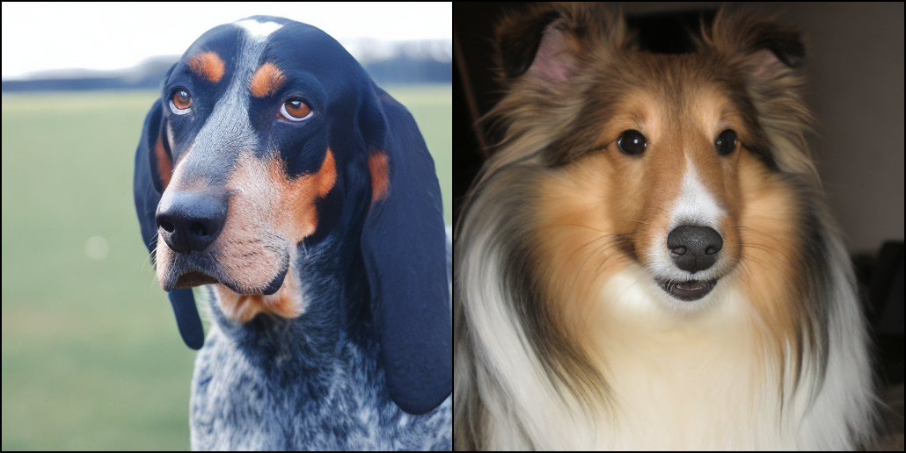

# DiT
This document shows how to build and run a [DiT](https://arxiv.org/abs/2212.09748) model with TensorRT-LLM.

## Overview

The TensorRT LLM DiT implementation can be found in [tensorrt_llm/models/dit/model.py](../../../../tensorrt_llm/models/dit/model.py). The TensorRT LLM DiT example code is located in [`examples/dit`](./). There are main files to build and run DiT with TensorRT-LLM:

* [`convert_checkpoint.py`](./convert_checkpoint.py) to convert the DiT model into TensorRT LLM checkpoint format.
* [`sample.py`](./sample.py) to generate images with TensorRT engine(s).

## Support Matrix

- [x] FP16
- [x] TP
- [x] FP8
- [x] CP

## Usage

The TensorRT LLM DiT example code locates at [examples/dit](./). It takes PyTorch weights as input, and builds the corresponding TensorRT engines. The number of TensorRT engines depends on the number of GPUs used to run inference.

### Build DiT TensorRT engine(s)

First, download the pretrained DiT-XL/2 PyTorch checkpoint from the official pytorch implementation repo [here](https://github.com/facebookresearch/DiT/tree/main?tab=readme-ov-file#sampling--), please review its license items before use.

This checkpoint will be converted to the TensorRT LLM checkpoint format by [`convert_checkpoint.py`](./convert_checkpoint.py). After that, we can build TensorRT engine(s) with the TensorRT LLM checkpoint.

As for run inference with FP8 quantization, currently only linear layers are supported to be quantized. Make sure that scaling factors for weights are also stored in the quantized checkpoint.

```
# Convert to TRT-LLM with float16(by default)
python convert_checkpoint.py
trtllm-build --checkpoint_dir ./tllm_checkpoint/ \
                --max_batch_size 8 \
                --remove_input_padding disable \
                --bert_attention_plugin disable

# Convert to TRT-LLM with float8
python convert_checkpoint.py --fp8_linear --timm_ckpt=</path/to/quantized_ckpt> --output_dir=tllm_checkpoint_fp8
trtllm-build --checkpoint_dir ./tllm_checkpoint_fp8/ \
             --output_dir ./engine_outputs_fp8/ \
             --max_batch_size 8 \
             --remove_input_padding disable \
             --bert_attention_plugin disable
```

The default quantized checkpoint is based on official DiT by Facebook. If the checkpoint is obtained with APIs of `diffusers` (provided by HuggingFace), please enable the option `--diffusers_dit`:

```
python convert_checkpoint.py --fp8_linear --diffusers_dit --timm_ckpt=</path/to/quantized_ckpt> --output_dir=tllm_checkpoint_fp8
trtllm-build --checkpoint_dir ./tllm_checkpoint_fp8/ \
             --output_dir ./engine_outputs_fp8/ \
             --max_batch_size 8 \
             --remove_input_padding disable \
             --bert_attention_plugin disable
```

Set `--max_batch_size` to tell how many images at most you would like to generate. We disable `--remove_input_padding` since we don't need to padding DiT's patches. Besides, we disable `--bert_attention_plugin` for better performance, since the plugin's fmha is not supported for DiT's hidden size (72 for DiT-XL).

After build, we can find a `./engine_output` directory, it is ready for running DiT model with TensorRT LLM now.

### Build VAE TensorRT engine
We can further accelerate VAE decoder by TensorRT.
```
python vae_decoder_trt.py --max_batch_size 8
```

### Generate images

A [`sample.py`](./sample.py) is provided to generated images with the optimized TensorRT engines.

We can simply run `python sample.py`. After that, an image named `sample.png` will be generated:
.

Image generated with quantized FP8 DiT:

.

By default, we set batch size to 2, you can set batch size up to `--max-batch-size`, e.g., `python sample.py --batch-size 8`

We can also run `python sample.py --tllm_model_dir=</path/to/tllm_model>` to apply specific engines.

### Tensor Parallel

We can levaerage tensor parallel to further reduce latency and memory consumption on each GPU. We can also run TP for FP8 DiT.

```
# build dit engine
python convert_checkpoint.py --tp_size 4
trtllm-build --checkpoint_dir ./tllm_checkpoint/ \
                --max_batch_size 8 \
                --remove_input_padding disable \
                --bert_attention_plugin disable
# build vae engine
python vae_decoder_trt.py --max_batch_size 8
# run
mpirun -n 4 --allow-run-as-root python sample.py
```

### Context Parallel

Context parallel can also be used to reduce latency and memory consumption on each GPU. We can also run CP for FP8 DiT.

```
# build dit engine
python convert_checkpoint.py --cp_size 4
trtllm-build --checkpoint_dir ./tllm_checkpoint/ --max_batch_size 8 --remove_input_padding disable --bert_attention_plugin disable
# build vae engine
python vae_decoder_trt.py --max_batch_size 8
# run
mpirun -n 4 --allow-run-as-root python sample.py
```

### Combine Tensor Parallel and Context Parallel

Tensor Parallel and Context Parallel can be used together to better balance latency and memory consumption.

```
# build dit engine
python convert_checkpoint.py --cp_size 2 --tp_size 2
trtllm-build --checkpoint_dir ./tllm_checkpoint/ --max_batch_size 8 --remove_input_padding disable --bert_attention_plugin disable
# build vae engine
python vae_decoder_trt.py --max_batch_size 8
# run
mpirun -n 4 --allow-run-as-root python sample.py
```
