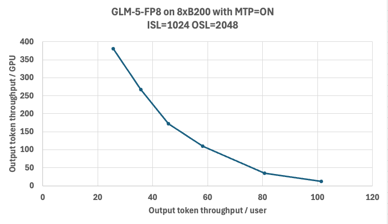

# GLM-5

This guide walks you through running the GLM-5 model with TensorRT-LLM using the PyTorch backend.

GLM-5 uses Multi-Latent Attention (MLA) with DeepSeek Sparse Attention (DSA). It shares the same architecture as DeepSeek V3.2 and reuses the `DeepseekV32ForCausalLM` code path in TensorRT-LLM.


## Table of Contents

- [Downloading the Model Weights](#downloading-the-model-weights)
- [Prerequisites](#prerequisites)
- [Serving](#serving)
  - [trtllm-serve](#trtllm-serve)
    - [B200 FP8 Config](#b200-fp8-config)
    - [Launching the Server](#launching-the-server)
    - [Querying the Server](#querying-the-server)
    - [Serving with MTP](#serving-with-mtp)
- [Performance](#performance)
- [Notes and Troubleshooting](#notes-and-troubleshooting)

## Downloading the Model Weights

The following checkpoints are available:

1. [zai-org/GLM-5](https://huggingface.co/zai-org/GLM-5) — Official BF16 checkpoint.
2. [zai-org/GLM-5-FP8](https://huggingface.co/zai-org/GLM-5-FP8) — Official FP8 checkpoint.
3. [warnold-nv/GLM-5-nvfp4-v1](https://huggingface.co/warnold-nv/GLM-5-nvfp4-v1) — Unofficial NVFP4 checkpoint for experimentation only. *Quantized with ModelOpt by Will Arnold.*

```bash
git lfs install
git clone https://huggingface.co/zai-org/GLM-5-FP8 /models/GLM-5-FP8
```

## Prerequisites

| Item | Details |
|------|---------|
| Hardware | 8x B200 GPUs (SM100) |
| Container | `nvcr.io/nvidia/tensorrt-llm/release:1.3.0rc3` with this PR installed |

Refer to [this guide](https://nvidia.github.io/TensorRT-LLM/installation/build-from-source-linux.html) for instructions on building TensorRT-LLM from source and starting a TRT-LLM Docker container.

```bash
docker run --gpus all --ipc=host \
    --ulimit memlock=-1 --ulimit stack=67108864 \
    -v /path/to/your/models:/models \
    -it nvcr.io/nvidia/tensorrt-llm/release:1.3.0rc3 bash
```

> **All commands below should be run inside the Docker container.**

---

## Serving

### trtllm-serve

Below is an example B200 serving configuration for GLM-5 in FP8. **Treat this as a starting point and tune the parameters for your workload.**

#### B200 FP8 Config

```bash
cat >./config.yml <<EOF
cuda_graph_config:
  enable_padding: true
  max_batch_size: 128
enable_attention_dp: false
enable_chunked_prefill: true
kv_cache_config:
  enable_block_reuse: false
  free_gpu_memory_fraction: 0.75
  dtype: auto
stream_interval: 10
moe_config:
  backend: DEEPGEMM
EOF
```

#### Launching the Server

```bash
trtllm-serve \
  /models/GLM-5-FP8 \
  --host localhost \
  --port 8000 \
  --backend pytorch \
  --max_batch_size 128 \
  --max_num_tokens 8192 \
  --tp_size 8 \
  --ep_size 8 \
  --pp_size 1 \
  --config ./config.yml
```

> [!WARNING]
> If you encounter OOM errors, try one or more of the following:
> - Lower `kv_cache_config.free_gpu_memory_fraction` (e.g., `0.6`).
> - Reduce `--max_num_tokens` to `3072` for max-throughput configs.
> - Reduce `--max_batch_size` and `cuda_graph_config.max_batch_size` to `32` or `16` for min-latency configs.

#### Querying the Server

```bash
curl http://localhost:8000/v1/completions \
  -H "Content-Type: application/json" \
  -d '{
      "model": "zai-org/GLM-5-FP8",
      "prompt": "What is the capital of France?",
      "max_tokens": 5,
      "temperature": 0.01
  }'
```

#### Serving with MTP

GLM-5 natively supports Multi-Token Prediction (MTP). To enable it, add the `speculative_config` section to your config file and launch the server as before:

```bash
cat >./config.yml <<EOF
cuda_graph_config:
  enable_padding: true
  max_batch_size: 128
enable_attention_dp: false
enable_chunked_prefill: true
kv_cache_config:
  enable_block_reuse: false
  free_gpu_memory_fraction: 0.75
  dtype: auto
speculative_config:
  decoding_type: MTP
  num_nextn_predict_layers: 1
stream_interval: 10
moe_config:
  backend: DEEPGEMM
EOF
```

## Performance

The chart below shows the Pareto frontier of output-token throughput per GPU versus per-user latency on 8x B200 with GLM-5-FP8 and MTP enabled. Benchmarks were run using AI-Perf as the client against TRT-LLM v1.2.0rc4 (`cc45119`).



## Notes and Troubleshooting

- **GPU memory:** Lower `--max_batch_size` or `--max_num_tokens` if you encounter out-of-memory errors.
- **Configuration files:** Ensure that YAML config files are correctly formatted to avoid runtime errors.
- **Architecture:** GLM-5 reuses the DeepSeek V3.2 attention implementation (`DeepseekV32Attention`), which includes a built-in DSA indexer that routes context attention through absorption mode. The DSA parameters (`index_n_heads`, `index_head_dim`, `index_topk`) are read automatically from the model config.
