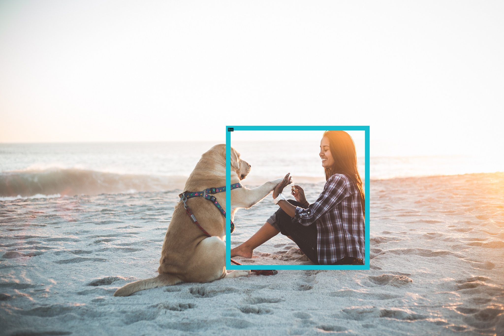

# Guide to Qwen-VL deployment pipeline
1. Download the Qwen vision-language model (Qwen-VL).
    ```bash
    git lfs install
    git clone https://huggingface.co/Qwen/Qwen-VL-Chat
    ```
2. Generate the Vision Transformer (ViT) ONNX model and the TensorRT engine.
- If you don't have ONNX file, run:
    ```bash
    python3 vit_onnx_trt.py --pretrained_model_path ./Qwen-VL-Chat
    ```
    The ONNX and TensorRT engine will be generated under `./onnx/visual_encoder` and `./plan/visual_encoder` respectively.

- If you already have an ONNX file under `./onnx/visual_encoder` and want to build a TensorRT engine with it, run:
    ```bash
    python3 vit_onnx_trt.py --pretrained_model_path ./Qwen-VL-Chat --only_trt
    ```
    This command saves the test image tensor to `image.pt` for later pipeline inference.

3. Build Qwen TensorRT engine.
- Convert checkpoint
    1. Install packages
    ```bash
    pip install -r requirements.txt
    ```
    2. Convert
    ```bash
    python3 ./examples/models/core/qwen/convert_checkpoint.py --model_dir=./Qwen-VL-Chat \
            --output_dir=./tllm_checkpoint_1gpu \
            --dtype float16
    ```

- Build TensorRT LLM engine

    NOTE: `max_prompt_embedding_table_size = query_token_num * max_batch_size`, therefore, if you change `max_batch_size`, `--max_prompt_embedding_table_size` must be reset accordingly.
    ```bash
    trtllm-build --checkpoint_dir=./tllm_checkpoint_1gpu \
                 --gemm_plugin=float16 --gpt_attention_plugin=float16 \
                 --max_input_len=2048 --max_seq_len=3072 \
                 --max_batch_size=8 --max_prompt_embedding_table_size=2048 \
                 --remove_input_padding=enable \
                 --output_dir=./trt_engines/Qwen-VL-7B-Chat
    ```
    The built Qwen engines are located in `./trt_engines/Qwen-VL-7B-Chat`.
    For more information about Qwen, refer to the README.md in [`example/qwen`](../qwen).

4. Assemble everything into the Qwen-VL pipeline.

    4.1 Run with INT4 GPTQ weight-only quantization engine
    ```bash
    python3 run.py \
        --tokenizer_dir=./Qwen-VL-Chat \
        --qwen_engine_dir=./trt_engines/Qwen-VL-7B-Chat \
        --vit_engine_path=./plan/visual_encoder/visual_encoder_fp16.plan \
        --images_path='{"image": "./pics/demo.jpeg"}'
    ```
    4.2 (Optional) For multiple rounds of dialogue, you can run:
    ```bash
    python3 run_chat.py \
        --tokenizer_dir=./Qwen-VL-Chat \
        --qwen_engine_dir=./trt_engines/Qwen-VL-7B-Chat \
        --vit_engine_path=./plan/visual_encoder/visual_encoder_fp16.plan \
        --images_path='{"image": "./pics/demo.jpeg"}'
    ```
    4.3 (Optional) To show the bounding box result in the demo picture, install OpenCV, ZMQ, and request:
    ```bash
    pip install opencv-python==4.5.5.64
    pip install opencv-python-headless==4.5.5.64
    pip install zmq
    pip install request
    ```

    &nbsp;&nbsp;4.3.1 If the current program is executed on a remote machine, run the following command on a local machine:

    ```bash
    python3 show_pic.py --ip=127.0.0.1 --port=8006
    ```

    &nbsp;&nbsp;Replace the `ip` and `port` values, where `ip` is your remote machine IP address.

    &nbsp;&nbsp;Run the following command on the remote machine:

    ```bash
    python3 run_chat.py \
        --tokenizer_dir=./Qwen-VL-Chat \
        --qwen_engine_dir=./trt_engines/Qwen-VL-7B-Chat \
        --vit_engine_path=./plan/visual_encoder/visual_encoder_fp16.plan \
        --display \
        --port=8006
    ```

    &nbsp;&nbsp;Replace the `port` value.

    &nbsp;&nbsp;4.3.2 If the current program is executed on the local machine, run the following command:

    ```bash
    python3 run_chat.py \
        --tokenizer_dir=./Qwen-VL-Chat \
        --qwen_engine_dir=./trt_engines/Qwen-VL-7B-Chat \
        --vit_engine_path=./plan/visual_encoder/visual_encoder_fp16.plan \
        --display \
        --local_machine
    ```

    &nbsp;&nbsp;The question "Print the bounding box of the girl" is displayed.  You should see the following image:

    
