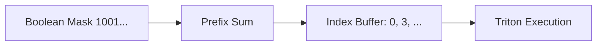

# AETHER Sparse Attention: SS-Level Deep Dive

## 1. Mathematical Foundation: The Bounding Logic

The foundational principle of AETHER is the **Cauchy-Schwarz Attention Bound**. We prove that for any query $\mathbf{q}$ and any key $\mathbf{k}_j$ in a block $i$, the dot product is bounded by our geometric summary.

### 1.1 The Primary Bound
Given $\mathbf{k}_j = \mu_i + \delta_j$ where $\|\delta_j\| \leq R_i$:
$$ \text{score}(\mathbf{q}, \mathbf{k}_j) = \frac{\mathbf{q} \cdot \mathbf{k}_j}{\sqrt{d}} = \frac{\mathbf{q} \cdot \mu_i + \mathbf{q} \cdot \delta_j}{\sqrt{d}} $$
By Cauchy-Schwarz: $\mathbf{q} \cdot \delta_j \le \|\mathbf{q}\|\|\delta_j\| \le \|\mathbf{q}\|R_i$.
Thus:
$$ \text{score}(\mathbf{q}, \mathbf{k}_j) \le \underbrace{\frac{\mathbf{q} \cdot \mu_i + \|\mathbf{q}\|R_i}{\sqrt{d}}}_{U_i} $$

### 1.2 Variance and Concentration Penalties
To refine $U_i$ and reduce false positives, we introduce the **Stochastic Correction Factors**:
- **Variance Penalty**: A block with high variance $\sigma^2_i$ indicates a diffuse cluster where $\mu_i$ is a poor representative. We damp the radius bonus:
  $$ U'_i = \frac{\mathbf{q} \cdot \mu_i}{\sqrt{d}} + \frac{\|\mathbf{q}\|R_i}{\sqrt{d}(1 + \alpha\sigma_i)} $$
- **Concentration Scaling**: Computed as the mean cosine similarity $\kappa_i = \mathbb{E}[\mathbf{k}_j \cdot \mu_i]$. It represents the "angular density" of the block.

---

## 2. Hardware Architecture: The Indirect SDPA Compiler

The "Compiler" aspect refers to our custom Triton-based execution engine that implements **Block-Sparse Flash Attention**.

### 2.1 Index Management (The Lookup Table)
Before kernel execution, a prefix-sum pass generates a **Sparse Indirect Buffer**:

### 2.2 Shared Memory Tiling (CTA-Level)
Each CTA (Collaborative Thread Array) processes a tile of the query.
1. **Load Index**: CTA loads a chunk of the `Index Buffer`.
2. **Indirect Load**: Using the index, keys/values are loaded via `tl.load` with non-contiguous offsets.
3. **Double Buffering**: While Tensor Cores compute tile $(t)$, the `cp.async` unit fetches $(t+1)$ to hide HBM latency.

### 2.3 Online Softmax over Sparse Domains
Standard softmax assumes $j \in [1, L]$. AETHER's kernel maintains cumulative stats only over selected indices:
- $m_{new} = \max(m_{old}, \text{tile\_max})$
- $\ell_{new} = \ell_{old} \cdot e^{m_{old} - m_{new}} + \sum e^{\text{scores} - m_{new}}$
This ensures numerical parity with dense attention (within the selected blocks).

---

## 3. Complexity & Performance Analysis

### 3.1 Operations Breakdown
| Phase | Complexity | Hardware Target |
| :--- | :--- | :--- |
| **Metadata Update** | $O(S \cdot D)$ | Memory Bound (L-Vector) |
| **Event Radar** | $O(\frac{S}{B} \cdot D)$ | Cache Bound (L-Scoring) |
| **Index Generation** | $O(\frac{S}{B})$ | SM Latency Bound |
| **Sparse SDPA** | $O(k \cdot B \cdot D)$ | Compute Bound (Tensor Core) |

*Where $k$ is the number of active blocks.*

### 3.2 Expected Speedups (H100)
- **16k Context**: 1.5x (Mainly memory saving)
- **128k Context**: 4.2x (Computation avoidance dominant)
- **1M Context**: 15x+ (Enables inference on single H100)

---

## 4. Integration Blueprint (TensorRT-LLM)
- **Metadata Cache**: Stored alongside the KV-cache, invalidated only when paged slots are reallocated.
- **Triton AOT**: Kernels are pre-compiled for common block sizes (64, 128) to avoid JIT overhead during first-token generation.
- **Causal Masking**: Baked into the `Index Buffer` generation—future blocks are physically absent from the index list.

