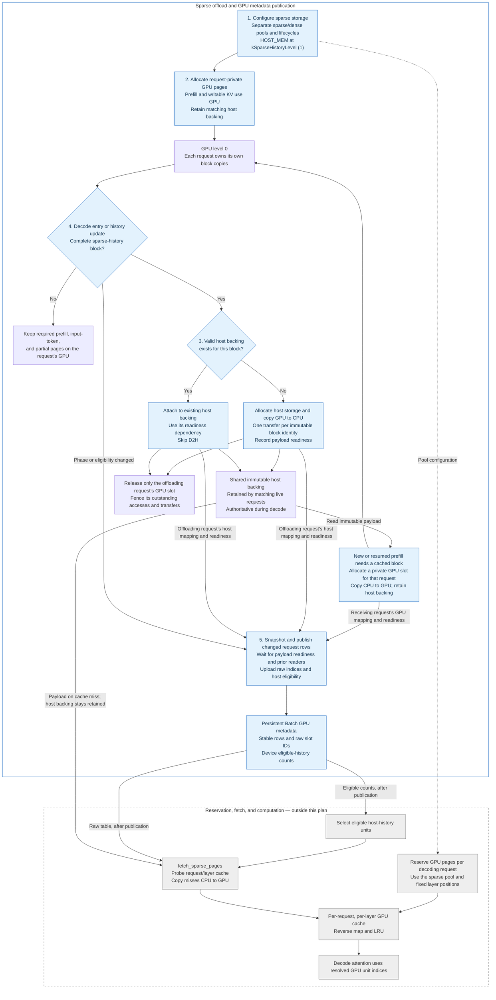

<!--
SPDX-FileCopyrightText: Copyright (c) 2026 NVIDIA CORPORATION & AFFILIATES. All rights reserved.
SPDX-License-Identifier: Apache-2.0
-->

# Sparse KV offload implementation plan

**Core invariant: every sparse-layer GPU block belongs to exactly one request.
Requests may reuse the same immutable host block, but each request that needs it
on GPU receives its own GPU copy.**

This document specifies the ownership, offload, prefix-reuse, and publication
contract. The implementation belongs in
`cpp/tensorrt_llm/batch_manager/kv_cache_manager_v2/`, with nanobind and runtime
exposure where needed. The acceptance criteria in step 6 require implementation
validation; this design update does not establish runtime test results.
GPU metadata publication uses the native
[`Batch` interface](cpp/tensorrt_llm/batch_manager/kv_cache_manager_v2/batch.h), and
the [runtime adapter](tensorrt_llm/_torch/pyexecutor/kv_cache/kv_cache_manager_v2.py)
consumes the native lifecycle APIs.

## Scope and target behavior

When a request finishes prefill and enters decode, process every eligible complete
sparse-history page. If its immutable contents have no host backing, copy the
request's GPU page to `HOST_MEM` at level 1 (`kSparseHistoryLevel`). If a valid host
copy already exists, attach the request to that copy and skip the GPU-to-CPU
transfer. In both cases, release only that request's GPU allocation, with a
completion fence covering its outstanding accesses and transfers. Apply the same
rule as new complete history pages become eligible during decode.

Another request's prefill phase does not affect this decision. Requests with the
same prefix have distinct GPU slots and can enter decode independently. Their
full immutable prefix blocks share a host backing record, allowing each block to
be stored on host once while that record remains valid and retained.

A new request that matches a host-backed prefix allocates private GPU pages and
copies the prefix from CPU to GPU before prefill consumes it. The host copy stays
authoritative and retained. Existing decoding requests keep their host mappings
and eligible-history counts. When the new request finishes prefill, it releases
these clean private GPU copies and offloads only subsequent eligible blocks whose
contents are not already backed on host.

Initial, cached, chunked, and resumed prefill require the KV they attend to on GPU.
History accounting continues during prefill, but watermark updates alone do not
trigger sparse offload. Input-token and partially filled pages stay writable in
the request's GPU allocation at level 0 (`kHotLevel`). Dense and SSM storage keep
their ordinary lifecycle rules.

Allocation, locking, and offload operate on full pages of the global
`tokens_per_block`, preserving coalesced sparse buffers. A **selection unit** is
what a future fetch selects; `tokens_per_block_override` changes index expansion,
not physical offload granularity. The initial target is block/page-level sparse
decoding, with sub-page/token selection supported later.

The sparse GPU pool supplies private prefill and writable pages and, in future
work, per-request reservations for fetched history. A common pool does not imply
common slot ownership. Releasing an ordinary GPU page does not populate a future
fetch cache; those entries receive their contents through CPU-to-GPU fetches.

**Out of scope:** `fetch_sparse_pages`, selection processing, sparse H2D
fetch/refill kernels, per-request GPU cache reservation/maps/LRU, selection-layout
descriptors, gather plugins/JIT fusion, and attention integration. Whole-page
CPU-to-GPU copying for prefill is in scope. Partial-prefix copying remains
necessary for writable GPU pages.

`Batch` groups live requests, assigns each a stable row, owns CPU staging and GPU
page tables/eligible-history counts, and uploads changed rows. The runtime facade
exposes its device views through DLPack. `BatchDesc` remains configuration data
used by `constraints` and `typical_step`; it does not own live membership or
publish device tables.

### Ownership and block identity

Separate the reusable block's identity and host backing from each request's GPU
allocation and execution mapping. A single mutable storage location on a shared
`Page` cannot represent these independent allocations.

| Object | Ownership and lifetime |
|--------|------------------------|
| Immutable block identity | Uses KVCM's full prefix/block identity and compatible buffer layout. A block ordinal such as 0 alone does not establish a cache match. |
| Host backing record | Shared by matching immutable blocks. Records the host slot, validity, copy-readiness event, and references that keep its payload alive. |
| Request GPU allocation | Owned by one request, including during full-prefix reuse, prefill, resume, and commit/rebase. Its slot and release fences are independent of other requests' slots. |
| Request block binding | Associates the logical block with its private GPU allocation, if present, and its reusable host backing. Selects the execution mapping for that request's phase. |
| Future fetched GPU entry | Owned by one request/layer within that request's reservation. The host record remains authoritative. |

Matching complete blocks refer to the same host backing record even while that
record has no host slot yet. When one request supplies the host copy, other live
matching bindings retain access to it without changing their GPU mappings. This
keeps the host copy available if the first request closes before another finishes
prefill. Active decode locks and prefill reuse references protect host storage;
outstanding copies and readers also retain the required lifetime and fences.

Only a full immutable block with the same contents and compatible layout can
reuse the host record. A partial prefix is copied into a private writable page.
Appending to that page creates request-specific contents; an earlier host prefix
is not a valid backing for the completed page. Apply identity and validity checks
to every block, including blocks following a reused prefix.

### Example: A, B, and X reuse block 0

| Event | Request-private GPU state | Host state and transfer |
|-------|---------------------------|-------------------------|
| A and B use the same immutable block 0 during prefill | A holds GPU slot 42; B holds GPU slot 17. | The common block identity has no host copy yet. |
| A enters decode while B is still in prefill | B continues using slot 17. A releases slot 42 after its accesses and copy finish. | A copies block 0 to host slot 9 and binds its decode history to slot 9. |
| B finishes prefill | B releases slot 17 after its own accesses finish. | B binds block 0 to host slot 9 without copying it again. It offloads only following eligible blocks missing host backing. |
| X arrives and matches block 0 | X allocates GPU slot 23 and copies host slot 9 into it for prefill. | Host slot 9 remains retained; A and B continue using their host mappings. |
| X finishes prefill | X releases slot 23 after its own accesses finish. | X keeps its reference to host slot 9, skips D2H for block 0, and offloads following eligible blocks missing host backing. |

The same rules apply if X arrives before B finishes prefill. B and X have separate
GPU copies, and neither request changes A's decode mapping. If B reaches decode
while A's D2H copy is still in flight, B uses the same host record and readiness
event; it does not submit a second copy of block 0.

## Whole picture: where each step fits

Steps 1–5 cover **request-private GPU storage, reusable host backing, whole-page
prefill copies, and GPU metadata publication**. Step 4 selects eligible history
on decode entry or history growth. Step 3 resolves each block's host backing,
copies missing contents, and releases that request's GPU allocation. Step 5
publishes the resulting request mappings and readiness dependencies.

For prefill reuse, step 2 obtains private GPU storage and copies the required KV
into it while retaining the host record. Step 5 publishes GPU indices only for
the receiving request. Per-request fetch reservations, selected-history
CPU-to-GPU fetch, and sparse attention integration remain separate work.

Blue identifies work in this plan; gray identifies the later fetch implementation.
Arrows describe execution, data transfer, or configuration. Both prefill copies
and future fetched entries have request-private GPU ownership. Copying from a
host block does not release its host slot or change another request's mapping.

| Step | Responsibility |
|------|----------------|
| **1. Configuration and grouping** | Separate sparse/dense lifecycles and pools, preserve compatible sparse coalescing, and require the host tier. |
| **2. Ownership and locking** | Track host backing separately from private GPU allocations; copy required prefix KV into each receiving request's GPU pages. |
| **3. Batched offload and source release** | Store each immutable block on host once, reuse existing backing, and safely release only the offloading request's GPU pages. |
| **4. Decode offload trigger** | Process complete history on decode entry and history growth using the requesting cache's phase and block state. |
| **5. CPU metadata and GPU publication** | Publish each request's execution mappings, eligibility, and readiness through stable `Batch` rows. |

## 1. Sparse configuration and storage grouping

Mark sparse KV buffers with `BufferConfig.is_sparse` (`isSparse` in C++).
The default is `false`.

| Rule | Requirement |
|------|-------------|
| History destination | Sparse buffers require `HOST_MEM` at `kSparseHistoryLevel` (level 1). |
| Attention layers | All buffers within one layer must agree on sparsity. |
| SSM layers | Sparse buffers are rejected. |
| GPU pools | Sparse and dense buffers stay separate; matching slot shapes can share a pool within the same sparsity. Each sparse slot has one request owner. |
| Page packing | Compatible sparse buffers with the same lifecycle and expanded size share a physical page within a request. Host backing covers the complete coalesced payload. |

`AttnLifeCycle` includes sparsity in its identity. `createStorageConfig()` groups
slots using `PoolGroupKey{slotSizes, isSparse}`. `CacheLevel` is a position in the
storage hierarchy; `CacheTier` is the storage type at that position.
`kSparseHistoryLevel{1}` names this feature's host destination.

The manager-level `is_sparse(layer_id, data_role)` query identifies the affected
buffers. Per-request GPU fetch-cache reservations belong to later work. Prefill
admission must account for the full private GPU capacity it needs, including
matched prefix blocks; a cache match saves computation and host storage but does
not remove that request's GPU allocation requirement.

## 2. Request ownership and tier-aware locking

`Page::queryLockLevel()` and `KvCache::_lockLevel()` must resolve the requested use
against the request's execution binding and its host backing. Selecting GPU for
prefill acquires a private allocation; selecting host for decode acquires a
reference to the reusable host record.

| Page or use | Required mapping |
|-------------|------------------|
| Required prefill KV with host backing | Private GPU copy at `kHotLevel`, plus a retained reference to its immutable host backing. |
| Required prefill KV without host backing | Private GPU allocation; compute the KV or copy a valid matching GPU source into the private destination. |
| Complete sparse decode history with host backing | Host at `kSparseHistoryLevel`, retaining payload readiness and the active lock. |
| Complete sparse decode history only on GPU | The request's private GPU allocation until step 3 successfully establishes the host mapping. |
| Sparse history on disk | Restore reusable backing to host; prefill additionally requires a private GPU copy. |
| Writable sparse pages | Private GPU allocation at `kHotLevel`. |
| Dense or SSM pages | Ordinary GPU locking and lifecycle rules. |

Key rules:

- `batchedLockPages()` may deduplicate host references and host transfers by
  immutable block identity. GPU destinations are allocated per request. Full
  prefix reuse from a GPU-resident source copies into the receiving request's
  private page and records the source-copy dependency before the source can be
  released or reused.
- `UniqPageLock` must distinguish a request's private GPU ownership from its host
  backing reference. Moving a request's execution mapping affects that request's
  indices and external buffers. Other matching requests keep their current
  mappings, phase, and locks.
- Partial-prefix reuse copies valid KV into a private writable GPU page. The
  source retains its own ownership, and ready/finish events protect the copy.
  Commit/rebase may associate a completed block with matching host backing; it
  must preserve private GPU ownership while that request needs the page on GPU.
- `_lockHeldBlocks()` and allocation rollback restore the request's bindings
  and lock levels. Failures leave established host entries and other requests'
  private GPU pages intact.
- Pages return slots to their actual tier. Scratch slots remain GPU-only.
  Host storage is reclaimable only after its retaining references and locks are
  released and outstanding readers/copies are fenced.

### CPU-to-GPU copies for prefill

Fresh cached-prefill admission, suspended-prefill resume, commit/rebase, and
prefetch use the same private-copy contract:

1. Resolve each matching immutable host block and retain its host backing.
2. Reserve a private GPU destination for each required page of the receiving
   request. An existing valid private copy for that request may be retained.
3. Wait on source payload readiness and destination reuse dependencies, then
   decode the full coalesced host page with the existing cold-page codec. Host
   reads from other requests can proceed concurrently; the payload is immutable.
4. Record the H2D completion event and attach the GPU mapping and readiness to
   the receiving request. Prefill and metadata consumers wait for that event.
5. Keep the host record and the receiving request's reference to it. At decode
   entry, that record permits release of the clean private copy without D2H.

GPU OOM leaves host backing intact and causes admission to fail cleanly for a
later attempt. Copy-submission failure preserves the request's valid mappings
and fences temporary destinations and source reads before cleanup. Accounting
records only successfully submitted transfers. Prefetch does not grant an active
prefill lock; any prepared GPU copy remains associated with the receiving request,
and admission rechecks its residency, readiness, and capacity.

## 3. Batched GPU-to-CPU offload and source release

`KvCache::offloadSparsePages()` is the entry point for an active request under the
manager's exclusive lock. Step 4 selects complete sparse-history pages and checks
the requesting cache's phase. Direct callers must satisfy the same eligibility
rules for that request.

`StorageManager::offloadSparsePages()` resolves host backing and performs only the
missing transfers:

| Stage | Action |
|-------|--------|
| Resolve | Look up the host backing for each immutable block identity. Reuse a valid host slot and its readiness event when present. |
| Reserve | Deduplicate missing host records by block identity, group compatible payloads by codec batch, and allocate destinations before submitting copies. |
| Wait | Order each copy after its source writes, source/destination readiness, and relevant access fences. GPU work on another request's independent copy does not gate it. |
| Copy | Encode each missing full coalesced page into host storage. Existing host payloads need no writeback. |
| Bind | Record the retained host mapping and completion dependency in the offloading request, update its CPU indices and external buffers, and mark its metadata changed. |
| Release | Return only that request's GPU slot with fences covering its accesses and transfers. For a host-backed clean page, fence the private GPU accesses without submitting D2H. |

Key rules:

- Eligibility requires a complete immutable sparse-history page for the
  requesting cache. Reject writable input pages and partial committed pages.
  A different request may still be in prefill with its own copy of the block.
- Host deduplication uses the full reusable block identity and layout, not the
  GPU slot, request-local ordinal, or GPU `Page` pointer. Repeated calls are
  idempotent while the valid host backing is retained.
- Reserve and publish host backing under the manager lock so concurrent requests
  cannot allocate competing destinations for one block. A successfully submitted
  copy can be reused through its completion event before it finishes. An empty
  reservation or failed copy submission is not valid host backing.
- Retain the host copy for all matching live bindings. A prefill binding can
  retain host backing while continuing to use its own GPU mapping. Establishing
  that backing alone does not change its execution indices or eligible count.
- `onPageStorageChanged()` increments `pageStorageVersion()` whenever a request's
  mapping, storage level, or readiness changes, even if numeric slot IDs happen
  to be equal. Physical transfer counters count actual copies; attaching another
  request to an existing host block records no D2H transfer. Emit physical storage
  events only for actual storage changes.
- Host-copy readiness and GPU-slot release are separate dependencies. When B
  attaches to A's host copy, B waits for A's payload readiness before reading host
  data, while B's GPU-slot reuse waits for B's own outstanding accesses.

Allocation or codec-submission failure preserves source GPU pages, existing host
backing, request bindings, and their indices. Commit new host records and request
mapping changes only after the transfer batch has been successfully submitted and
completion events recorded. If an earlier codec group has already queued work
when a later group fails, fence the source accesses and temporary destinations
before cleanup, and remove uncommitted host reservations. A later attempt may
reuse valid committed backing and copy only missing blocks.

## 4. Trigger sparse offload during decode

The scheduler explicitly marks the transition from prefill to decode. A nonzero
history length alone does not enable offload.

| When | Action |
|------|--------|
| Initial, cached, chunked, or resumed prefill | Provide private GPU pages for all required KV. Copy host-backed prefixes into those pages and retain their host references. History updates do not trigger offload. |
| Decode entry | Resolve host backing for every complete sparse-history block, copy missing blocks, and release the request's corresponding GPU pages, even if history length is unchanged. |
| Decode history advances | Process newly completed history using the same host lookup and private GPU release rules. |
| Decode resumes or rebases onto a reused prefix | Retain existing host backing, restore cold history to host as needed, and offload eligible request-private GPU pages whose host backing is missing. |
| Request suspends or closes | Release that request's private allocations and references according to lifecycle rules and access fences. Preserve host backing retained by other requests. |

`try_allocate_generation()` calls `enter_decode()` for active requests or
`resume(..., is_decoding=True)` for suspended requests. Native
`_offloadSparseHistory()` selects pages and calls step 3. History updates through
`resize()` / `_shortcutSetHistoryLength()` process newly completed pages.
`Batch::publish()` snapshots and publishes the resulting state after lifecycle
operations finish.

Key rules:

- Successful decode entry leaves every eligible complete sparse-history page
  mapped to retained host backing with a readiness dependency. Input, partial,
  and dense pages retain GPU management. Preserve sparse history through SWA
  cleanup, scratch reuse, and turn-end drop plans.
- Another request's phase, GPU mapping, or progress does not determine whether
  the current request can offload its private copy. Runtime/model adapters use
  ordinary lifecycle calls; KVCM resolves host backing and copy ownership.
- Order offload after relevant CUDA work without CPU synchronization. Allocation
  or codec failures preserve valid state and dependencies under rollback rules;
  the lifecycle operation reports failure so admission or resize can be attempted
  again. Reject history rewinds and a return to prefill after decode. Decode
  history must fit within already allocated capacity.
- Call `onPageStorageChanged()` on decode entry/resume and changes to the complete
  history count during decode, including when existing host backing means there
  is no payload transfer or numeric index change.

With **64 tokens/page**, entering decode at history length **1024** establishes
host mappings for pages **0–15**. If page **0** already has valid host backing,
only pages **1–15** need D2H. Advancing to **1088** processes page **16**, copying it
only if its immutable contents are not already backed on host.

## 5. CPU metadata and GPU publication

`KvCache` maintains request-local CPU execution metadata; `PageStorageSnapshot`
copies one request/group/beam's state; `Batch` publishes it to stable GPU rows
before consumption. `KVCacheManagerV2` creates a batch for managers with sparse
buffers.

| Operation | Action |
|-----------|--------|
| Query | `is_sparse(layer_id, data_role)` identifies sparse buffers. |
| Track changes | `onPageStorageChanged()` increments the affected request's version and marks its metadata and `Batch` row dirty. |
| Snapshot | `getPageStorageSnapshot()` copies execution indices, storage levels, eligible-history count, readiness events, and row/version under the manager lock. |
| Own rows | One `Batch` spans all layer groups, with exclusive membership and stable row slots. Removal leaves a reusable hole. |
| Own tables | Allocate stable raw GPU tables per layer group, device eligible-history counts (`num_blocks`), and pinned staging buffers. |
| Publish | Snapshot final dirty rows, wait for payload readiness and prior metadata readers, and upload raw indices and counts asynchronously. Clear holes to invalid indices and zero eligibility. |
| Connect callers | Match `Batch` rows to `IndexMapper` slots; publish after resource preparation and connector acceptance, before block-offset preparation. Expose tables through DLPack. |
| Batch resize | Forward to per-request `resize()`, return each result, and publish once after all updates and any rollback. |

Key rules:

- The published mapping is request-specific. Prefill uses that request's private
  GPU indices even when the same blocks have host backing. Decode history uses
  the retained host indices. Host backing remains separately tracked while the
  request uses a GPU execution mapping.
- Index/buffer changes, relocation/readiness, commit/rebase, suspend/resume,
  decode entry, and eligibility changes invalidate the affected metadata.
  Repeated notifications combine into one refresh of the final state, including
  after rollback. A new request's H2D copy does not invalidate other requests'
  mappings or reduce their host eligibility.
- Preserve raw indices and `BAD_PAGE_INDEX`. Eligible history is the contiguous
  complete-history prefix with valid locked host mappings and recorded readiness,
  bounded by `history_length // tokens_per_block`. Successful decode admission
  establishes backing for all eligible complete history. Prefill, inactive
  requests, and dense groups expose zero. Consumers must honor the published
  count and storage levels, including when observing a failed operation's
  restored state.
- CPU metadata can change while a payload copy is still running. `publish()`
  waits on snapshot readiness before uploading, then records `mReady`. It
  acknowledges the version via `acknowledgePageStorage()` only after all
  groups/beams and counts are queued; stale acknowledgments cannot clear newer
  changes. Retain staging until upload completion. Failed publication stays dirty;
  `wait_ready()` rejects unpublished changes.
- On the request's owning thread, publish and wait outside graph capture. Call
  `record_read()` after submitting reads or graph replay, before mutation,
  suspend, removal, or close. Direct snapshot consumers use `snapshot.waitReady()`
  and `recordPageStorageRead()`. These stream dependencies do not block the CPU.
- Request close detaches its row; batch close detaches requests without closing
  them. Use `Batch.add/remove` for membership; `bindPageStorageRow()` remains for
  standalone consumers. Snapshots retain events, DLPack views retain device
  allocations, and request bindings/locks retain the KV storage they use. Shapes
  and addresses stay stable, with beam width 1 supported by this plan.
- Executor publication uses the execution stream. Other streams must use
  `wait_ready()` / `record_read()`. Dense-only managers need no `Batch`. Until the
  fetch and sparse attention path exists, `copy_batch_block_offsets()` must reject
  host mappings that a GPU-only consumer cannot interpret, using the actual
  execution mapping and storage level.

For the A/B/X example, A's **GPU slot 42 → host slot 9** transition dirties A's row.
B's prefill row continues to contain **GPU slot 17**. At B's decode entry, its row
changes to **host slot 9** with the same host-copy readiness dependency and no new
D2H transfer. X's prefix copy publishes **GPU slot 23** only in X's prefill row;
A and B continue to publish **host slot 9** and their existing eligible counts.
When X enters decode, its row also uses **host slot 9**.

Metadata upload transfers indices and counts, not KV payload. Consumers wait for
`mReady` before reading the published tables. Host-copy readiness and host
lifetime must also cover future fetch readers and current prefill H2D readers.

## 6. Offload correctness and regression validation

Validate the ownership contract through native lifecycle/publication tests,
runtime-facade tests, and scheduler integration. The cases below are acceptance
requirements; implementation results must be recorded after running them.

| Case | Required checks |
|------|-----------------|
| A enters decode while B is in prefill | Distinct GPU slots for block 0; A copies it to host immediately after its own dependencies, releases only A's slot, and publishes host eligibility. B's payload, GPU slot, row, and phase stay valid. |
| B later enters decode | B discovers and retains the existing host backing, performs zero additional D2H for block 0, and releases B's slot. Only following blocks missing host backing are copied. |
| X matches host-backed block 0 | One new private GPU destination for X; one H2D copy; host slot and A/B mappings, versions, and eligibility stay unchanged. X's decode entry performs zero D2H for that block. |
| Multiple cached-prefill arrivals | Each request receives distinct GPU slots and correct payloads. GPU usage grows per admitted request; one retained host payload serves all matching blocks. |
| Host copy already in flight | A and B entering decode near the same time resolve one host record and one D2H transfer. All host consumers honor the recorded completion event. |
| First offloader closes | B or X retains the host record even if A closes before their prefill ends. Their decode entry reuses that backing without another D2H. |
| Full GPU-prefix reuse and commit/rebase | A receiving request always has its own GPU destination. Identity association and host reuse preserve private execution mappings. Source-copy fences prevent premature source reuse. |
| Partial-prefix reuse and divergent continuations | Mutable pages have private contents and identities; stale or merely equal-ordinal host entries are never reused as complete backing. |
| Prefill chunks, suspend/resume, and prefetch | Required KV is available in private GPU pages before each prefill use; host backing stays retained as required, and prefill history updates do not trigger sparse offload. |
| Decode entry and incremental history | An unchanged watermark still enables offload on phase transition. Later full pages offload once; dense, writable, and partial pages keep their intended lifecycle. |
| Delayed accesses and slot reuse | D2H source reads, H2D source reads, prior GPU readers, metadata readers, and graph replay are fenced correctly. Reads of B's separate GPU copy do not gate A's offload. |
| Host/GPU OOM and codec failures | Preserve valid mappings, backing, payloads, and dependencies; free only temporary allocations with fences; failed host reservations cannot be reused as valid data. A later successful attempt does not duplicate already valid backing. |
| Metadata isolation and accounting | Only affected execution rows change. Check tier tags even when slot numbers match, physical transfer counts, per-request GPU usage, shared host usage, and release after the final reference. |

Keep broader regressions in the existing suites:

- Configuration and grouping in
  [kvCacheManagerV2ConfigTest.cpp](cpp/tests/unit_tests/batch_manager/kvCacheManagerV2ConfigTest.cpp):
  defaults, host-tier requirements, invalid buffer combinations, sparse/dense
  separation, and expanded-size coalescing.
- Ownership, locks, offload, snapshots, and `Batch` in
  [kvCacheManagerV2ColdPageTest.cpp](cpp/tests/unit_tests/batch_manager/kvCacheManagerV2ColdPageTest.cpp):
  payload preservation, disk-to-host restoration, mixed lifecycles, external
  indices, rollback, host retention, source-slot fences, row reuse, stale
  acknowledgments, staging lifetime, publication failures, and graph replay.
- Runtime bindings and DLPack in
  [test_kv_cache_manager_v2.py](tests/unittest/kv_cache_manager_v2_tests/test_kv_cache_manager_v2.py):
  sparse configuration, storage statistics, private GPU allocation accounting,
  shared host accounting, CPU snapshots, and GPU table publication.
- Scheduler admission in
  [test_kv_cache_v2_scheduler.py](tests/unittest/_torch/executor/kv_cache/test_kv_cache_v2_scheduler.py):
  active/suspended decode entry, cached-prefill GPU capacity, admission failures,
  publication after preparation and connector acceptance, and rejection of host
  indices by GPU-only consumers.

Use the existing native test target and KVCacheManagerV2 runtime suite entries in
the A10, H100, and B200 test lists; executor cases remain in the executor directory
in `l0_cpu.yml`. Run payload and ordering checks on GPU with debug checks enabled,
and validate the normal production package as well as isolated bindings. Native
and facade coverage does not establish complete model integration; runtime cases
must exercise the same behavior through normal scheduling and publication hooks.
Fetch and attention consumption remain outside this plan.

## Boundary with the later fetch implementation

- **Reservation:** for the initial one-unit-per-page case, each decoding request
  reserves `min(N, history_length // tokens_per_block)` GPU pages on decode entry
  or decode resume; insufficient capacity fails that admission. This bounded
  fetch reservation is separate from private prefill GPU capacity. `N` is bounded
  per sparse buffer and covers selection width `k = num_selected_blocks`; a
  capacity of `2k`–`4k` can retain previously fetched entries. Each coalesced layer
  uses its fixed buffer position. A reserved page may hold different ordinals for
  different layers and cannot be treated as an ordinary block-identified `Page`.
- **Cache:** state is scoped to `(request, layer)`. Each entry occupies
  `(page, layer)` within the reservation, extended to `(page, layer, unit)` for
  sub-page selection. The device implementation uses a slot-to-unit reverse map,
  an ephemeral resident hash, and LRU. Requests matching the same prefix have
  independent fetched GPU entries backed by the same immutable host record.
  Clean entry eviction requires no writeback.
- **Extraction:** the first fetch stage uses the default codec and
  buffer-relative `SelectionUnitLayout` descriptors. Offloading a whole page
  through an existing codec does not itself provide sparse extraction for that
  codec; gather plugins and optional JIT fusion remain later stages.
- **Selection:** only history units within the published host-eligible prefix
  may be resolved against the host pool. `Batch` publishes that count on device;
  fetch must not interpret input, partial, or prefill GPU indices as host indices.
  A different request's prefill copies leave the decoding request's host mapping
  and eligibility intact.

Multi-page selection units and uniform versus request-varying reservation bounds
remain open. Before sub-page fetch work, reconcile page-based and selection-unit
reservation sizing; they coincide for the initial one-unit-per-page target.
These choices preserve full-page offload, retained immutable host backing, and
request-private GPU ownership.
