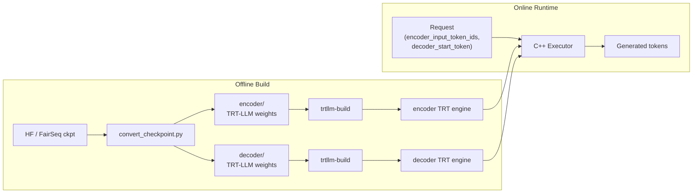
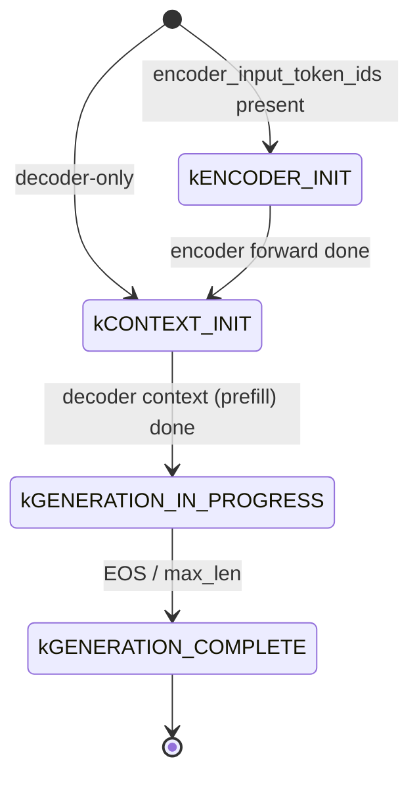
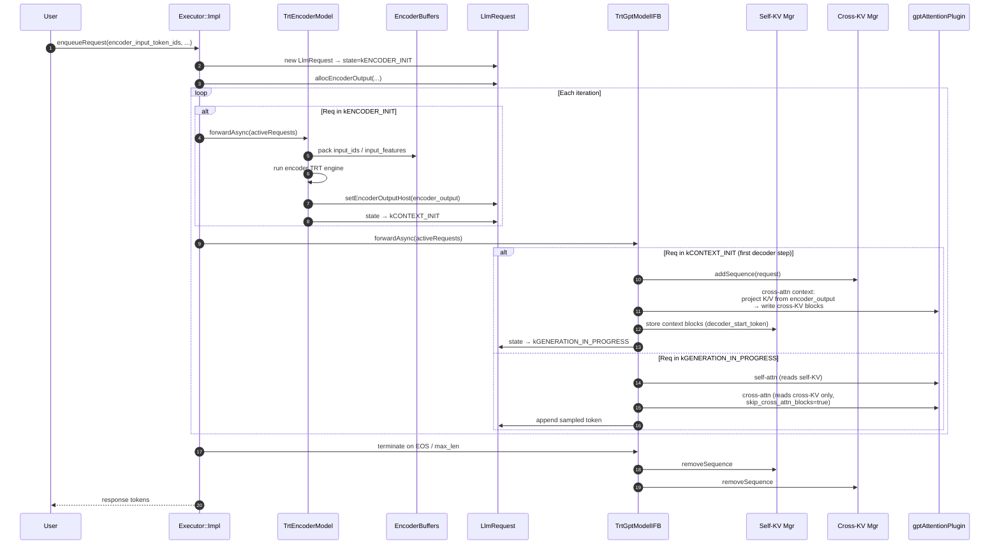

# Encoder-Decoder Models in the Legacy C++ / TensorRT Flow

This document explains how encoder-decoder (enc-dec / seq2seq) models such as
T5, Flan-T5, mT5, ByT5, BART, mBART, FairSeq NMT, and Whisper are built and
executed in the **legacy TensorRT backend** of TensorRT-LLM. It summarizes the
high-level architecture and the key components, file-by-file, and describes how
they interact across a request's lifetime.

> Scope: the `convert_checkpoint.py` → `trtllm-build` → C++ `Executor` / Python
> `GenerationSession` pipeline. This path is legacy and will not get new
> features; new projects should use the PyTorch backend (see
> [`encoder_decoder_porting_guide.md`](encoder_decoder_porting_guide.md) for the porting plan).

---

## 1. High-Level Architecture



Key design choices:

- **Two separate TRT engines** per deployment — one for the encoder, one for
  the decoder. They are built from two separate TRT-LLM `PretrainedModel`
  subclasses, saved to `encoder/` and `decoder/` subdirectories, and loaded
  independently at runtime.
- **Two C++ model wrappers** at runtime — `TrtEncoderModel` drives the encoder
  engine, `TrtGptModelInflightBatching` drives the decoder engine. The
  top-level `Executor` orchestrates them.
- **One logical `LlmRequest`** per user request. It transitions through a
  multi-phase state machine (`kENCODER_INIT` → `kCONTEXT_INIT` →
  `kGENERATION_IN_PROGRESS` → `kGENERATION_COMPLETE`). Encoder and decoder
  micro-batches are scheduled independently based on state.
- **Two KV-cache pools** on the decoder side — the normal self-attention KV
  cache, plus a **cross-KV cache** that holds projected K/V of the encoder
  output. Cross-KV is computed once per request and reused across decode
  steps. The split is governed by `KvCacheConfig::crossKvCacheFraction`.
- **Cross-attention is a code path inside the GPT attention plugin**
  (`gptAttentionPlugin`) — not a separate kernel. The same plugin serves
  self-attention and cross-attention; a `do_cross_attention` flag switches
  between them.

---

## 2. Key Components

### 2.1 Model Definitions (TensorRT Network Graph)

**File:** [`tensorrt_llm/models/enc_dec/model.py`](tensorrt_llm/models/enc_dec/model.py)

All seq2seq families share a single unified Python implementation that defines
three `PretrainedModel` subclasses (TRT-LLM Pydantic/Functional graphs):

| Class              | Purpose                                         | Marked outputs                            |
| ------------------ | ----------------------------------------------- | ----------------------------------------- |
| `EncoderModel`     | Self-attention-only stack for text tokens       | `encoder_output` on last PP rank          |
| `DecoderModel`     | Self-attn + **cross-attn** + MLP per layer + LM head | token logits                         |
| `WhisperEncoder`   | Conv frontend + encoder stack for mel features  | `encoder_output`                          |

Model-family differences (gated MLP for T5, ALiBi vs. learned vs. relative
positional embeddings, layer-norm flavor, etc.) are controlled entirely through
`PretrainedConfig` fields set by the checkpoint converter.

Cross-attention in `DecoderLayer` uses the standard TRT-LLM `Attention` layer
with `cross_attention=True` (see line 433 of `model.py`). `DecoderModel.forward`
takes `encoder_output` as an input tensor and threads it through every layer.

### 2.2 Checkpoint Conversion

**File:** [`examples/models/core/enc_dec/convert_checkpoint.py`](examples/models/core/enc_dec/convert_checkpoint.py)

Merges all supported families (T5 / BART / NMT / etc.) into one script:

- Reads HF / FairSeq weights.
- Splits tensors for TP / PP according to `--tp_size` / `--pp_size`.
- Writes two directories: `<out>/<tpX>/encoder/` and `<out>/<tpX>/decoder/`,
  each containing `config.json` + sharded weight files in TRT-LLM format.

The two directories are then fed **separately** to `trtllm-build`.

### 2.3 Engine Build

**File:** [`tensorrt_llm/builder.py`](tensorrt_llm/builder.py)

`trtllm-build` calls each model's `prepare_inputs(...)` to stamp out the TRT
input tensors, then compiles a TRT engine. Notable differences:

- `EncoderModel.prepare_inputs` only needs `max_input_len` /
  `max_batch_size`; `max_seq_len` is forced equal to `max_input_len` because
  the encoder does not generate.
- `DecoderModel.prepare_inputs` additionally receives **`max_encoder_input_len`**
  (shape budget for the `encoder_output` tensor) and the usual
  `max_input_len` / `max_seq_len` for the generated sequence.
- `WhisperEncoder.prepare_inputs` only needs `max_batch_size` — mel
  spectrograms are fixed length.
- For `DecoderModel` the standard `optimize(network)` TRT post-pass is
  **skipped** (see `builder.py`) because some cross-attention op patterns
  regress under it.
- `--gpt_attention_plugin` is **required**. `--bert_attention_plugin` is used
  for encoder self-attention. `--remove_input_padding` is recommended.
  T5 needs `--context_fmha disable` because FMHA does not yet support T5's
  relative attention bias.

Output layout:

```
out/<tpX>/encoder/rank0.engine, config.json
out/<tpX>/decoder/rank0.engine, config.json
```

### 2.4 `LlmRequest` — Unified Request Object

**File:** [`cpp/include/tensorrt_llm/batch_manager/llmRequest.h`](cpp/include/tensorrt_llm/batch_manager/llmRequest.h)

A single `LlmRequest` object carries the whole lifecycle. Enc-dec-specific
fields and methods:

- `mEncoderTokens` / `getEncoderTokens()` — encoder input token ids (text path).
- `mEncoderInputFeatures` / `getEncoderInputFeatures()` — mel features (Whisper).
- `mEncoderOutputLength` / `getEncoderOutputLen()` — length budgeted for the
  encoder output (equals encoder input length for text, post-conv length for
  Whisper).
- `mEncoderOutput` (GPU) and `mEncoderOutputHost` (pinned host) — encoder
  hidden states, filled by `TrtEncoderModel` and consumed by the decoder.
- `allocEncoderOutput(...)` / `setEncoderOutput(...)` / `getEncoderOutput()` —
  lifecycle API used by `Executor::Impl`.

The initial state on submission is selected by the presence of encoder inputs:

```cpp
mState = (mEncoderTokens.has_value() || mEncoderInputFeatures)
       ? LlmRequestState::kENCODER_INIT
       : LlmRequestState::kCONTEXT_INIT;
```

(see `llmRequest.h` lines ~212, ~281, ~349, ~851).

### 2.5 Request State Machine

**Enum:** `LlmRequestState` (same file, lines 47–73).



There are additional disaggregated-serving states (`kDISAGG_*`) but they are
orthogonal to enc-dec scheduling.

### 2.6 `TrtEncoderModel` — Encoder Orchestrator

**Files:**
- [`cpp/tensorrt_llm/batch_manager/trtEncoderModel.h`](cpp/tensorrt_llm/batch_manager/trtEncoderModel.h)
- [`cpp/tensorrt_llm/batch_manager/trtEncoderModel.cpp`](cpp/tensorrt_llm/batch_manager/trtEncoderModel.cpp)

Wraps the encoder TRT engine. Its responsibilities:

1. Owns its own `TllmRuntime`, CUDA stream, `EncoderBuffers`, and micro-batch
   scheduler. **No KV cache** (overrides of `getKVCacheManager()` throw).
2. Uses a `CapacityScheduler` and `MicroBatchScheduler` gated on
   `[kENCODER_INIT, kCONTEXT_INIT)` — they only return requests in the encoder
   phase:

   ```cpp
   mCapacityScheduler = std::make_unique<CapacityScheduler>(
       getMaxBatchSize() * mNumMicroBatches, ..., false, false,
       LlmRequestState::kENCODER_INIT, LlmRequestState::kCONTEXT_INIT);
   ```

3. `forwardAsync(activeRequests)` (line ~267):
   a. Scheduler picks encoder-phase requests, respecting `mInflightReqIds`
      (no duplicate launches).
   b. `executeBatch(currRequests)` packs `input_ids` + `position_ids` (text)
      or `input_features` + `position_ids` (Whisper), allocates the
      `encoder_output` output tensor of shape
      `[sum(encoder_output_len), hidden_size * TP]`, and executes the engine.
   c. `fillEncoderOutputSync(...)` (line ~406) copies the packed output back
      to host and then, per-request, into pinned buffers owned by each
      `LlmRequest` via `llmReq->setEncoderOutputHost(...)`.
   d. Transitions every request from `kENCODER_INIT` → `kCONTEXT_INIT`
      (line ~345, and inside `fillEncoderOutputSync`).

4. Pipeline parallelism is currently **not supported** on the encoder side
   (constructor asserts `!isPipelineParallel()`).

### 2.7 `EncoderBuffers` — Encoder I/O Scratch

**Files:** `cpp/tensorrt_llm/batch_manager/encoderBuffers.{h,cpp}`

Holds the flat, packed input and output tensors for a single encoder
micro-batch (`input_ids`, `position_ids`, `input_lengths`, `max_input_length`,
`hidden_states_input` / `hidden_states_output` for non-last PP ranks, and
`encoder_output` for the last PP rank). Names mirror the TRT engine's named
I/O.

### 2.8 `TrtGptModelInflightBatching` — Decoder Orchestrator

**File:** [`cpp/tensorrt_llm/batch_manager/trtGptModelInflightBatching.cpp`](cpp/tensorrt_llm/batch_manager/trtGptModelInflightBatching.cpp)

The standard IFB GPT model loop, with enc-dec extensions:

- **Two KV-cache managers** when loaded as part of an enc-dec executor:
  - `mKvCacheManager` — self-attention KV (per decoded token).
  - `mCrossKvCacheManager` — cross-attention KV (projected from
    `encoder_output`, one-shot per request).

  On construction:

  ```cpp
  // trtGptModelInflightBatching.cpp ~l.312
  TLLM_CHECK(kvCacheConfig.getCrossKvCacheFraction().has_value(),
             "Must set crossKvCacheFraction for encoder-decoder model");
  auto crossFrac = kvCacheConfig.getCrossKvCacheFraction().value();
  mKvCacheManager      = createKvCacheManager(..., freeMem * (1 - crossFrac), ...);
  mCrossKvCacheManager = createKvCacheManager(..., freeMem *      crossFrac , ...,
                                              KvCacheType::kCROSS, ...);
  ```

- Its scheduler only admits requests at `kCONTEXT_INIT` or later. Requests
  still in `kENCODER_INIT` are invisible to it, guaranteeing encoder- and
  decoder-phase requests are never mixed into the same decoder micro-batch.
- During `forwardAsync`, the decoder engine receives — alongside the usual
  input ids, position ids, and self-attention KV block offsets — the
  cross-attention tensors:
  - `encoder_output` (bound directly from `LlmRequest::getEncoderOutput()`
    during the context phase; after that, cross-KV lives in the cross pool).
  - `encoder_input_lengths` (per-request encoder sequence lengths).
  - `cross_attention_mask` / `cross_attention_packed_mask`.
  - `cross_kv_cache_block_offsets` /
    `host_cross_kv_cache_block_offsets` /
    `host_cross_kv_cache_pool_pointers` /
    `host_cross_kv_cache_pool_mapping`.
  - `skip_cross_attn_blocks` — set by the runtime after the first decode
    step so cross-KV is projected only **once** per request.

  These tensor names are the contract between `TransformerBuffers` and the
  `gptAttentionPlugin` (see `cpp/include/tensorrt_llm/batch_manager/transformerBuffers.h`
  lines 47–61).

- Termination runs `mKvCacheManager->removeSequence(...)` **and**
  `mCrossKvCacheManager->removeSequence(...)` so both pools release blocks.

### 2.9 `gptAttentionPlugin` — Cross-Attention Implementation

**File:** `cpp/tensorrt_llm/plugins/gptAttentionPlugin/gptAttentionPlugin.cpp`

The TRT-LLM `Attention` layer with `cross_attention=True` builds a GPT
attention plugin node whose plugin field `do_cross_attention=True`. Inside the
plugin:

- In the **context phase** of cross-attention, K/V are projected once from
  `encoder_output` using `kv_b_proj` equivalents and written into the
  **cross-KV cache** pages assigned to that request.
- In the **generation phase**, Q comes from the decoder hidden states and K/V
  are simply read from the cross-KV cache — no re-projection. This is why the
  `skip_cross_attn_blocks` flag is flipped on after the first step.
- Cross-attention uses `encoder_input_lengths` instead of the usual
  self-attention sequence lengths when computing attention masks.

### 2.10 `Executor::Impl` — Top-Level Orchestrator

**Files:**
- [`cpp/include/tensorrt_llm/executor/executor.h`](cpp/include/tensorrt_llm/executor/executor.h)
- [`cpp/tensorrt_llm/executor/executorImpl.h`](cpp/tensorrt_llm/executor/executorImpl.h)
- [`cpp/tensorrt_llm/executor/executorImpl.cpp`](cpp/tensorrt_llm/executor/executorImpl.cpp)

Constructed with both engine paths:

```cpp
Executor(std::filesystem::path const& encoderModelPath,
         std::filesystem::path const& decoderModelPath,
         ModelType modelType,             // kENCODER_DECODER
         ExecutorConfig const& cfg);
```

`Impl::Impl` parses both `config.json`s, creates an extra
`TrtEncoderModel` via `createEncoderModel(...)`, stores it as `mEncoderModel`,
and stores the decoder wrapper as `mModel`. ModelType is one of:

```cpp
enum class ModelType { kDECODER_ONLY, kENCODER_ONLY, kENCODER_DECODER };
```

Per-iteration work:

```cpp
// executorImpl.cpp ~l.1750
void Executor::Impl::forwardAsync(RequestList& activeRequests) {
    if (mEncoderModel) {
        mEncoderModel->forwardAsync(activeRequests);
        // Encoder finishes on its own stream; decoder stream waits on it
        runtime::CudaEvent done;
        mEncoderModel->getRuntimeStreamPtr()->record(done);
        mModel->getRuntimeStreamPtr()->wait(done);
    } else {
        prepRequestsForEncoderSkip(activeRequests);
    }
    mModel->forwardAsync(activeRequests);     // decoder IFB step
}
```

When a new request arrives (`~l.1567`), `Impl` allocates the request-side
encoder output storage once the encoder model is available:

```cpp
newReq->allocEncoderOutput(mEncoderModel->getBufferManager(), dtype);
newReq->allocEncoderOutputHost(
    encoderHiddenSize * tp, dtype);
```

`forwardSync()` similarly mirrors the pattern, syncing encoder and decoder
streams before returning.

### 2.11 Python Runtime (alternative to C++ Executor)

**File:** [`tensorrt_llm/runtime/enc_dec_model_runner.py`](tensorrt_llm/runtime/enc_dec_model_runner.py)

Pure-Python path (no IFB, no paged cross-KV). Used by the `examples/models/core/enc_dec/run.py` script when the `--paged_kv_cache` flag is disabled on the decoder build.

Flow:

1. Load `encoder/` as a raw TRT `Session`.
2. Load `decoder/` as a `GenerationSession`
   ([`tensorrt_llm/runtime/generation.py`](tensorrt_llm/runtime/generation.py)).
3. Run the encoder session → obtain `encoder_output` tensor in GPU memory.
4. Call `decoder_session.decode(encoder_output=..., encoder_input_lengths=...,
   cross_attention_mask=...)`.
5. `GenerationSession` binds `encoder_output`, `encoder_input_lengths`,
   `cross_kv_cache_block_offsets` (if paged), and `cross_attention_mask` as
   decoder engine inputs on every step.

Note: The **high-level `LLM` / `GenerationExecutor` API does not cover
enc-dec in the legacy flow.** Users go through `EncDecModelRunner` (Python)
or `ModelRunnerCpp` (C++ bindings of the Executor), which explicitly construct
a `trtllm.Request` with encoder fields.

---

## 3. End-to-End Interaction

The following shows how the pieces above cooperate for a typical enc-dec
request (e.g., T5 translation).



Per-iteration schedule summary:

1. `Executor::Impl::forwardAsync` runs the encoder model first (if present),
   then inserts a CUDA event so the decoder stream waits on encoder
   completion.
2. `TrtEncoderModel` schedules only `kENCODER_INIT` requests, runs one
   encoder engine call, writes `encoder_output` back onto each `LlmRequest`,
   and flips their state to `kCONTEXT_INIT`.
3. `TrtGptModelInflightBatching` schedules any requests at `kCONTEXT_INIT` or
   later. It reads `encoder_output` from the request, binds the cross-attn
   tensors, allocates cross-KV blocks on the first visit, and runs one
   decoder engine call.
4. Inside the decoder engine, each `DecoderLayer`'s cross-attention node is a
   `gptAttentionPlugin` with `do_cross_attention=true`. On the first decode
   step it projects K/V from `encoder_output` into the cross-KV pool; on
   subsequent steps it just reads from that pool.
5. On termination, both `mKvCacheManager` and `mCrossKvCacheManager` release
   their blocks for the request.

---

## 4. Glossary of File Paths

| Path                                                                                       | Role                                                      |
| ------------------------------------------------------------------------------------------ | --------------------------------------------------------- |
| `tensorrt_llm/models/enc_dec/model.py`                                                     | `EncoderModel`, `DecoderModel`, `WhisperEncoder` definitions |
| `examples/models/core/enc_dec/convert_checkpoint.py`                                       | HF / FairSeq → TRT-LLM weight conversion                  |
| `examples/models/core/enc_dec/README.md`                                                   | User-facing build & run instructions                      |
| `examples/models/core/enc_dec/run.py`                                                      | Python entry point                                        |
| `tensorrt_llm/builder.py`                                                                  | `trtllm-build`; handles enc-dec shape knobs               |
| `tensorrt_llm/layers/attention.py`                                                         | `Attention` layer with `cross_attention=True` flag        |
| `tensorrt_llm/runtime/enc_dec_model_runner.py`                                             | Pure-Python two-engine runner                             |
| `tensorrt_llm/runtime/generation.py`                                                       | `GenerationSession` – decoder-side binding of cross-attn inputs |
| `cpp/include/tensorrt_llm/batch_manager/llmRequest.h`                                      | `LlmRequestState` enum + encoder fields on `LlmRequest`   |
| `cpp/tensorrt_llm/batch_manager/trtEncoderModel.{h,cpp}`                                   | Encoder runtime wrapper                                   |
| `cpp/tensorrt_llm/batch_manager/encoderBuffers.{h,cpp}`                                    | Encoder I/O scratch buffers                               |
| `cpp/tensorrt_llm/batch_manager/trtGptModelInflightBatching.cpp`                           | Decoder IFB loop + cross-KV cache wiring                  |
| `cpp/include/tensorrt_llm/batch_manager/transformerBuffers.h`                              | Named-tensor contract (cross-KV / cross-attention mask)   |
| `cpp/tensorrt_llm/plugins/gptAttentionPlugin/gptAttentionPlugin.cpp`                       | Cross-attention code path in the attention plugin         |
| `cpp/tensorrt_llm/executor/executorImpl.{h,cpp}`                                           | Top-level `Executor::Impl::forwardAsync` orchestration    |
| `cpp/include/tensorrt_llm/executor/executor.h`                                             | `Executor(encoderPath, decoderPath, kENCODER_DECODER, cfg)` ctor |
| `cpp/include/tensorrt_llm/executor/types.h`                                                | `ModelType::kENCODER_DECODER`                             |
| `cpp/tests/e2e_tests/executor/encDecTest.cpp`                                              | End-to-end test reference                                 |

---

## 5. Practical Notes & Gotchas

- **`--gpt_attention_plugin` is mandatory** even for the encoder build because
  the decoder's cross-attention relies on the same plugin's KV-cache layout.
- **`--max_input_len=1`** on the decoder build is the common case because
  `decoder_start_token_id` is a single token. Set it higher only if you want
  `decoder_forced_input_ids`-style behavior.
- **T5 requires `--context_fmha disable`** because FMHA does not support T5's
  relative attention bias. BART allows FMHA on the encoder.
- **`KvCacheConfig::crossKvCacheFraction` is required** when `ModelType` is
  `kENCODER_DECODER`. Default in the CLI is `0.5`. Setting it on a
  decoder-only model is rejected.
- **Pipeline parallelism on the encoder side is unsupported** in the C++
  executor (constructor asserts) and also in the Triton backend. Use the
  Python runner if PP is truly needed.
- **Encoder output is pinned-host-cached per request** in `LlmRequest`; it
  lives for the entire request lifetime so restarts / reschedules do not need
  to rerun the encoder.
- **First decoder step** projects the cross-KV (cost ≈ 1 GEMM per layer over
  `encoder_input_len`). Subsequent steps are cheap because they only read the
  cached K/V and `skip_cross_attn_blocks` is flipped on.
