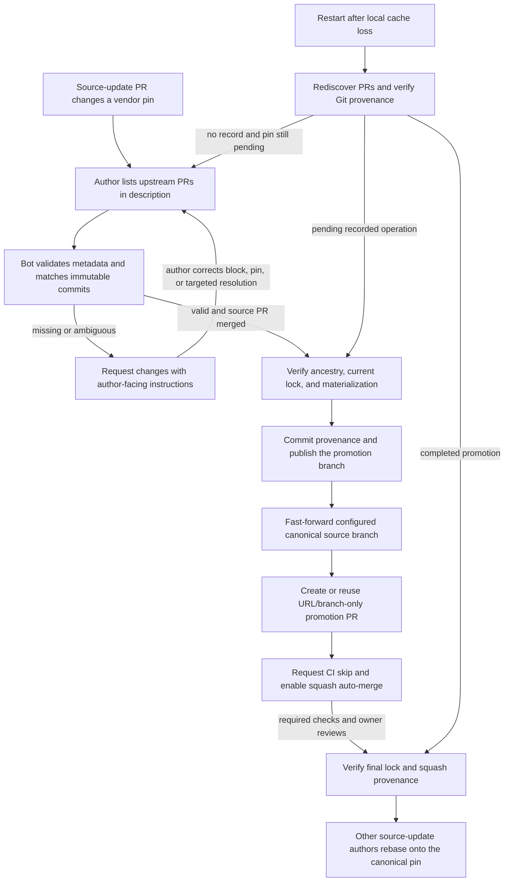

<!--
SPDX-FileCopyrightText: Copyright (c) 2026 NVIDIA CORPORATION & AFFILIATES. All rights reserved.
SPDX-License-Identifier: Apache-2.0
-->

# Vendor source toolkit

These tools work with any vendor key in `3rdparty/vendor_sources.lock.yaml`.
They contain no operator credentials, personal repository defaults, or private
configuration. Use Python 3.10+, Git, PyYAML, and, for GitHub promotion/monitoring,
an authenticated `gh` CLI. Promotion and monitoring currently support GitHub.com
repositories and canonical **branches**, not tag promotion or periodic rebases.

| Entry point | Responsibility |
| --- | --- |
| `python scripts/vendor/manage.py` | Create, inspect, sync, export, patch, pin, and verify vendored trees |
| `python scripts/vendor/promote.py promote` | Promote an immutable, merged source update and prepare a lock-only PR |
| `python scripts/vendor/bot.py run` | Monitor source-update PRs, validate metadata, resolve attribution, and promote |

Use these entry points directly; no backward compatibility is promised for the
old top-level scripts or PrimTS-specific CLI aliases. Supply vendor and repository
configuration explicitly. The separate legacy Triton packager does not use this
lock and is not migrated by this change.

## Workflow



Promotion preserves the source SHA, selected files, compatibility patch, and
digests. It does not re-vendor code. A periodic upstream refresh is a separate
code-changing operation and must not use the promotion CI-skip path.

## Operator setup

Use your own approved GitHub credentials (`gh auth login`, `GH_CONFIG_DIR`, or
the usual GitHub CLI token environment). Configure Git authentication for pushes
and a real Git name/email for DCO-signed commits. Tokens are never accepted in
repository URLs, stored in SQLite, or copied into repository configuration by
these tools. Do not put credentials in command-line arguments.

The operator needs permission to push the configured canonical source branch
and consumer publishing fork, create consumer PRs/comments/reviews, request the
CI-skip path, and enable auto-merge. Review dismissal can require additional
repository authorization. No GitHub App, repository-admin access, webhook
server, or systemd unit is required merely to run the monitor. Repository rules,
SSO/token policies, CI-bot authorization, and required owner reviews still apply.

Run only one **publishing** monitor per consumer/vendor/canonical branch. The
workdir lock prevents duplicate processes using the same directory; it is not a
distributed lock between operators or machines. Finish one promotion before
merging the next source update for that vendor. Unexpected concurrent changes
stop publication rather than force-pushing or selecting an arbitrary newer pin.

## Contributor metadata

Authors add exactly one block to the source-update PR description. Multiple
vendors can share it; each monitor reads its configured vendor entry:

````markdown
<!-- vendor-promotion:start -->
```yaml
schema_version: 1
vendors:
  example-library:
    upstream_prs:
      - https://github.com/UPSTREAM/library/pull/123
      - https://github.com/UPSTREAM/library/pull/456
```
<!-- vendor-promotion:end -->
````

No complete commit map is required. The bot compares the exact source delta
against immutable upstream PR snapshots. Matching uses commit identity,
whitespace- and context-preserving edits, and whole-series aggregate changes for squash/split
cases. Commit titles, cherry-pick trailers, and fuzzy similarity are not proof.
Merged upstream PRs can still be paired using their original head history.

If attribution is unresolved, feedback lists the full source SHAs and candidate
PRs. **The PR author**, not the operator, resolves it by adding missing upstream
PRs, removing unrelated PRs, correcting/rebasing the pinned source, or adding a
targeted explanation under that vendor:

```yaml
resolutions:
  FULL_40_CHARACTER_SOURCE_SHA:
    upstream_pr: https://github.com/UPSTREAM/library/pull/123
    reason: Explain the downstream adaptation or why this PR owns the change.
```

This is an explicit author assertion, not an automatic equivalence claim. The
final provenance records its reason and `retain-until-verified` refresh policy.
When there is no upstream PR for the update, replace `upstream_prs` with a
nonempty `unpaired_reason`. Do not combine those alternatives. Unpaired changes
are retained during future refresh until equivalence is established separately.

Before a new operation is committed, the source head and normalized metadata
are rechecked before feedback and publication. Metadata corrections rerun
validation. Durable promotion records remain authoritative; later description
edits or upstream PR changes do not rewrite a recorded operation's provenance.

## Launch the local monitor

All operator-specific settings are CLI inputs. Start with one dry-run pass:

```bash
python scripts/vendor/bot.py run \
  --vendor example-library \
  --upstream-repo UPSTREAM/library \
  --canonical-repo MAINTAINER/library \
  --canonical-branch consumer-dev \
  --fork YOUR_ACCOUNT/TensorRT-LLM \
  --workdir /path/to/private/vendor-bot-state \
  --once
```

For PrimTS, use vendor `flashinfer-prims-ts`, upstream
`flashinfer-ai/flashinfer`, and the operator's current canonical fork/branch.
The canonical repository is always explicit: the bot never adopts a contributor
fork as the publishing destination merely because it appears in a lock or PR.

Omit `--once` to run continuously in the foreground. Add **both** `--daemon` and
`--publish` to detach and enable remote writes. `--daemon` alone remains dry-run.
The bot always enables squash auto-merge when publishing. It retains the
complete signed-off provenance message and verifies the final merge later.

```bash
python scripts/vendor/bot.py status --workdir /path/to/private/vendor-bot-state
python scripts/vendor/bot.py stop --workdir /path/to/private/vendor-bot-state
```

`stop` requests a graceful exit after the current operation; it does not kill an
unrelated process using a stale PID. Logs go to `WORKDIR/bot.log` in daemon mode.
The daemon survives terminal closure but does not automatically restart after a
crash or reboot; a supervisor is optional. Stop before changing launch settings.

The workdir must be empty on first use, owned by the current user, and outside a
Git worktree. It holds a disposable SQLite cache, a bare source cache, process-lock
and stop files, and isolated promotion worktrees. Runtime state is not committed.
An existing workdir is bound to its operator and vendor configuration; use a
different directory for another operator/vendor. Authentication is inherited
from the launching environment and is not persisted in that state.

The default interval is 120 seconds (`--interval`, minimum 30). A cold start
discovers existing open PRs and backfills merged PRs from all history. This scan
can be expensive; subsequent polls use a cached cursor and tracked candidates.
An explicit `--since 2026-01-01T00:00:00Z` restricts historical discovery; use the
same cutoff on every launch, including recovery. Historical updates belonging
to another canonical branch, or superseded pins without a recoverable promotion,
are not promoted or sent author feedback.

### Recovery after cache loss

Git/GitHub are the source of truth; SQLite is not required to reconstruct a
promotion. Stop the old process before replacing or discarding its database.
Relaunch with the **same account, repositories, canonical branch, and cutoff**.
The bot accepts an existing workdir containing only recognized bot artifacts
even if SQLite is missing. It preserves those artifacts and refuses unrelated
files and symlinks. A new empty workdir also works; existing registered Git
worktrees are validated and reused, or recreated when their directories are gone.

Recovery checks the deterministic promotion PR/branch and its signed-off commit
before parsing the source PR description or consulting upstream PR heads. It
verifies the operation identity, lock-only diff, and provenance, then resumes
the recorded operation. Completed promotions are verified against their squash
commit without requiring the old source fork or mutable PR metadata. Existing
feedback, reviews, CI-skip comments, and auto-merge settings are discovered from
GitHub rather than duplicated from missing local IDs.

Before the first canonical-branch push, the signed promotion commit is pushed to
the configured publishing fork. Therefore loss after any remote publication
step retains a durable provenance record. A locally committed but not yet pushed
operation can also be recovered from the consumer repository's Git branch.
Before any provenance commit exists, attribution is recomputed from current
remote inputs; a previous successful match in SQLite is never authoritative.

Recovery assumes a single publishing operator and accessible, unmodified Git/GitHub
artifacts. It is not recovery from deleted remote history or a replacement
publishing account/fork. Tampered commits, unexpected branch moves, closed-unmerged
promotion PRs, and unrelated worktree edits still stop the operation for inspection.

One process monitors one vendor; separate workdirs can monitor different vendors.
`--consumer-repo`, `--base-branch`, and `--upstream-branch` also support consumers
and upstreams whose default branch is not `main`. `--repo` selects a **trusted**
local consumer checkout; no code or hooks from source forks are executed.

## Feedback and review safety

With `--publish`, invalid metadata produces an updatable comment containing the
specific error and a copyable marked block. Eligible open PRs also receive one
metadata-only `REQUEST_CHANGES` review. The bot deduplicates its feedback and
never submits `APPROVE` just because metadata is valid.

After correction it dismisses only its own marked metadata reviews, when
authorized. If dismissal is forbidden, an authorized human must dismiss the
review; the bot reports the failure rather than approving the code. If the
authenticated account already has a manual approval/objection, the bot uses
comments so it does not supersede that review. It likewise uses comments on the
operator's own PRs. Polling and review permissions do not create a mandatory
pre-merge gate: strict blocking requires repository-admin rules. Promotion still
refuses invalid metadata even if the source PR merges between polls.

## Manual promotion and recovery

The same generic engine can run without a daemon:

```bash
python scripts/vendor/promote.py promote \
  --vendor example-library \
  --source-pr 123 \
  --upstream-repo UPSTREAM/library \
  --canonical-repo MAINTAINER/library \
  --canonical-branch consumer-dev \
  --fork YOUR_ACCOUNT/TensorRT-LLM \
  --from-pr-description \
  --publish --auto-merge
```

Omit the final flags for a dry run. Alternatively supply repeated `--upstream-pr`
with `--auto-match`, or an explicit `--unpaired-reason`. The existing
`--map-upstream SHA=PR` interface remains available for manual provenance
assertions but cannot accompany automatic matching. `--source-repo` selects a
local immutable source checkout for materialization; `--worktree` overrides the
follow-up checkout location. `--wait` optionally waits for and verifies merge.

Publication checks the merged source PR, expected previous canonical lock,
linear fast-forward ancestry, current consumer pin, complete materialization,
and full lock-only diff. It uses non-force pushes and DCO-signed commits. The
`VENDOR PROMOTION V1` JSON block in the commit/squash message records vendor,
source/consumer identities, source SHAs, upstream snapshots, and attribution.
Historical `PRIMTS PROMOTION V1` messages remain readable. No provenance file is
added to the consumer repository.

## Tests

Tests use temporary Git repositories and fake GitHub responses, including a real
detached-process smoke test with a fake `gh`; no credentials, network, or GPU:

```bash
PYTEST_DISABLE_PLUGIN_AUTOLOAD=1 pytest --noconftest -c /dev/null \
  -p no:cacheprovider -o 'markers=cpu_only: CPU-only test' \
  tests/unittest/others/test_vendor_sources.py \
  tests/unittest/others/test_maintain_prims_ts.py \
  tests/unittest/others/test_vendor_bot.py
```
