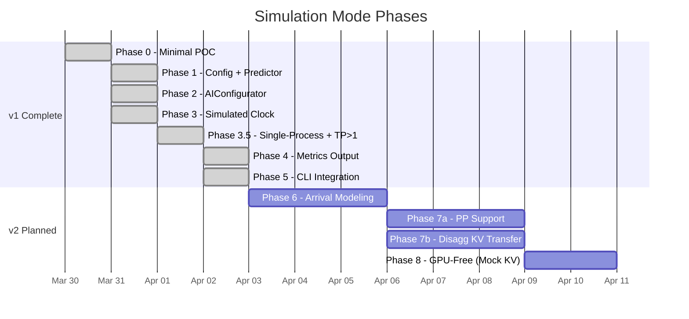
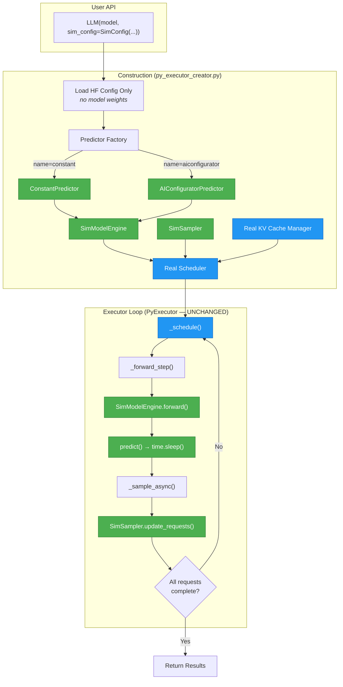
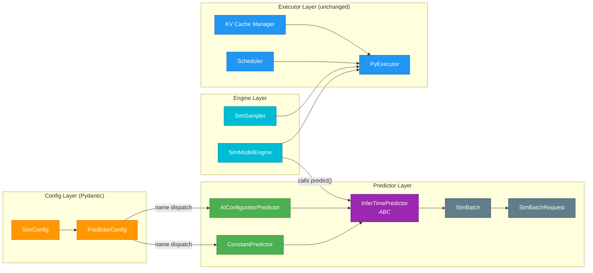
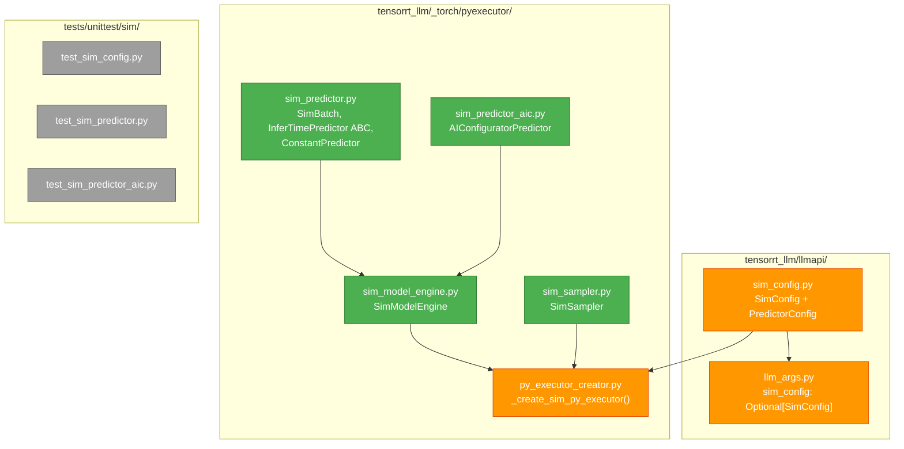

# TensorRT-LLM Simulation Mode — Design Spec

## Problem

Evaluating TRT-LLM serving configurations (batch sizes, scheduling policies, KV cache sizing, concurrency levels) currently requires running real GPU inference. This is slow, expensive, and limits the iteration speed for finding optimal deployment configurations.

HiSim (in `tair-kvcache`) solved this for SGLang by hooking the real scheduler, mocking GPU execution, and predicting batch times analytically via AIConfigurator. We want the same capability natively in TRT-LLM.

## Goal

Add a simulation mode to TRT-LLM that runs the real Python scheduler with mocked model execution, enabling fast GPU-free benchmarking of serving configurations.

## Roadmap



| Phase | Goal | Key Deliverable | Status |
|-------|------|-----------------|--------|
| **0** | Minimal POC | `simulation_mode=True` -> TinyLlama completes with dummy tokens | **Done** |
| **1** | Config + predictor interface | `SimConfig` Pydantic model, `InferTimePredictor` ABC, constant predictor | **Done** |
| **2** | AIConfigurator integration | Real batch time predictions via AIC SDK | **Done** |
| **3** | Simulated clock | `SimClock`, no `time.sleep()`, accumulate predicted times | **Done** |
| **3.5** | Single-process mode | Force single-process executor for sim, fix clock visibility, TP>1 | **Done** |
| **4** | Metrics output | Per-request TTFT/TPOT/ITL, per-iteration breakdown, `metrics.json` | **Done** |
| **5** | CLI integration | `trtllm-bench throughput --sim [--sim-config]` with 3-tier verification | **Done** |
| **6** | Request arrival modeling | Staggered arrivals, `--request-rate`, online serving sim | Planned |
| **7a** | PP support | SimDistributed PP send/recv, multi-stage pipeline sim | Planned |
| **7b** | Disagg KV transfer | KV cache transfer latency modeling for disagg serving | Planned |
| **8** | GPU-free sim (mock KV cache) | Eliminate GPU requirement entirely | Backlog |

**Dropped from v1**: Mock KV cache manager (GPU for KV cache is acceptable for 1-GPU).

**Long-term vision**: Deep-Sim (`slop/specs/2026-04-01-deep-sim-vision.md`) —
replace AIC batch predictor with per-op timing hooks embedded in TRT-LLM ops.
v1 (AIC-Sim) builds the serving sim infrastructure; Deep-Sim replaces only the
prediction layer. Components designed for reusability: `SimClock`, `SimConfig`,
`SimSampler`, single-process mode, metrics output, CLI integration.

**Fidelity & limitations**: See `slop/specs/simulation-fidelity-and-limitations.md`
for what's faithfully modeled vs known gaps (piggybacking, overlap, disagg, PP).

### Implementation Findings (Post-v1)

1. **PP is blocked, not just deferred** — `SimDistributed` raises
   `NotImplementedError` for PP send/recv. Phase 7 split into 7a (PP, hard)
   and 7b (disagg KV transfer, medium) because they have different complexity.

2. **Constant predictor calibration is surprisingly useful** — Extracting real
   prefill/decode times from `--iteration_log` and feeding back as constant
   predictor gives ~30% structural accuracy. Could be productized as
   `--calibrate` mode (polish, not a new phase).

3. **GPU still required** — KV cache block allocation needs a GPU even in sim.
   HiSim avoids this by fully mocking KV cache. Moved to Phase 8 (backlog)
   since 1-GPU is acceptable. Becomes priority if GPU-free is needed.

4. **trtllm-bench output format mismatch** — Real report.json is nested
   (`engine`, `benchmarking_results`), sim report is flat. `compare_reports.py`
   bridges this. Full format parity is minor polish.

5. **Architecture validates Deep-Sim** — The SimModelEngine→SimSampler→SimClock
   separation maps cleanly to Deep-Sim's per-op timing vision.
   `SimClock.record_iteration()` is the exact aggregation point.

**Reordering rationale** (2026-04-02): Phase 5 (CLI) moved before arrival modeling
because `trtllm-bench` submits all requests at once (batch mode) — no arrival
modeling needed for parity. Phase 6 (arrival modeling) is for future online
serving simulation. TP>1 already works via SimDistributed (Phase 3.5).
Simulated clock (originally Phase 6) was pulled forward because `time.sleep()` pollutes
wall-clock measurements — metrics from Phase 4 need a virtual clock to be meaningful.
GPU-free mode (originally Phase 4) was dropped — requiring a GPU for KV cache capacity
tracking is acceptable for this project's scope.

## Architecture Overview



**Legend:** <span style="color:#4CAF50">■ Green = Simulation components (new code)</span> · <span style="color:#2196F3">■ Blue = Real TRT-LLM components (unchanged)</span>

## Component Dependency Graph



**Legend:** <span style="color:#FF9800">■ Config</span> · <span style="color:#9C27B0">■ ABC</span> · <span style="color:#4CAF50">■ Predictors</span> · <span style="color:#607D8B">■ Data</span> · <span style="color:#00BCD4">■ Engines</span> · <span style="color:#2196F3">■ Real (unchanged)</span>

## File Map



**Legend:** <span style="color:#4CAF50">■ New files</span> · <span style="color:#FF9800">■ Modified files</span> · <span style="color:#9E9E9E">■ Test files</span>

---

## Phase 0: Minimal POC

### Success Criteria

```python
from tensorrt_llm.llmapi import LLM, TorchLlmArgs

llm = LLM("TinyLlama/TinyLlama-1.1B-Chat-v1.0",
           torch_llm_args=TorchLlmArgs(simulation_mode=True))
output = llm.generate(["Hello world"])
# Completes with dummy tokens. No real model forward pass executed.
```

See `slop/specs/phase0-what-was-built.md` for full details.

## Phase 1: Config + Predictor Interface

See `slop/specs/phase1-what-was-built.md` for full details.

## Phase 2: AIConfigurator Integration

See `slop/specs/phase2-what-was-built.md` for full details.

## Phases 3-6: Planned

See individual phase specs when created.

---

## Reference Implementation

HiSim (`slop/tair-kvcache/hisim/`) does the same thing for SGLang:
- `sglang_hook.py` — hooks scheduler, model runner
- `sglang_mock_class.py` — mock KV pools
- `time_predictor/aiconfigurator.py` — batch time prediction
- `simulation/manager/state.py` — simulated clock
- `slop/hisim_constraints.md` — documented limitations
