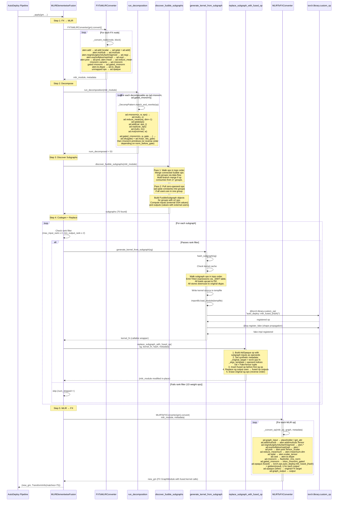

# MLIR Elementwise Fusion — Sequence Diagram

## Overview

The `mlir_elementwise_fusion` transform converts an FX graph into MLIR,
decomposes high-level ops, discovers fusible subgraphs, generates Triton
kernels, replaces the subgraphs in the MLIR IR, and converts back to FX.

## Sequence Diagram



## Data Flow Through the Pipeline

```
Original FX Graph (1045 call_function nodes)
    │
    ▼
┌─────────────────────────────────────┐
│  FX → MLIR  (FXToMLIRConverter)     │
│                                     │
│  aten.add/mul/sub   → ad.add/mul/sub│
│  aten.neg           → ad.neg        │
│  aten.pow.T_Scalar  → ad.pow        │
│  aten.mean.dim      → ad.reduce_mean│
│  aten.rsqrt/sqrt    → ad.rsqrt/sqrt │
│  aten.silu/gelu/relu/tanh/sigmoid   │
│    → ad.silu/gelu/relu/tanh/sigmoid │
│  aten.exp/softplus  → ad.exp/…      │
│  rmsnorm variants   → ad.rmsnorm    │
│  gated rmsnorm      → ad.gated_rms… │
│  aten.to.dtype      → ad.to_dtype   │
│  aten.add(t, 1e-5)  → ad.splat+add  │
│  everything else    → ad.opaque     │
└──────────────┬──────────────────────┘
               │  MLIR ModuleOp
               ▼
┌─────────────────────────────────────┐
│  Decompose  (PatternRewriter)       │
│                                     │
│  ad.rmsnorm(x, w, eps)              │
│       ↓                             │
│  ad.mul(x, x)         # x²         │
│  ad.reduce_mean(sq)   # variance    │
│  ad.splat(eps)         # constant   │
│  ad.add(var, eps_t)    # var+eps    │
│  ad.rsqrt(var_eps)     # 1/√(v+e)  │
│  ad.mul(x, inv)        # normalize  │
│  ad.mul(normed, w)     # scale      │
│                                     │
│  ad.gated_rmsnorm(x, w, gate, …)   │
│       ↓                             │
│  ad.silu(gate) + ad.mul(x, silu_g) │
│  then rmsnorm primitives above      │
│  (order depends on norm_before_gate)│
│                                     │
│  53 rmsnorm ops → 371 primitives    │
└──────────────┬──────────────────────┘
               │  MLIR with primitives
               ▼
┌─────────────────────────────────────┐
│  Discover Subgraphs (greedy merge)  │
│                                     │
│  Walk ops in topo order.            │
│  Merge connected fusible ops.       │
│  Multi-branch: if op reads from     │
│    2 groups, merge them.            │
│  Pull in zero-operand ops (splat).  │
│                                     │
│  75 subgraphs (417 total ops)       │
│  Filter: skip if rank < 2          │
└──────────────┬──────────────────────┘
               │  List[FusibleSubgraph]
               ▼
┌─────────────────────────────────────┐
│  For each eligible subgraph:        │
│                                     │
│  ┌───────────────────────────────┐  │
│  │  Codegen (triton_emitter)     │  │
│  │                               │  │
│  │  1. Hash subgraph structure   │  │
│  │  2. Emit Triton kernel source │  │
│  │     - loads: upcast to f32    │  │
│  │     - ops: _EMIT table        │  │
│  │     - stores: downcast        │  │
│  │  3. Write to tempfile         │  │
│  │  4. importlib.load_module     │  │
│  │  5. Register custom_op       │  │
│  │  6. Register fake impl       │  │
│  └───────────────┬───────────────┘  │
│                  │ kernel_fn         │
│                  ▼                   │
│  ┌───────────────────────────────┐  │
│  │  Replace (subgraph_replace)   │  │
│  │                               │  │
│  │  1. Create AdOpaque op with   │  │
│  │     subgraph inputs           │  │
│  │  2. Add metadata for MLIR→FX  │  │
│  │  3. Wire outputs              │  │
│  │  4. Erase old ops             │  │
│  └───────────────────────────────┘  │
└──────────────┬──────────────────────┘
               │  MLIR with fused AdOpaque ops
               ▼
┌─────────────────────────────────────┐
│  MLIR → FX  (MLIRToFXConverter)     │
│                                     │
│  ad.add/mul/sub → aten.add/mul/sub  │
│  ad.neg/silu/… → aten.neg/silu/…    │
│  ad.rmsnorm → flashinfer_rms_norm   │
│  ad.gated_rmsnorm → triton_rmsnorm… │
│                                     │
│  ad.opaque(mlir_fused_{hash})       │
│       ↓                             │
│  call_function(torch.ops.auto_      │
│    deploy.mlir_fused_{hash}, ...)   │
│  getitem(result, 0)  # output 0    │
│  getitem(result, 1)  # output 1    │
│                                     │
│  Other opaques → original targets   │
└──────────────┬──────────────────────┘
               │
               ▼
          New FX GraphModule
     (with generated kernel calls)
```

## Example: What Happens to One RMSNorm

```
FX Graph:
  %torch_rmsnorm = call_function[torch_rmsnorm](added, weight, 1e-5)

  ↓ FX → MLIR

MLIR:
  %0 = ad.rmsnorm(%added, %weight) {eps = 1e-5}

  ↓ Decompose

MLIR (7 ops):
  %sq     = ad.mul(%added, %added)
  %var    = ad.reduce_mean(%sq, dim=-1, keepdim=true)
  %eps    = ad.splat(1e-5)
  %vareps = ad.add(%var, %eps)
  %inv    = ad.rsqrt(%vareps)
  %normed = ad.mul(%added, %inv)
  %result = ad.mul(%normed, %weight)

  ↓ Discover (all 7+1 ops form one subgraph with the preceding ad.add)

FusibleSubgraph:
  ops: [ad.add, ad.mul, ad.reduce_mean, ad.splat, ad.add, ad.rsqrt, ad.mul, ad.mul]
  inputs: [x, residual, weight]
  outputs: [result, added]

  ↓ Codegen

@triton.jit
def fused_kernel_abc123(in0_ptr, in1_ptr, in2_ptr, out0_ptr, out1_ptr, ...):
    v0 = tl.load(in0_ptr + row_off + offs, mask=mask).to(tl.float32)  # x
    v1 = tl.load(in1_ptr + row_off + offs, mask=mask).to(tl.float32)  # residual
    v2 = tl.load(in2_ptr + offs, mask=mask).to(tl.float32)            # weight (broadcast)
    t0 = (v0 + v1)           # add
    t1 = (t0 * t0)           # mul (x²)
    t2 = (tl.sum(t1, 0) * (1.0 / N_COLS))  # reduce_mean
    t3 = 1e-05               # splat
    t4 = (t2 + t3)           # add (var + eps)
    t5 = (1.0 / tl.sqrt(t4)) # rsqrt
    t6 = (t0 * t5)           # mul (normalize)
    t7 = (t6 * v2)           # mul (scale by weight)
    tl.store(out0_ptr + row_off + offs, t0.to(tl.bfloat16), mask=mask)  # added
    tl.store(out1_ptr + row_off + offs, t7.to(tl.bfloat16), mask=mask)  # result

  ↓ Register as torch.ops.auto_deploy.mlir_fused_abc123

  ↓ Replace in MLIR

MLIR:
  %fused:2 = ad.opaque(%x, %residual, %weight) {node_key = "mlir_fused_abc123"}

  ↓ MLIR → FX

FX Graph:
  %mlir_fused_abc123 = call_function[mlir_fused_abc123](x, residual, weight)
  %getitem   = call_function[getitem](mlir_fused_abc123, 0)  # added
  %getitem_1 = call_function[getitem](mlir_fused_abc123, 1)  # result
```
