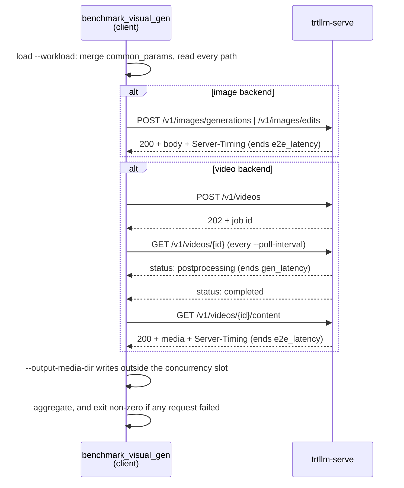

# Benchmarking VisualGen

`tensorrt_llm.serve.scripts.benchmark_visual_gen` drives a running `trtllm-serve` VisualGen
server over its OpenAI-compatible endpoints and reports latency and throughput.

```bash
python -m tensorrt_llm.serve.scripts.benchmark_visual_gen \
    --workload workload.yaml --port 8000 \
    --max-concurrency 1 --save-result --save-detailed
```

This page repeats no field description. Each lives with its definition:

| what | where |
|---|---|
| every flag, with its default | `--help` |
| what a generation parameter means | `VisualGenParams` in [`visual_gen/params.py`](../../visual_gen/params.py) |
| which backend accepts which field | `ImageGenerationRequest` · `ImageEditRequest` · `VideoGenerationRequest` in [`openai_protocol.py`](../openai_protocol.py) |
| what a result-JSON key holds | `VisualGenBenchResult` and `VisualGenRequestRecord` in [`benchmark_visual_gen.py`](benchmark_visual_gen.py) |

## Benchmarking args

`--help` lists them under five groups, each answering one question:

* **Connection** — where the server is, and what it serves.
* **Workload** — what the run sends. The document arrives as `--workload` or spelled out as
  field flags, never both.
* **Traffic** — when requests are issued.
* **Execution** — how the client drives the run, and how the media comes back.
* **Results** — what the run writes down.

### Workload

A YAML or JSON file, the same document inline (starting with `{` or `[`), or a bare list of
requests, named by `--workload`.

```yaml
backend: openai-videos                    # openai-videos | openai-images | openai-image-edits

common_params:                            # applies to every request
  width: 1280
  height: 720
  num_frames: 81
  extra_params:                           # per-pipeline knobs
    output_type: video

requests:
  - prompt: A red fox trotting across a snowy field at dawn
  - prompt_file: prompts/aerial.json      # instead of prompt
    image_reference:
      - content: ../media/frame.png       # format defaults to path
        role: first_frame
    width: 720                            # overrides common_params for this request
    height: 1280
```

`backend` sits at the top level and picks the endpoint, and so what the run measures.
Everything else is a `VisualGenParams` field, `prompt`, `prompt_file`, or `extra_params`.

#### Fields per backend

Derived at load from the request model that backend validates against, so naming a field it
cannot carry is an error rather than a request the server ignores.

| field | `openai-videos` | `openai-images` | `openai-image-edits` |
|---|:---:|:---:|:---:|
| `width` · `height` · `seed` | ✓ | ✓ | ✓ |
| `num_inference_steps` · `guidance_scale` · `max_sequence_length` | ✓ | ✓ | ✓ |
| `negative_prompt` | ✓ | ✓ | ✓ |
| `num_frames` · `frame_rate` | ✓ | — | — |
| `num_images_per_prompt` | — | ✓ | ✓ |
| `image_reference` | ✓ | — | required, base64 only |
| `video_reference` · `audio_reference` | ✓ | — | — |

#### Resolution order

Each request is `common_params`, then the request's own keys. `extra_params` merges per key
rather than being replaced whole.

* `width` and `height` are judged on key presence: setting exactly one is rejected before the
  run.
* `--num-requests` cycles or truncates the resulting list.

#### File inputs

`prompt_file` and `extra_params.action_file` are path strings. The three reference slots take
the object `MediaReferenceItem` declares — `{content, format, role}`, `format` one of `path`
(the default), `url` or `base64` — or a list of them. A relative path in any of these resolves
from the document, with `~` expanded and no variable expansion.

| key | what it becomes |
|---|---|
| `image_reference` · `video_reference` · `audio_reference` | a `path` goes out as the path and the server reads the file; `url` and `base64` go out as written |
| `prompt_file` | that request's `prompt`: a JSON object's `prompt` field, the whole object serialized when it has none, or the file's text when it is not JSON |
| `extra_params.action_file` | `extra_params.action`, a JSON `[T, D]` trajectory |

## Result

`--save-result` writes the JSON, `--save-detailed` adds the server-side metrics and the
per-request records, and the run prints the summary scalars with a table of `e2e_latency` and
`gen_latency`. Every metric is `{mean, median, std, min, max, percentiles}` over the run's
requests — **one sample per request**.

### Latency breakdown



```math
\texttt{client\_gen} = \texttt{server\_gen} + \texttt{network} + \texttt{client\_poll\_interval}
```

```math
\texttt{client\_e2e} = \texttt{client\_gen} + \texttt{server\_media\_encode} + \texttt{client\_fetch\_result}
```

Those are per-request fields, which `--save-detailed` writes under `requests`; the run aggregates
`client_gen` as `gen_latency` and `client_e2e` as `e2e_latency`. Both are client-measured, and
`server_gen` comes from the `Server-Timing` header; the other terms name spans nothing measures on
its own, and their prefix says which side spends them.

Under `--response-format path` the fetch returns a path rather than the bytes, so
`e2e_latency` minus `gen_latency` is essentially `server_media_encode`. The two being equal
means the boundary was not observed: the encode finished within one `--poll-interval`.

`server_pre_denoise`, `server_denoise` and `server_post_denoise` sum to the pipeline's time on
the device, and `server_gen` minus that sum is its host-side work.

`server_post_denoise` and the `postprocessing` job status are different phases either side of
the `gen_latency` boundary: the first is GPU work inside `server_gen`, the second is the encode
that follows it, and `gen_latency` stops where the second begins. The encode's cost belongs to
`--format` and to whether ffmpeg is installed, so folding it into `server_gen` would move the
engine's number when only the output container changed.

### Validity checks

The run exits non-zero when `completed` differs from `total_requests`, after writing the
result.

A completed request says nothing about the media it produced. Confirm the artifacts decode and
match the requested shape.
