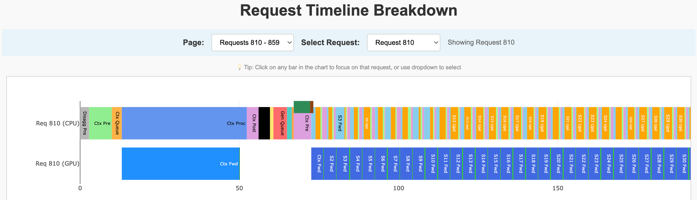

# Time Breakdown Tool

A standalone tool for analyzing and visualizing TensorRT-LLM server request time breakdown.

## Overview

The Time Breakdown tool analyzes performance metrics from TensorRT-LLM servers and creates interactive visualizations showing how time is spent processing each request. It supports both aggregated and disaggregated server configurations.

The tool generates:

1. **Interactive HTML Diagram**: A stacked bar chart showing timing breakdown per request with hover tooltips
2. **Per-step CPU and GPU timing**: Detailed breakdown of each generation step
3. **Statistics**: Median times for each timing segment (optional)

### Example Visualization


*Example of the interactive time diagram showing request time breakdown across multiple requests.*



*Detailed view of a single request showing per-step CPU and GPU timing breakdown.*

## Features

### Per-Step Timing (New)
- **CPU Timeline**: Shows preprocessing, forward, update, sample, and postprocessing for each step
- **GPU Timeline**: Shows GPU forward and sample times aligned with CPU timeline

### Interactive Features
- **Request Selection**: Click on any bar or use dropdown to focus on a single request
- **Pagination**: For large datasets, automatic pagination with page selector

## Timing Metrics

### Timestamp Recording Points

The following diagram shows where timestamps are recorded in the request lifecycle:

#### Non-Disaggregated Mode

```
Client Request
    |
    v
[server_arrival_time] ─── OpenAI Server receives request
    |
    v
[arrival_time] ─────────── After tokenization, before queueing to executor
    |
    v
[first_scheduled_time] ── Request scheduled for execution
    |
    |  ┌─────────────────────────────────────────────────────┐
    |  │  Per-Step Timing (for each generation step):       │
    |  │                                                     │
    |  │  [forward_start_time] ── Before model forward()    │
    |  │  [forward_end_time]   ── After model forward()     │
    |  │  [sample_start_time]  ── Before sampling           │
    |  │  [sample_end_time]    ── After sampling            │
    |  │  [token_time]         ── After handle_responses()  │
    |  │                                                     │
    |  │  GPU Events (recorded via CUDA events):            │
    |  │  - gpu_forward_start → gpu_forward_end             │
    |  │  - gpu_forward_end → gpu_sample_end                │
    |  └─────────────────────────────────────────────────────┘
    |
    v
[first_token_time] ────── First token generated by LLM
    |
    v
[server_first_token_time] ─ After detokenize + IPC to OpenAI Server
    |
    v
Client receives first token
```

#### Disaggregated Mode

```
Client Request
    |
    v
[disagg_server_arrival_time] ─── Disagg Router receives request
    |
    v
┌─────────────────────────────────────────────────────────────────┐
│  CONTEXT SERVER (Prefill)                                       │
│                                                                 │
│  [ctx_server_arrival_time] ─── Context server receives request │
│      |                                                          │
│      v                                                          │
│  [ctx_arrival_time] ────────── After tokenization               │
│      |                                                          │
│      v                                                          │
│  [ctx_first_scheduled_time] ── Scheduled for prefill            │
│      |                                                          │
│      v                                                          │
│  [ctx_first_token_time] ────── First token generated            │
│      |                                                          │
│      v                                                          │
│  [ctx_server_first_token_time] ── Detokenize + IPC              │
│                                                                 │
│  >>> KV Cache Transfer to Generation Server >>>                 │
└─────────────────────────────────────────────────────────────────┘
    |
    v
┌─────────────────────────────────────────────────────────────────┐
│  DISAGG RELAY                                                   │
│                                                                 │
│  [ctx_server_first_token_time] ─── Context server sends response│
│      |                                                          │
│      v                                                          │
│  [gen_server_arrival_time] ────── Generation server receives    │
│                                                                 │
│  (Network transfer from context to generation via disagg router)│
└─────────────────────────────────────────────────────────────────┘
    |
    v
┌─────────────────────────────────────────────────────────────────┐
│  GENERATION SERVER (Decode)                                     │
│                                                                 │
│  [gen_server_arrival_time] ─── Generation server receives req   │
│      |                                                          │
│      v                                                          │
│  [gen_arrival_time] ────────── After KV cache received          │
│      |                                                          │
│      v                                                          │
│  [gen_first_scheduled_time] ── Scheduled for decode             │
│      |                                                          │
│      |  ┌───────────────────────────────────────────────────┐   │
│      |  │  Per-Step Timing (same as non-disagg mode)        │   │
│      |  └───────────────────────────────────────────────────┘   │
│      |                                                          │
│      v                                                          │
│  [gen_first_token_time] ────── First decode token               │
│      |                                                          │
│      v                                                          │
│  [gen_server_first_token_time] ── Detokenize + IPC              │
└─────────────────────────────────────────────────────────────────┘
    |
    v
[disagg_server_first_token_time] ─── Disagg Router forwards response
    |
    v
Client receives first token
```

### Context/Prefill Stage Metrics

1. **Context Preprocessing** (`ctx_preprocessing`)
   - **Time Period**: `server_arrival_time` → `arrival_time`
   - **Description**: Request parsing and tokenization
   - **Includes**: HTTP parsing, tokenization, request validation

2. **Context Queue** (`ctx_queue`)
   - **Time Period**: `arrival_time` → `first_scheduled_time`
   - **Description**: Time spent waiting in queue and resource allocation
   - **Includes**: Queueing delay, memory allocation, scheduling wait time

3. **Context Processing** (`ctx_processing`)
   - **Time Period**: `first_scheduled_time` → `first_token_time`
   - **Description**: Actual prefill computation time
   - **Includes**: Model forward pass for the context/prompt tokens

4. **Context Postprocessing** (`ctx_postprocessing`)
   - **Time Period**: `first_token_time` → `server_first_token_time`
   - **Description**: Detokenize + IPC from executor to OpenAI server
   - **Includes**: Token-to-text conversion, inter-process communication to OpenAI server
   - **Display**: Shown as semi-transparent overlay on CPU timeline

### Per-Step Metrics (Generation Phase)

For each generation step, the following CPU and GPU times are recorded:

1. **Step Preprocessing**
   - **Time Period**: `token_time(N-1)` → `forward_start_time(N)`
   - **Description**: Scheduling and preparation for current step
   - **Includes**: Batch scheduling, resource allocation

2. **Step Forward**
   - **Time Period**: `forward_start_time` → `forward_end_time`
   - **Description**: CPU time for model forward pass
   - **Includes**: Model forward call, GPU kernel launches

3. **Step Update**
   - **Time Period**: `forward_end_time` → `sample_start_time`
   - **Description**: Sync GPU and update batch results
   - **Includes**: GPU synchronization, KV cache updates
   - **Note**: In overlap mode, handles Step N-1 results; in non-overlap mode, handles current Step N

4. **Step Sample**
   - **Time Period**: `sample_start_time` → `sample_end_time`
   - **Description**: CPU time for sampling operation
   - **Includes**: Sampling call, token selection

5. **Step Postprocessing**
   - **Time Period**: `sample_end_time` → `token_time`
   - **Description**: Update request states and prepare responses
   - **Includes**: Request state updates, canceled request handling
   - **Note**: In overlap mode, handles Step N-1 responses; in non-overlap mode, handles current Step N

6. **GPU Forward**
   - **Measured via**: CUDA events (`gpu_forward_start` → `gpu_forward_end`)
   - **Description**: Actual GPU execution time for forward pass
   - **Includes**: Attention, MLP, layer norm computations

7. **GPU Sample**
   - **Measured via**: CUDA events (`gpu_forward_end` → `gpu_sample_end`)
   - **Description**: Actual GPU execution time for sampling
   - **Includes**: Logits processing, token sampling kernels

### Generation/Decode Stage Metrics (Disaggregated Mode Only)

5. **Generation Preprocessing** (`gen_preprocessing`)
   - **Time Period**: `gen_server_arrival_time` → `gen_arrival_time`
   - **Description**: Python overhead & initialization when generation server receives the request

6. **Generation Queue** (`gen_queue`)
   - **Time Period**: `gen_arrival_time` → `gen_first_scheduled_time`
   - **Description**: Time spent in queue including KV cache transfer

7. **Generation First Token Postprocessing** (`gen_postprocessing`)
   - **Time Period**: `gen_first_scheduled_time` → `gen_server_first_token_time`
   - **Description**: Time to generate and send first token from generation server

### Disaggregation Server Metrics

8. **Disaggregation Preprocessing** (`disagg_preprocessing`)
   - **Time Period**: `disagg_server_arrival_time` → `ctx_server_arrival_time`
   - **Description**: Routing overhead from disagg server to context server
   - **Includes**: Request routing, load balancing, network transfer

9. **Disaggregation Relay** (`disagg_relay`)
   - **Time Period**: `ctx_server_first_token_time` → `gen_server_arrival_time`
   - **Description**: Handoff from context server to generation server
   - **Includes**: Network transfer, KV cache metadata relay via disagg router

10. **Disaggregation Postprocessing** (`disagg_postprocessing`)
    - **Time Period**: `gen_server_first_token_time` → `disagg_server_first_token_time`
    - **Description**: Routing overhead from generation server back through disagg server
    - **Includes**: Response aggregation, network transfer to client

## Input Format

The tool expects a JSON file containing an array of request performance metrics (unit: seconds).

### Aggregated Format (with step_metrics)

```json
[
  {
    "request_id": 0,
    "perf_metrics": {
      "timing_metrics": {
        "server_arrival_time": 1.000,
        "arrival_time": 1.002,
        "first_scheduled_time": 1.005,
        "first_token_time": 1.025,
        "server_first_token_time": 1.027
      }
    },
    "time_breakdown_metrics": {
      "step_metrics": [
        {
          "iter": 1,
          "forward_start_time": 1.010,
          "forward_end_time": 1.015,
          "sample_start_time": 1.018,
          "sample_end_time": 1.020,
          "gpu_forward_time": 4.5,
          "gpu_sample_time": 0.1,
          "prev_batch_token_time": 1.022
        }
      ]
    }
  }
]
```

### Disaggregated Format

```json
[
  {
    "ctx_perf_metrics": {
      "request_id": 3,
      "perf_metrics": {
        "timing_metrics": {
          "server_arrival_time": 2.000,
          "arrival_time": 2.003,
          "first_scheduled_time": 2.008,
          "first_token_time": 2.035,
          "server_first_token_time": 2.038
        }
      }
    },
    "gen_perf_metrics": {
      "perf_metrics": {
        "timing_metrics": {...}
      },
      "time_breakdown_metrics": {
        "step_metrics": [...],
        "ctx_gpu_forward_time": 25.5,
        "ctx_gpu_sample_time": 0.2
      }
    },
    "disagg_server_arrival_time": 1.995,
    "disagg_server_first_token_time": 2.090
  }
]
```

## Usage

### Integration with Benchmark Serving

Step 1: Set in `extra-llm-api-config.yaml`:
```yaml
return_perf_metrics: True
perf_metrics_max_requests: <INTEGER>
```
If running disaggregated serving, add configs for all servers (disagg, context and generation server).

Step 2: Add `--save-request-time-breakdown` when running `benchmark_serving.py`:
```bash
python -m tensorrt_llm.serve.scripts.benchmark_serving \
        --model ${model_name} \
        --dataset-name random \
        --ignore-eos \
        --num-prompts 1000 \
        --random-input-len 1024 \
        --random-output-len 2048 \
        --random-ids \
        --max-concurrency 64 \
        --save-result \
        --result-dir <RESULT_DIR> \
        --percentile-metrics "ttft,tpot,itl,e2e" \
        --save-request-time-breakdown 
```

### As a CLI Tool

```bash
# Basic usage
python time_breakdown.py perf_metrics.json

# Specify output file
python time_breakdown.py perf_metrics.json -o my_time_diagram.html

# Limit max requests and sort by E2E latency
python time_breakdown.py perf_metrics.json --max-requests 100 --sort-by e2e

# Show statistics only
python time_breakdown.py perf_metrics.json --stats-only

# Create diagram and show statistics
python time_breakdown.py perf_metrics.json --show-stats
```

### CLI Options

| Option | Description |
|--------|-------------|
| `-o, --output` | Output HTML file path |
| `--max-requests` | Maximum number of requests to display |
| `--sort-by` | Sort order: `arrival` (default) or `e2e` |
| `--stats-only` | Only show statistics, no diagram |
| `--show-stats` | Show statistics in addition to diagram |
