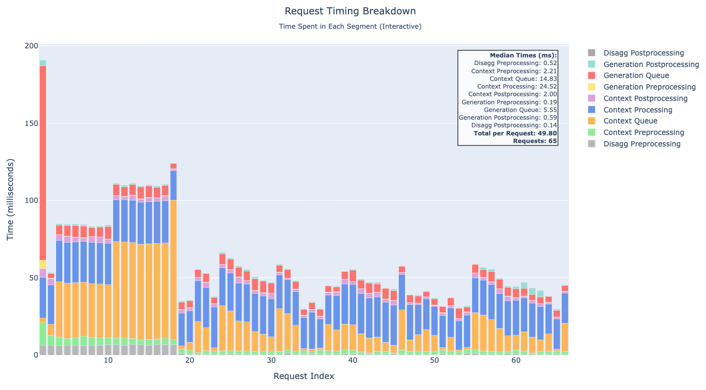

# Time Breakdown Tool

A standalone tool for analyzing and visualizing TensorRT-LLM server request time breakdown.

## Overview

The Time Breakdown tool analyzes performance metrics from TensorRT-LLM servers and creates interactive visualizations showing how time is spent processing each request. It supports both aggregated and disaggregated server configurations.


The tool generates:

1. **Interactive HTML Diagram**: A stacked bar chart showing timing breakdown per request with hover tooltips
2. **Statistics**: Median times for each timing segment (optional)

### Example Visualization



*Example of the interactive time diagram showing request time breakdown across different processing stages.*

### Timing Metrics

The tool aims to track detailed timing segments throughout the request lifecycle (currently we only track timing segments related to TTFT (Time-To-First-Token), full lifecycle tracking will be added soon):

#### Context/Prefill Stage Metrics

1. **Context Preprocessing** (`ctx_preprocessing`)
   - **Time Period**: `server_arrival_time` → `arrival_time`
   - **Description**: Python overhead & initialization when the context server receives the request
   - **Includes**: Request parsing, pre-processing (e.g., tokenization) before queuing

2. **Context Queue** (`ctx_queue`)
   - **Time Period**: `arrival_time` → `first_scheduled_time`
   - **Description**: Time spent waiting in queue and resource allocation
   - **Includes**: Queueing delay, memory allocation, scheduling wait time

3. **Context Processing** (`ctx_processing`)
   - **Time Period**: `first_scheduled_time` → `first_token_time`
   - **Description**: Actual prefill computation time
   - **Includes**: Model forward pass for the context/prompt tokens

4. **Context Postprocessing** (`ctx_postprocessing`)
   - **Time Period**: `first_token_time` → `server_first_token_time`
   - **Description**: Time to prepare and send the first token response
   - **Includes**:  Response preparation, serialization, network overhead

#### Generation/Decode Stage Metrics (Disaggregated Mode Only)

5. **Generation Preprocessing** (`gen_preprocessing`)
   - **Time Period**: `gen_server_arrival_time` → `gen_arrival_time`
   - **Description**: Python overhead & initialization when generation server receives the request
   - **Includes**: Request parsing, KV cache transfer preparation

6. **Generation Queue** (`gen_queue`)
   - **Time Period**: `gen_arrival_time` → `gen_first_scheduled_time`
   - **Description**: Time spent in queue and resource allocation, including KV cache transfer
   - **Includes**: 
     Queueing delay, KV cache transfer, memory allocation for generation

7. **Generation First Token Postprocessing** (`gen_postprocessing`)
   - **Time Period**: `gen_first_scheduled_time` → `gen_server_first_token_time`
   - **Description**: Time to generate and send first token from generation server
   - **Includes**: Token generation, response preparation

#### Disaggregation Server Metrics

8. **Disaggregation Preprocessing** (`disagg_preprocessing`)
   - **Time Period**: `disagg_server_arrival_time` → `ctx_server_arrival_time`
   - **Description**: Routing overhead from disagg server to context server
   - **Includes**: Request forwarding, network latency

9. **Disaggregation Postprocessing** (`disagg_postprocessing`)
   - **Time Period**: `gen_server_first_token_time` → `disagg_server_first_token_time`
   - **Description**: Routing overhead from generation server back through disagg server
   - **Includes**: Response forwarding, aggregation

#### Visualization of Disaggregated Server Metrics
The timepoints are recorded internally by TensorRT LLM per-request performance metrics (also available via LLM API) and OpenAI-compatible server.


## Input Format

The tool expects a JSON file containing an array of request performance metrics (unit: seconds).

### Aggregated Format

```json
[
  {
    "request_id": 0,
    "perf_metrics": {
      "timing_metrics": {
        "server_arrival_time": 1.000,
        "arrival_time": 1.002,
        "first_scheduled_time": 1.005,
        "first_token_time": 1.025,
        "server_first_token_time": 1.027
      }
    }
  }
]
```

### Disaggregated Format

```json
[
  {
    "ctx_perf_metrics": {
      "request_id": 3,
      "perf_metrics": {
        "timing_metrics": {
          "server_arrival_time": 2.000,
          "arrival_time": 2.003,
          "first_scheduled_time": 2.008,
          "first_token_time": 2.035,
          "server_first_token_time": 2.038
        }
      }
    },
    "gen_perf_metrics": {
      "perf_metrics": {
        "timing_metrics": {
          "server_arrival_time": 2.050,
          "arrival_time": 2.052,
          "first_scheduled_time": 2.055,
          "first_token_time": 2.080,
          "server_first_token_time": 2.083
        }
      }
    },
    "disagg_server_arrival_time": 1.995,
    "disagg_server_first_token_time": 2.090
  }
]
```
## Usage

### Integration with Benchmark Serving
Step 1:
Set 
```
 return_perf_metrics: True
 perf_metrics_max_requests: <INTEGER>
```
in the `extra-llm-api-config.yaml`. If you are running disaggregated serving, you should add configs for all servers (disagg, context and generation server).
The server keeps at most `perf_metrics_max_requests` entries.

Step 2:
Add `--save-request-time-breakdown` when running `benchmark_serving.py`
```
python -m tensorrt_llm.serve.scripts.benchmark_serving \
        --model ${model_name} \
        --dataset-name random \
        --ignore-eos \
        --num-prompts 1000 \
        --random-input-len 1024 \
        --random-output-len 2048 \
        --random-ids \
        --max-concurrency 64 \
        --save-result \
        --result-dir <RESULT_DIR> \
        --percentile-metrics "ttft,tpot,itl,e2e" \
        --save-request-time-breakdown 
```
You will be able find the interactive time diagram in `<RESULT_DIR>`.
### As a CLI Tool
Step 1:
Query the perf_metrics.json using the `/perf_metrics` endpoint of the trtllm server (in case of disaggreated serving, you only need to query the disagg server). Make sure the servers have `perf_metrics_max_requests` and `return_perf_metric` configured.
```
curl -o perf_metrics.json <HOST>:<PORT>/perf_metrics
```
Step 2:
Process the `perf_metrics.json` with `time_breakdown.py`
```bash
# Basic usage - analyze and create time diagram
python time_breakdown.py perf_metrics.json

# Specify custom output file
python time_breakdown.py perf_metrics.json -o my_time_diagram.html

# Show statistics only (no diagram) 
python time_breakdown.py perf_metrics.json --stats-only

# Create diagram and show statistics
python time_breakdown.py perf_metrics.json --show-stats
```
