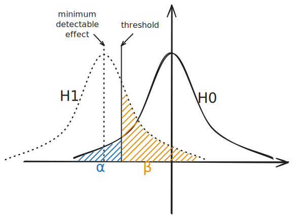

# Accuracy Test Suite

This folder contains an accuracy test suite for TensorRT-LLM. Our CI/CD workflow and QA cycles run these tests to protect the model implementations from accuracy regressions.

This test suite employs a *hypothesis testing* methodology that determines the evaluation sample volume and accuracy thresholds based on objective statistics. This approach prevents the thresholds from being either too close to the reference (which could lead to intermittent failures due to normal accuracy fluctuations) or too far from the reference (which could result in tests always passing even if an accuracy regression occurs).

In addition, most tests are based on the offline API -- [LLM API](https://nvidia.github.io/TensorRT-LLM/llm-api/index.html). This allows the tests to leverage in-flight fused batching and other performance optimizations efficiently. Compared to the online API [trtllm-serve](https://nvidia.github.io/TensorRT-LLM/commands/trtllm-serve.html), the offline API provides clearer error messages and simplifies the debugging workflow.

This test suite is organized as following:
* [accuracy_core.py](./accuracy_core.py) provides the test harness, including hypothesis testing logics, evaluation task configurations, and common utilities.
* [test_cli_flow.py](./test_cli_flow.py) contains the tests with CLI workflow, i.e., checkpoint conversion, engine building and evaluation.
* [test_llm_api.py](./test_llm_api.py) contains the tests with LLM API and TensorRT backend.
* [test_llm_api_pytorch.py](./test_llm_api_pytorch.py) contains the tests with LLM API and PyTorch backend.
* [references](./references) registers the reference accuracies for each task, each model and each specification (e.g., data type, quantization).
* [scripts](./scripts) provides some utility scripts that may help setup accuracy tests.

The following tasks are currently supported:

| Dataset                | Task                  | Metric     | Default ISL | Default OSL | LLM API | CLI flow |
|:----------------------:|:---------------------:|:----------:|------------:|------------:|:--------:|:--------:|
| CNN Dailymail          | summarization         | rouge      |         924 |         100 | Y | Y |
| MMLU                   | QA; multiple choice   | accuracy   |       4,094 |           2 | Y | Y |
| GSM8K                  | QA; regex matching    | accuracy   |       4,096 |         256 | Y | N |
| GPQA                   | QA; multiple choice   | accuracy   |      32,768 |       4,096 | Y | N |
| JSON mode eval         | structured generation | accuracy   |       1,024 |         512 | Y | N |
| Humaneval              | code completion       | rouge*     |         924 |         100 | N | Y |
| ZeroScrolls            | summarization         | rouge      |      24,576 |       8,192 | N | Y |
| Passkey retrieval 64k  | retrieval             | accuracy   |      65,536 |          50 | N | Y |
| Passkey retrieval 128k | retrieval             | accuracy   |     131,072 |          50 | N | Y |
| SlimPajama-6B          | perplexity            | perplexity |      16,384 |           1 | N | Y |

\* Rouge is an informal evaluation metric for code completion.

For LLM API supported tasks, the core evaluation logics (i.e., evaluators) are implemented in the [`tensorrt_llm.evaluate`](../../../../tensorrt_llm/evaluate) module. They are also shared with the CLI tool [`trtllm-eval`](../../../../examples/trtllm-eval). CLI flow tasks typically require calling a standalone script like [`summarize.py`](../../../../examples/summarize.py).

New accuracy tests are strongly recommended to be added to this test suite, in particular, in the LLM API style (i.e., [test_llm_api.py](./test_llm_api.py) and [test_llm_api_pytorch.py](./test_llm_api_pytorch.py)). There are some legacy accuracy tests outside this test suite (e.g., the tests in [examples](../examples) folder), but they are not recommended anymore.


## Background: Why This Test Suite?

It probably seems simple to set up an accuracy test:
* Decide the dataset and task; if the dataset is large, optionally decide the sample volume of a subset.
* Evaluate the model on the subset and obtain a reference accuracy.
* Set up a threshold slightly lower than the reference accuracy.
* Implement the testing code that automatically runs the evaluation and compares the resulting accuracy to the threshold.
    * If the evaluated accuracy is higher than the threshold, the test passes.
    * If the evaluated accuracy is lower than the threshold, the test fails.

Once implemented, the test can be run in the CI/CD workflow or QA cycles, to protect the model from accuracy regression due to future code changes.

The above steps are quite intuitive except for a seemingly trivial question: How to decide the sample volume and threshold?

According to our engineering experience, a model's accuracy can slightly vary because it *reasonably* executes on different kernels (e.g., different batch sizes, fusion patterns, kernel implementations, hardware). That means, a model's accuracy can slightly drop but it doesn't mean accuracy regression. Another engineering insight is that increasing the sample volume can reduce the evaluated accuracy variance. This is also intuitive because the evaluated accuracy is typically averaged over sample scores, and sampled average score's variance is inversely proportional to the sample volume ([central limit theorem](https://en.wikipedia.org/wiki/Central_limit_theorem)).

Thus, it becomes tricky when deciding the sample volume and threshold:
* Higher sample volume reduces the evaluated accuracy variance.
* Lower sample volume reduces the test cost.
* Higher threshold makes the test more strict, so that accuracy regression can be easily detected.
* Lower threshold makes the test more robust, so that reasonable accuracy variance can be ignored.

From a statistical perspective, we aim to balance several conflicting objectives:
* Minimize sample volume $n$.
* Minimize minimum detectable effect $\theta$ (the minimum accuracy difference regarded as a regression).
* Minimize false positive rate $\alpha$ (the probability that the test fails but accuracy does not regress).
* Minimize false negative rate $\beta$ (the probability that the test passes but accuracy regresses).

Increasing $n$ allows for lower values of $\theta$, $\alpha$, and $\beta$. Given $n$ and $\theta$, the threshold setting involves a trade-off between $\alpha$ and $\beta$. Hypothesis testing provides a rigorous framework for this balance.

Within this framework, we first determine $\theta$, $\alpha$, and $\beta$, and then compute the minimum required sample volume along with the corresponding threshold. Note that incorporating these three parameters does not increase the complexity of adding a new test. Existing evaluation tasks provide these parameters, and new tasks can adopt the default values: $\theta = 3$ (scoring from 0 to 100), $\alpha = 0.05$, and $\beta = 0.2$.

In addition to the hypothesis testing framework, this accuracy test suite provides:
* Test harness, which encapsulates common test logics.
    * The new test functions are simplified compared to the legacy style.
* Centralized accuracy reference registration.
    * The accuracy references are registered in YAML files in [references](./references), instead of being hard-coded in the testing code.
    * The accuracy references are categorized by tasks, models and accuracy specifications, which allows fine-grained management.
* Performant evaluation.
    * The test harness leverages our own inference optimizations, which accelerates the accuracy evaluation.


## How to Add Accuracy Tests

Before proceeding with the detailed steps, please take a look at [tests/README.md](../../../README.md) for a general guidance on how to run or add new tests. This accuracy test suite belongs to integration tests.

### Understanding Existing Tests

Each test case aims to evaluate the accuracy of a model with some accuracy specifications (e.g., data type, quantization). To achieve this, it runs one or more evaluation tasks.

#### Evaluation Tasks

Given an existing task, $\theta$, $\alpha$, $\beta$ and $n$ are all configured. For example, in [accuracy_core.py](./accuracy_core.py) the MMLU task is defined as follows:

```python
class MMLU(AccuracyTask):
    ...
    ALPHA = 0.05
    BETA = 0.2
    SIGMA = 50
    NUM_SAMPLES = 4096
    ...
```

The parameters $\alpha$, $\beta$ and $n$ are clearly present. With an additional statistic score variance $\sigma$, the parameter $\theta$ can be computed (See formulas in [Hypothesis Testing Methodology](#hypothesis-testing-methodology) or function `compute_theta` in [accuracy_core.py](./accuracy_core.py)).

For any test case that runs this task, it additionally requires a reference accuracy for threshold computation.

#### Accuracy References

The accuracy references are registered in the YAML files in [references](./references). The references are organized by three levels:
* Task level: Each task has a dedicated YAML file; for example, MMLU's references are in [references/mmlu.yaml](./references/mmlu.yaml).
* Model level: Each model is indexed by its unique Hugging Face model ID in each YAML file.
* Accuracy specification level: Each accuracy specification is some feature combination that has justifiable accuracy difference from the default accuracy.

For example, in [references/mmlu.yaml](./references/mmlu.yaml) the model [`meta-llama/Llama-3.1-8B-Instruct`](https://huggingface.co/meta-llama/Llama-3.1-8B-Instruct) has accuracy references as following:

```yaml
meta-llama/Llama-3.1-8B-Instruct:
  - accuracy: 68.17
  - quant_algo: FP8
    accuracy: 67.93
  - quant_algo: FP8
    kv_cache_quant_algo: FP8
    accuracy: 67.87
```

The first item is the default accuracy specification (i.e., using original Hugging Face model data type and no quantization), and the reference accuracy is 68.17. The second item is an accuracy specification with FP8 GEMM quantization, with a slightly lower reference accuracy 67.93. The third item is a specification with FP8 GEMM and KV cache quantization, with a further slightly lower reference accuracy 67.87.

Model data type and quantization decide the precision in model computation, so accuracy differences can be *justified* if different data types or quantizations are used. Hence, they are the most typical components in accuracy specifications. Please see other categories of accuracy specifications documented in `AccuracyTask.get_hypothesis_testing_params` in [accuracy_core.py](./accuracy_core.py). Note that we exclude most inference features such as parallelism, because theoretically they should not affect model accuracy. Think from the opposite perspective, if enabling tensor parallelism results in statistically significant accuracy loss, we might need to check whether some accuracy bugs exist.

A direct implication is that multiple test cases with different features may share the same accuracy reference. This is by design. For example, we should expect a test case with tensor parallelism to have very similar accuracy to its single-GPU counterpart.

#### Testing Logic

As aforementioned, each test case evaluates the accuracy of a model with some specifications by running one or multiple tasks.

For each task, it obtains the parameters $\theta$, $\alpha$, $\beta$, $\sigma$ and $n$ from the task configuration, and looks for the reference accuracy from the YAML files via task, model and accuracy specifications. Thus, the threshold can be computed (See formulas in [Hypothesis Testing Methodology](#hypothesis-testing-methodology) or function `compute_threshold` in [accuracy_core.py](./accuracy_core.py)). The test case runs the model on the task (a subset of volume $n$) and obtains the evaluated accuracy.

If all the evaluated accuracies are equal to or higher than the corresponding thresholds, the test passes.

### Add New Test Cases with Existing Tasks

We suggest supporting the model with LLM API, and then add tests to [test_llm_api.py](./test_llm_api.py) or [test_llm_api_pytorch.py](./test_llm_api_pytorch.py). Typically, a test class is responsible for a model (corresponding to a unique Hugging Face model ID); it contains several test methods for different features (e.g., quantizations, parallelisms). For example, in [test_llm_api_pytorch.py](./test_llm_api_pytorch.py) the model [`meta-llama/Llama-3.1-8B-Instruct`](https://huggingface.co/meta-llama/Llama-3.1-8B-Instruct) has the test class defined as:

```python
class TestLlama3_1_8BInstruct(LlmapiAccuracyTestHarness):
    MODEL_NAME = "meta-llama/Llama-3.1-8B-Instruct"
    MODEL_PATH = f"{llm_models_root()}/llama-3.1-model/Llama-3.1-8B-Instruct"

    def test_bfloat16(self, ...):
        # create an LLM instance with tested features enabled, optionally with pytest parameters
        llm = LLM(self.MODEL_PATH, ...)
        # use a context manager to explicitly deconstruct the LLM instance upon exiting
        with llm:
            # create and run the MMLU task
            task = MMLU(self.MODEL_NAME)
            task.evaluate(llm)
            # create and run the GSM8K task
            task = GSM8K(self.MODEL_NAME)
            task.evaluate(llm)
```

Please inherit `LlmapiAccuracyTestHarness` when defining a new test class. At the class level, `MODEL_NAME` is the unique Hugging Face model ID. `MODEL_PATH` is the Hugging Face model checkpoint path accessible by the test machine. Normally, `MODEL_NAME` and `MODEL_PATH` should be the non-quantized version.

At the test method level, the test code should enable the tested features when creating the LLM instance, and then create and run task instances one by one. Existing tasks can be imported from [accuracy_core.py](./accuracy_core.py).

The last step is registering the accuracy reference. If the new test case shares the task, model, and accuracy specifications with existing cases, then the accuracy reference has already been registered, and this step can be skipped.

Otherwise, run the new test case without reference by prepending `TRTLLM_ACCURACY_NO_REFERENCE=1`. For example,

```bash
TRTLLM_ACCURACY_NO_REFERENCE=1 pytest -vs "test_llm_api_pytorch.py::TestLlama3_1_8BInstruct::test_bfloat16[attn_backend=TRTLLM-torch_compile]"
```

The results would look like:

```txt
......
[04/29/2025-07:01:55] [TRT-LLM] [I] MMLU weighted average accuracy: 68.20 (4104)
......
[04/29/2025-07:03:00] [TRT-LLM] [I] lm-eval gsm8k average accuracy: 73.88
```

We can clearly see the evaluated accuracies from the test logs. If the accuracies look good, register them to [references](./references).

The new test case is all set. See [tests/README.md](../../../README.md) for how to register the new case to the CI or QA list.

If the model supports CLI flow only, please follow other cases in [test_cli_flow.py](./test_cli_flow.py).

### Add New Tasks

We recommend reading [Hypothesis Testing Methodology](#hypothesis-testing-methodology) before introducing a new evaluation task.

#### New Evaluator in `tensorrt_llm.evaluate`

For LLM API style tests, a new accuracy evaluator class should be implemented in the [tensorrt_llm.evaluate](../../../../tensorrt_llm/evaluate) module. In general, the evaluator class should inherit the `Evaluator` interface and implement the abstract methods. Please see [MMLU](../../../../tensorrt_llm/evaluate/mmlu.py) or [CNN Dailymail](../../../../tensorrt_llm/evaluate/cnn_dailymail.py) as examples.

If the task is supported by [lm-eval](https://github.com/EleutherAI/lm-evaluation-harness), the new evaluator class should inherit the `LmEvalEvaluator` and specify the lm-eval task name in the class constructor. Please see [GSM8K](../../../../tensorrt_llm/evaluate/lm_eval.py) or [GPQADiamond](../../../../tensorrt_llm/evaluate/lm_eval.py) as examples.

There is a bonus one step away! If we implement the the new evaluator's static method `command` and register it in [tensorrt_llm/commands/eval.py](../../../../tensorrt_llm/commands/eval.py), the new evaluator is automatically supported in `trtllm-eval`.

#### New Task

Let's revisit the MMLU task in [accuracy_core.py](./accuracy_core.py) as a reference for new task definition.

```python
class MMLU(AccuracyTask):
    DATASET = "mmlu"
    DATASET_DIR = f"{llm_models_root()}/datasets/mmlu"

    ALPHA = 0.05
    BETA = 0.2
    SIGMA = 50
    NUM_SAMPLES = 4096

    MAX_BATCH_SIZE = 128
    MAX_INPUT_LEN = 4094
    MAX_OUTPUT_LEN = 2

    EVALUATOR_CLS = tensorrt_llm.evaluate.MMLU
    EVALUATOR_KWARGS = dict(dataset_path=DATASET_DIR, random_seed=0)
```

Please inherit `AccuracyTask` when defining a new task class.

The concepts of `ALPHA`, `BETA`, `SIGMA` and `NUM_SAMPLES` have been introduced above. [Hypothesis Testing Methodology](#hypothesis-testing-methodology) provides more concrete statistical analysis. Here we describe how to setup the values in practice.

First, estimate the score variance $\sigma$ of the samples in the dataset. In theory, the variance should be estimated for each combination of task/dataset, model and accuracy specification. Specifically, we evaluate the model on the dataset, get the scores for all samples, and estimate the variance. While in practice, the variance is not necessary to be so accurate; it is sufficient to use a per-task variance estimated using a single model. It becomes even more simplified if the per-sample score is from a Bernoulli distribution (i.e., those from yes-no question datasets like MMLU and GSM8K). Given the correction possibility $p$, the variance should be $\sigma = p (1-p)$. Again, it is not necessary to be accurate, so we can use $p = 0.5$ and thus $\sigma = 0.5$. Remember to scale $\sigma$ to the scoring range. For the conventional range 0 to 100, $\sigma = 0.5$ should be scaled to $\sigma = 50$.

Second, choose values for $\alpha$ and $\beta$. Without special reasons, we can use the default values 0.05 and 0.2 for $\alpha$ and $\beta$, respectively.

Third, decide the minimum detectable effect $\theta$ and compute the least required sample volume $n$. $\theta$ is the minimum accuracy loss that should be regarded as a regression, so it depends on the task's characteristics (e.g., metric, importance). For example, MMLU has a scoring range from 0 to 100, and thus we can choose $\theta$ to be a value between 1 and 5 points. Then, run `scripts/compute_theta_and_thresholds.py` to show the $\theta$ values over a list of samples volumes:

```bash
# MMLU has total number of samples 14042
python scripts/compute_theta_and_thresholds.py --num_samples_total 14042 \
    --sigma 50 \
    --alpha 0.05 \
    --beta 0.2
```

The results are:

```txt
                 theta  threshold-reference
num_samples
32           31.080936           -20.560670
64           21.977540           -14.538589
128          15.540468           -10.280335
256          10.988770            -7.269295
512           7.770234            -5.140168
1024          5.494385            -3.634647
2048          3.885117            -2.570084
4096          2.747193            -1.817324
8192          1.942558            -1.285042
14042         1.483729            -0.981517
```

If we require $\theta$ to be lower than 3 points, then the sample volume $n$ could be 4096. Accordingly, the tests will use a threshold lower than reference accuracy by 1.82 points.

The remaining fields of the task class should be straightforward:
* `DATASET`: The dataset name, which is used as the file name in [references](./references).
* `DATASET_DIR`: The dataset path accessible by the test machine.
* `MAX_BATCH_SIZE`: The maximum batch size to run the task; it is used by CLI flow only.
* `MAX_INPUT_LEN`: The maximum input length of the dataset.
* `MAX_OUTPUT_LEN`: The maximum output length required by the task.
* `EVALUATOR_CLS`: The evaluator class.
* `EVALUATOR_KWARGS`: The arguments used to create the evaluator instance.

Please see `AccuracyTask.evaluate` in [accuracy_core.py](./accuracy_core.py) for how `EVALUATOR_CLS` and `EVALUATOR_KWARGS` are used.

The new task class is all set. Use it in [test_llm_api.py](./test_llm_api.py) or [test_llm_api_pytorch.py](./test_llm_api_pytorch.py).


## Hypothesis Testing Methodology

### Null Hypothesis and Alternative Hypothesis

For a given dataset and model, the evaluated scores can be viewed as a population with mean $\mu$ and variance $\sigma$. Note that the distribution is not necessarily to be a normal distribution.

When we finish implementing a model, we need to set up an accuracy *reference*. By evaluating the model on a subset of $n$ samples, we practically draw $n$ scores $`x_1, x_2, \dots, x_n`$ from the population, and thus we can compute and record the sample average $`\bar{x} = \frac{1}{n} \sum_{i} x_i`$.

When testing if there is an accuracy *regression*, we once again evaluate the model on $n$ samples, resulting in $`x'_1, x'_2, \dots, x'_n`$, and also sample average $`\bar{x'} = \frac{1}{n} \sum_{i} x'_i`$. The question is, are these $n$ samples drawn from the same distribution as the reference? This can be formulated as a hypothesis testing problem:

* Null Hypothesis ($H_0$): $`x'_1, x'_2, \dots, x'_n`$ are drawn from the same distribution as the reference.
* Alternative Hypothesis ($H_1$): $`x'_1, x'_2, \dots, x'_n`$ are drawn from a different distribution than the reference.

Since we are only concerned with detecting accuracy regression, this is formulated as a one-tailed hypothesis testing problem:

* Null Hypothesis ($H_0$): $`x'_1, x'_2, \dots, x'_n`$ are drawn from a distribution with a mean equal to or higher than the reference.
* Alternative Hypothesis ($H_1$): $`x'_1, x'_2, \dots, x'_n`$ are drawn from a distribution with a mean lower than the reference.



### Two-Sample T-Test

According to the two-sample t-test method, we can compute the t-statistic $`t = \frac{\bar{x'} - \bar{x}}{\sqrt{2 \sigma^2 / n}}`$. According to the Central Limit Theorem (CLT), the t-statistic is from a distribution that converges to the standard normal distribution $\mathcal{N} (0, 1)$.

Given the threshold $\gamma$, the false positive (type I error) rate $\alpha$ can be formulated as:

$$
\begin{equation*}
\begin{aligned}
\alpha &= P \left(\bar{x'} \leq \gamma \mid t \sim \mathcal{N} (0, 1) \right) \\
&= P \left(t \leq \frac{\gamma - \bar{x}}{\sqrt{2 \sigma^2 / n}} \mid t \sim \mathcal{N} (0, 1) \right).
\end{aligned}
\end{equation*}
$$

In practice, we set up an $\alpha$ (e.g., 0.05) and then compute the threshold $\gamma$:

$$
\begin{equation*}
\gamma = \Phi^{-1} (\alpha) \cdot \sqrt{2 \sigma^2 / n} + \bar{x}.
\end{equation*}
$$

Note that $\alpha$ is typically smaller than 0.5, so $\gamma < \bar{x}$.

Given the minimum detectable effect $\theta$, the false negative (type II error) rate $\beta$ can be formulated as:

$$
\begin{equation*}
\begin{aligned}
\beta &= P \left(\bar{x'} > \gamma \mid t \sim \mathcal{N} (-\frac{\theta}{\sqrt{2 \sigma^2 / n}}, 1) \right) \\
&= P \left(t > \frac{\gamma - \bar{x}}{\sqrt{2 \sigma^2 / n}} \mid t \sim \mathcal{N} (-\frac{\theta}{\sqrt{2 \sigma^2 / n}}, 1) \right) \\
&= P \left(t + \frac{\theta}{\sqrt{2 \sigma^2 / n}} > \frac{\gamma - \bar{x} + \theta}{\sqrt{2 \sigma^2 / n}} \mid t + \frac{\theta}{\sqrt{2 \sigma^2 / n}} \sim \mathcal{N} (0, 1) \right) \\
&= P \left(t + \frac{\theta}{\sqrt{2 \sigma^2 / n}} > \Phi^{-1} (\alpha) + \frac{\theta}{\sqrt{2 \sigma^2 / n}} \mid t + \frac{\theta}{\sqrt{2 \sigma^2 / n}} \sim \mathcal{N} (0, 1) \right)
\end{aligned}
\end{equation*}
$$

In practice, we set up a $\beta$ (e.g., 0.2) and then compute $\theta$:

$$
\begin{equation*}
\begin{aligned}
\theta &= (\Phi^{-1} (1-\beta) - \Phi^{-1} (\alpha)) \cdot \sqrt{2 \sigma^2 / n} \\
&= - (\Phi^{-1} (\alpha) + \Phi^{-1} (\beta)) \cdot \sqrt{2 \sigma^2 / n}
\end{aligned}
\end{equation*}
$$

Note that $\alpha$ and $\beta$ are typical smaller than 0.5, so $\theta > 0$.

References: [student's t-test](https://en.wikipedia.org/wiki/Student%27s_t-test), [statistics test power](https://en.wikipedia.org/wiki/Power_(statistics)).
